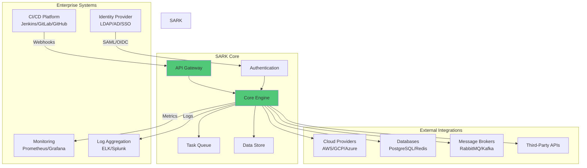
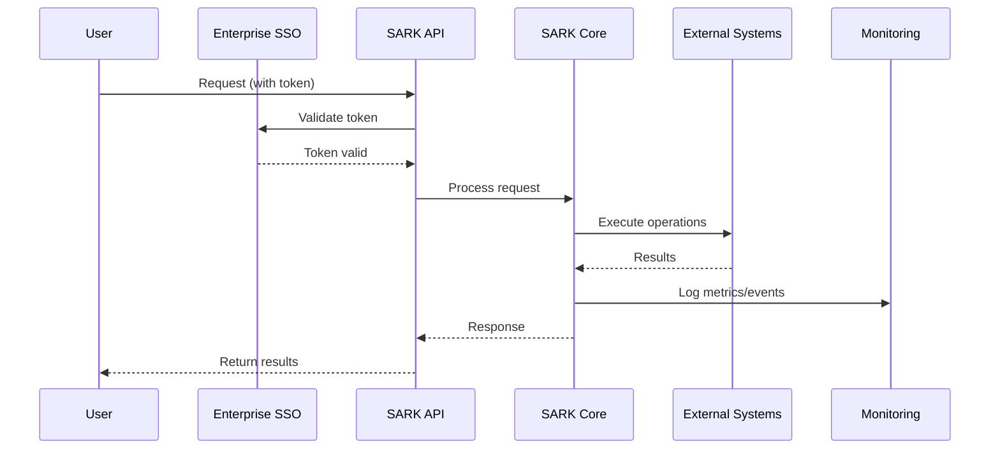
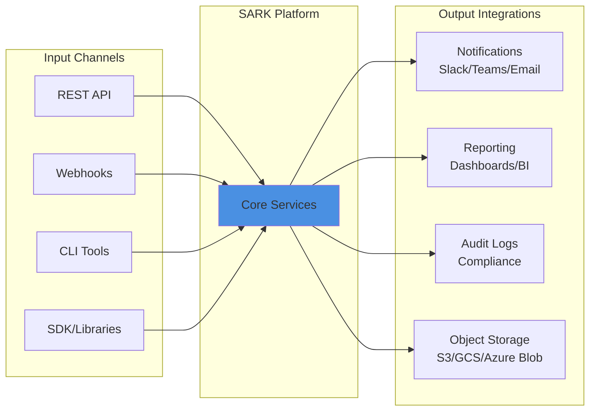

# Sark

> *"He's not any kind of user, SARK, he's a program."*
> —MCP, probably

A large Python application built with Python 3.11.

## Project Status

🚧 **In Development** - Project structure and CI/CD setup complete, awaiting design document.

## Enterprise Integration

SARK is designed to seamlessly integrate within enterprise environments, serving as a central orchestration and automation platform.

### System Architecture Overview



### Data Flow Architecture



### Integration Points



### Key Enterprise Features

- **🔐 Enterprise Authentication**: Seamless integration with existing identity providers (LDAP, Active Directory, SAML, OIDC)
- **📊 Observability**: Built-in metrics, logging, and tracing for enterprise monitoring platforms
- **🔄 CI/CD Integration**: Native webhook support for automated workflows
- **🛡️ Security & Compliance**: Audit logging, encryption at rest and in transit, role-based access control
- **⚡ Scalability**: Containerized deployment with horizontal scaling capabilities
- **🔌 Extensible**: Plugin architecture for custom integrations and workflows

## Requirements

- Python 3.11+
- Docker with Docker Compose v2
- Git

## Development Setup

### Initial Setup

```bash
# Clone the repository
git clone <repository-url>
cd sark

# Create virtual environment
python3.11 -m venv venv
source venv/bin/activate  # On Windows: venv\Scripts\activate

# Install development dependencies
pip install -e ".[dev]"

# Install pre-commit hooks
pre-commit install
```

### Docker Development

```bash
# Build and start services
docker compose up --build

# Run tests in container
docker compose run --rm app pytest

# Access shell in container
docker compose run --rm app bash
```

## Development Workflow

### Code Quality Standards

This project enforces strict code quality standards:

- **Formatting**: Black (line length: 100)
- **Linting**: Ruff with comprehensive rule sets
- **Type Checking**: MyPy with strict mode
- **Testing**: Pytest with coverage requirements

All checks run automatically via pre-commit hooks and CI/CD.

### Making Changes

1. Create a feature branch from main: `git checkout -b feature/your-feature-name`
2. Make your changes following the coding standards in `CONTRIBUTING.md`
3. Write tests for new functionality
4. Ensure all tests pass: `pytest`
5. Ensure code quality checks pass: `pre-commit run --all-files`
6. Commit with descriptive messages
7. Push and create a pull request

### Running Tests

```bash
# Run all tests
pytest

# Run with coverage
pytest --cov

# Run specific test file
pytest tests/test_example.py

# Run tests matching pattern
pytest -k "test_pattern"

# Run only fast tests
pytest -m "not slow"
```

### Code Quality Checks

```bash
# Run all pre-commit hooks
pre-commit run --all-files

# Format code
black src tests

# Lint code
ruff check src tests

# Type check
mypy src
```

## Project Structure

```
sark/
├── src/
│   └── sark/          # Main application code
├── tests/             # Test files
├── docker/            # Docker-related files
├── .github/           # GitHub Actions workflows
├── docs/              # Documentation
├── scripts/           # Utility scripts
├── pyproject.toml     # Project configuration
├── docker-compose.yml # Docker Compose configuration
└── README.md          # This file
```

## CI/CD

This project uses GitHub Actions for continuous integration and deployment:

- **CI Pipeline**: Runs on every push and PR
  - Code quality checks (ruff, black, mypy)
  - Tests with coverage
  - Build verification
  - Docker image builds

- **Branch Protection**: Main branch requires:
  - All CI checks to pass
  - Code review approval
  - Up-to-date with base branch

## Contributing

See [CONTRIBUTING.md](CONTRIBUTING.md) for detailed guidelines on:
- Code style and standards
- Commit message format
- PR process
- Multi-agent collaboration guidelines

## License

TBD
