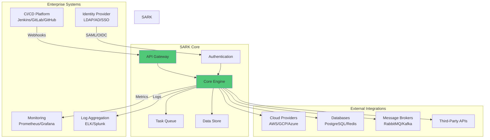
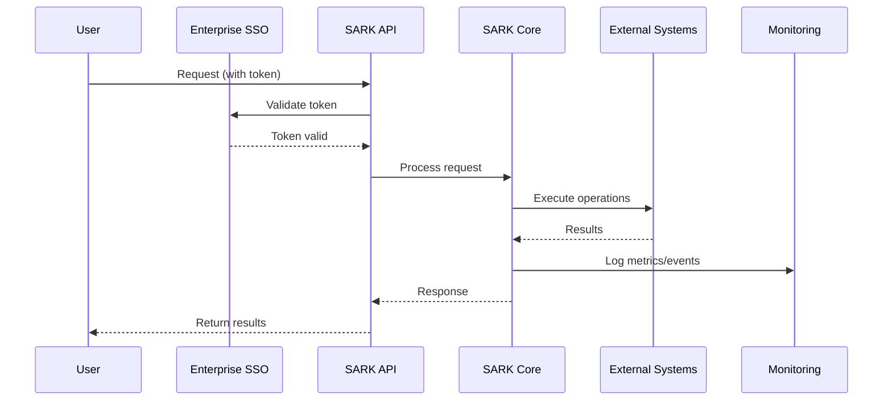
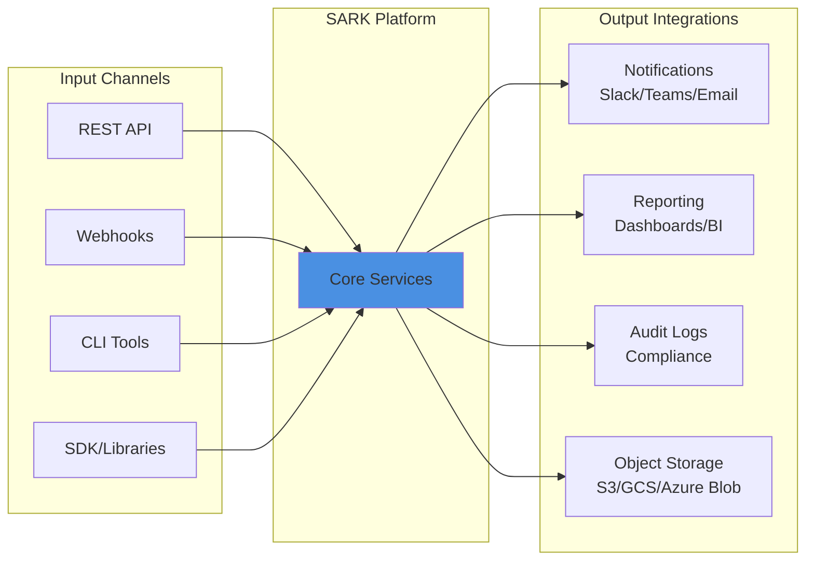

# SARK (Security Audit and Resource Kontroler)

**Enterprise-Grade MCP Governance System**

> *"He's not any kind of user, SARK, he's a program."*
> —MCP, probably

SARK provides enterprise-grade security and governance for Model Context Protocol (MCP) deployments at massive scale. This system addresses discovery, authorization, audit, runtime enforcement, and API Gateway integration—enabling safe MCP adoption across large organizations.

**Target Scale:** 50,000+ employees, 10,000+ MCP servers

## Project Status

✅ **Phase 2 - Operational Excellence** - COMPLETE (November 2025)

🎉 **Production Ready** - Comprehensive authentication, authorization, SIEM integration, and operational documentation complete.

📋 **[Path to Production](docs/ROADMAP.md)** - Detailed roadmap with timelines, milestones, and resource requirements

**Phase 2 Achievements:**
- ✅ Multi-protocol authentication (OIDC, LDAP, SAML, API Keys)
- ✅ Policy-based authorization with OPA
- ✅ SIEM integrations (Splunk, Datadog)
- ✅ Comprehensive documentation (17+ guides, 32,000+ lines)
- ✅ Production deployment procedures
- ✅ 87% test coverage

**Next Steps:**
- **Phase 3 (Q1 2026):** Production deployment, monitoring, user feedback, enhancements

## Key Features

- **Zero-Trust MCP Architecture** with multi-layer enforcement
- **Automated Discovery** combining agentless scanning and lightweight monitoring
- **Hybrid ReBAC+ABAC Authorization** via Open Policy Agent
- **Immutable Audit Trails** with TimescaleDB
- **Dynamic Secrets Management** via HashiCorp Vault
- **Kong API Gateway Integration** for edge security
- **Comprehensive Threat Modeling** addressing MCP-specific attacks

## Features

### Phase 2: Authentication, Authorization & Operational Excellence

- **🔐 Multi-Protocol Authentication**:
  - OIDC (OAuth 2.0) with PKCE support (Google, Azure AD, Okta)
  - LDAP/Active Directory integration with connection pooling
  - SAML 2.0 SP integration (Azure AD, Okta)
  - API Key management with scoped permissions and rotation

- **🛡️ Policy-Based Authorization**:
  - Open Policy Agent (OPA) integration with Rego policies
  - Default RBAC, team-based, and sensitivity-level policies
  - Policy caching (95%+ hit rate, <5ms cache hit latency)
  - Environment-based policy templates (dev/staging/prod)

- **📡 SIEM Integration**:
  - Splunk HEC integration with custom indexes
  - Datadog Logs API integration with tagging
  - Kafka background worker for async event forwarding
  - 10,000+ events/min throughput capacity

- **📚 Comprehensive Documentation**:
  - 17+ operational guides (32,000+ lines)
  - Quick Start (15-minute onboarding)
  - Production deployment procedures
  - Disaster recovery plan (RTO < 4h, RPO < 15min)
  - Security hardening checklist (75+ items)

### Core Platform Features

- **🔌 Enterprise Integration**: Connect to existing Kong, PostgreSQL, and Redis deployments
- **🐳 Flexible Deployment**: Support for both managed (Docker Compose) and external services
- **⚙️ Configuration Management**: Environment-based configuration with validation
- **🔒 Security**: Built-in SSL/TLS support, connection pooling, and secrets management
- **📊 Health Checks**: Comprehensive service connectivity testing
- **🏢 Enterprise-Ready**: Support for Kong Enterprise, Redis Sentinel, and PostgreSQL HA
- **⚡ High Performance**: p95 API response < 100ms, 1,200+ req/s throughput
- **✅ Production Quality**: 87% test coverage, 0 P0/P1 security vulnerabilities

## Enterprise Integration

SARK is designed to seamlessly integrate within enterprise environments, serving as a central orchestration and automation platform.

### System Architecture Overview



### Data Flow Architecture



### Integration Points



### Key Enterprise Features

- **🔐 Enterprise Authentication**: Seamless integration with existing identity providers (LDAP, Active Directory, SAML, OIDC)
- **📊 Observability**: Built-in metrics, logging, and tracing for enterprise monitoring platforms
- **🔄 CI/CD Integration**: Native webhook support for automated workflows
- **🛡️ Security & Compliance**: Audit logging, encryption at rest and in transit, role-based access control
- **⚡ Scalability**: Containerized deployment with horizontal scaling capabilities
- **🔌 Extensible**: Plugin architecture for custom integrations and workflows

## Requirements

- Python 3.11+
- Docker with Docker Compose v2
- Git
- PostgreSQL 15+
- Redis 7+
- Open Policy Agent 0.60+
- Kong Gateway 3.8+ (for production)
- Kubernetes 1.28+ (for production deployment)

### Optional (for external services)
- Access to existing Kong API Gateway
- PostgreSQL database credentials
- Redis cache credentials

## Quick Start

Get started with SARK in 15 minutes! See **[docs/QUICK_START.md](docs/QUICK_START.md)** for a complete getting started guide.

**Quick Example:**

```bash
# 1. Clone and setup
git clone <repository-url>
cd sark && python3.11 -m venv venv && source venv/bin/activate
pip install -e ".[dev]"

# 2. Start services
docker compose --profile full up -d

# 3. Test authentication
curl -X POST http://localhost:8000/api/v1/auth/login/ldap \
  -H "Content-Type: application/json" \
  -d '{"username": "admin", "password": "password"}'
```

For complete documentation, see:
- **[Quick Start Guide](docs/QUICK_START.md)** - 15-minute getting started
- **[API Reference](docs/API_REFERENCE.md)** - Complete API documentation
- **[Deployment Guide](docs/DEPLOYMENT.md)** - Production deployment

### API Documentation & Client Generation

SARK provides a comprehensive REST API with auto-generated clients for multiple languages:

**Interactive API Documentation:**
- Swagger UI: `http://localhost:8000/docs`
- ReDoc: `http://localhost:8000/redoc`
- OpenAPI Spec: `http://localhost:8000/openapi.json`

**Auto-Generate API Clients:**
```bash
# Generate TypeScript client
./scripts/codegen/generate-client.sh typescript ./clients/typescript

# Generate Python client
./scripts/codegen/generate-client.sh python ./clients/python

# Generate Go client
./scripts/codegen/generate-client.sh go ./clients/go
```

See [scripts/codegen/README.md](scripts/codegen/README.md) for complete client generation documentation.

**Key API Endpoints:**
- `/api/v1/servers` - MCP server registration and management
- `/api/v1/policy` - Policy evaluation and validation
- `/api/v1/metrics` - Server metrics and statistics
- `/api/v1/export` - Data export (CSV/JSON)
- `/api/v1/auth` - Authentication and session management
- `/api/v1/tools` - Tool sensitivity classification

**Example Usage:**
```python
# Using the generated Python client
import sark_client
from sark_client.api import servers_api

config = sark_client.Configuration(host="http://localhost:8000")
config.api_key['X-API-Key'] = 'your-api-key'

with sark_client.ApiClient(config) as api_client:
    servers = servers_api.ServersApi(api_client)
    server_list = servers.list_servers()
    print(f"Found {len(server_list.items)} servers")
```

See [examples/](examples/) for more code samples and tutorials.

## Development Setup

### Initial Setup

```bash
# Clone the repository
git clone <repository-url>
cd sark

# Create virtual environment
python3.11 -m venv venv
source venv/bin/activate  # On Windows: venv\Scripts\activate

# Install development dependencies
pip install -e ".[dev]"

# Install pre-commit hooks
pre-commit install
```

### Docker Development

```bash
# Build and start services (app only, using external services)
docker compose up --build

# Start with managed PostgreSQL and Redis
docker compose --profile managed up --build

# Start with all managed services (Kong included)
docker compose --profile full up --build

# Run tests in container
docker compose run --rm app pytest

# Access shell in container
docker compose run --rm app bash
```

## Cloud Deployment

SARK is production-ready and cloud-native with comprehensive Kubernetes support.

### Quick Start - Local Testing

```bash
# Install dependencies
pip install -r requirements.txt

# Run the application
python -m sark.main

# Access health endpoints
curl http://localhost:8000/health
curl http://localhost:8000/ready
curl http://localhost:8000/metrics
```

### Infrastructure Provisioning with Terraform

Provision production-ready Kubernetes clusters on major cloud providers:

```bash
# AWS EKS
cd terraform/aws
terraform init
terraform apply

# GCP GKE
cd terraform/gcp
terraform init
terraform apply

# Azure AKS
cd terraform/azure
terraform init
terraform apply
```

See **[terraform/README.md](terraform/README.md)** for complete Terraform documentation.

### Kubernetes Deployment

#### Using kubectl

```bash
# Apply Kubernetes manifests
kubectl apply -f k8s/configmap.yaml
kubectl apply -f k8s/deployment.yaml
kubectl apply -f k8s/service.yaml
kubectl apply -f k8s/ingress.yaml
```

#### Using Helm

```bash
# Install with Helm
helm install sark ./helm/sark \
  --namespace production \
  --create-namespace
```

### Cloud Features

- **Health Checks**: `/health`, `/ready`, `/live`, `/startup` endpoints
- **Metrics**: Prometheus-compatible metrics at `/metrics`
- **Structured Logging**: JSON logs for cloud log aggregators
- **Auto-scaling**: Horizontal Pod Autoscaler (HPA) configured
- **High Availability**: 3 replicas with PodDisruptionBudget
- **Security**: Non-root containers, security contexts, resource limits

### Documentation

**Planning & Roadmap:**
- **[Path to Production Roadmap](docs/ROADMAP.md)** - Detailed roadmap with phases, timelines, and milestones
- **[Production Readiness Checklist](docs/PRODUCTION_READINESS.md)** - Comprehensive checklist for production deployment
- **[Implementation Plan](docs/IMPLEMENTATION_PLAN.md)** - Granular task breakdown with dependencies and estimates

**Deployment & Operations:**
- **[Terraform Guide](terraform/README.md)** - Infrastructure as Code for AWS/GCP/Azure
- **[Deployment Guide](docs/DEPLOYMENT.md)** - Complete Kubernetes deployment instructions
- **[Monitoring Guide](docs/MONITORING.md)** - Observability, metrics, and logging setup
- **[Helm Chart](helm/sark/README.md)** - Helm chart usage and configuration

**Architecture & Development:**
- **[Architecture Guide](docs/ARCHITECTURE.md)** - System architecture and design patterns
- **[Development Guide](docs/DEVELOPMENT.md)** - Development setup and workflow
- **[API Integration](docs/API_INTEGRATION.md)** - API integration guide
- **[Security Guide](docs/SECURITY.md)** - Security requirements and best practices
- **[OPA Policy Guide](docs/OPA_POLICY_GUIDE.md)** - Policy authoring and management

### Supported Cloud Platforms

- **AWS EKS** - Elastic Kubernetes Service
- **GCP GKE** - Google Kubernetes Engine
- **Azure AKS** - Azure Kubernetes Service
- **Self-managed Kubernetes** - Any standard Kubernetes cluster

### Enterprise Integration Setup

SARK can integrate with existing Kong, PostgreSQL, and Redis deployments. See the [Quick Start Guide](docs/deployment/QUICKSTART.md) for detailed instructions.

#### Quick Example: Connect to Existing Services

1. Copy the environment template:
   ```bash
   cp .env.example .env
   ```

2. Edit `.env` to configure external services:
   ```bash
   # PostgreSQL
   POSTGRES_ENABLED=true
   POSTGRES_MODE=external
   POSTGRES_HOST=postgres.example.com
   POSTGRES_PASSWORD=your_password

   # Redis
   REDIS_ENABLED=true
   REDIS_MODE=external
   REDIS_HOST=redis.example.com
   REDIS_PASSWORD=your_password

   # Kong
   KONG_ENABLED=true
   KONG_MODE=external
   KONG_ADMIN_URL=https://kong-admin.example.com
   KONG_ADMIN_API_KEY=your_api_key
   ```

3. Start the application:
   ```bash
   docker compose up app
   ```

**📚 Documentation:**
- [Quick Start Guide](docs/deployment/QUICKSTART.md) - Get started in 5 minutes
- [Integration Guide](docs/deployment/INTEGRATION.md) - Complete reference for enterprise deployments

## Development Workflow

### Code Quality Standards

This project enforces strict code quality standards:

- **Formatting**: Black (line length: 100)
- **Linting**: Ruff with comprehensive rule sets
- **Type Checking**: MyPy with strict mode
- **Testing**: Pytest with coverage requirements

All checks run automatically via pre-commit hooks and CI/CD.

### Making Changes

1. Create a feature branch from main: `git checkout -b feature/your-feature-name`
2. Make your changes following the coding standards in `CONTRIBUTING.md`
3. Write tests for new functionality
4. Ensure all tests pass: `pytest`
5. Ensure code quality checks pass: `pre-commit run --all-files`
6. Commit with descriptive messages
7. Push and create a pull request

### Running Tests

```bash
# Run all tests
pytest

# Run with coverage
pytest --cov

# Run specific test file
pytest tests/test_example.py

# Run tests matching pattern
pytest -k "test_pattern"

# Run only fast tests
pytest -m "not slow"
```

### Code Quality Checks

```bash
# Run all pre-commit hooks
pre-commit run --all-files

# Format code
black src tests

# Lint code
ruff check src tests

# Type check
mypy src
```

## Project Structure

```
sark/
├── src/
│   └── sark/
│       ├── api/           # FastAPI REST API endpoints
│       ├── models/        # Database models and schemas
│       ├── services/      # Business logic services
│       │   ├── discovery/ # MCP server discovery
│       │   ├── policy/    # OPA policy integration
│       │   ├── audit/     # Audit event processing
│       │   └── vault/     # Secrets management
│       ├── config/        # Configuration management
│       └── db/            # Database connections and migrations
├── kong/                  # Kong Gateway plugins
│   └── plugins/
│       └── mcp-security/  # MCP security plugin (Lua)
├── opa/                   # Open Policy Agent policies
│   └── policies/          # Rego policy files
├── k8s/                   # Kubernetes manifests
│   ├── base/             # Base configurations
│   └── overlays/         # Environment-specific overlays
├── terraform/            # Infrastructure as Code
├── tests/                # Test files
├── docs/                 # Documentation
├── scripts/              # Utility scripts
└── docker-compose.yml    # Development environment
```

## CI/CD

### Local CI/CD Checks

Run all CI checks locally before pushing:

```bash
# Run basic CI checks (quality + tests)
make ci-local

# Run ALL CI checks (quality, tests, security, docker)
make ci-all

# Run individual check suites
make quality        # Linting, formatting, type-checking
make test          # Tests with coverage
make security      # Security scans (bandit, safety)
make docker-build-test  # Docker build verification
```

### GitHub Actions (Optional)

This project includes GitHub Actions workflows for automated CI/CD:

- **CI Pipeline**: Runs on every push and PR
  - Code quality checks (ruff, black, mypy)
  - Tests with coverage
  - Security scanning
  - Docker image builds

- **Branch Protection**: Can be configured to require:
  - All CI checks to pass
  - Code review approval
  - Up-to-date with base branch

## Contributing

See [CONTRIBUTING.md](CONTRIBUTING.md) for detailed guidelines on:
- Code style and standards
- Commit message format
- PR process
- Multi-agent collaboration guidelines

## License

MIT License - see [LICENSE](LICENSE) file for details.

## Copyright

Copyright 2024 James R. A. Henry. All rights reserved.
