# Architecture

> *"He's not any kind of user, SARK, he's a program."* —MCP, probably

## Overview

SARK is designed as a scalable, enterprise-grade platform for orchestration and automation. The architecture follows modern cloud-native principles with a focus on reliability, observability, and extensibility.

## System Components

### High-Level Architecture

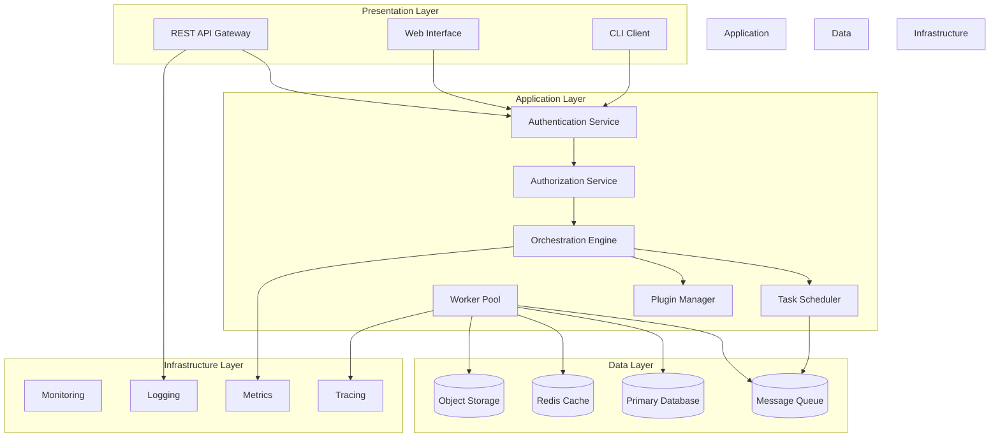

### Component Details

#### API Gateway
- RESTful API endpoints
- Request validation and rate limiting
- API versioning support
- OpenAPI/Swagger documentation
- WebSocket support for real-time updates

#### Authentication & Authorization
- Multi-provider authentication (LDAP, SAML, OIDC, OAuth2)
- JWT token-based sessions
- Role-Based Access Control (RBAC)
- Attribute-Based Access Control (ABAC)
- API key management

---

## Detailed Flow Diagrams

### Authentication Flows

#### LDAP Authentication Flow

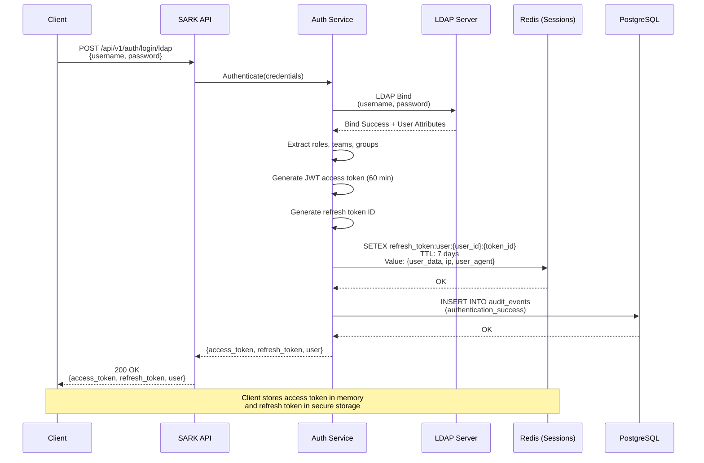

#### OIDC Authentication Flow

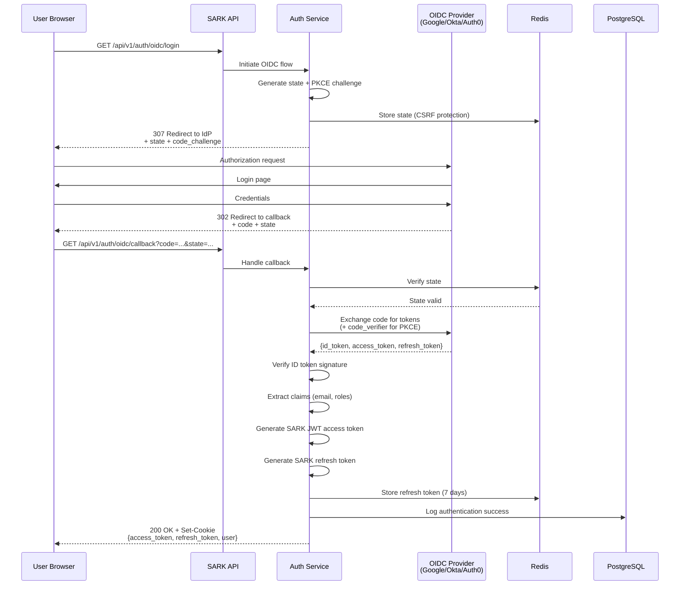

#### SAML 2.0 Authentication Flow

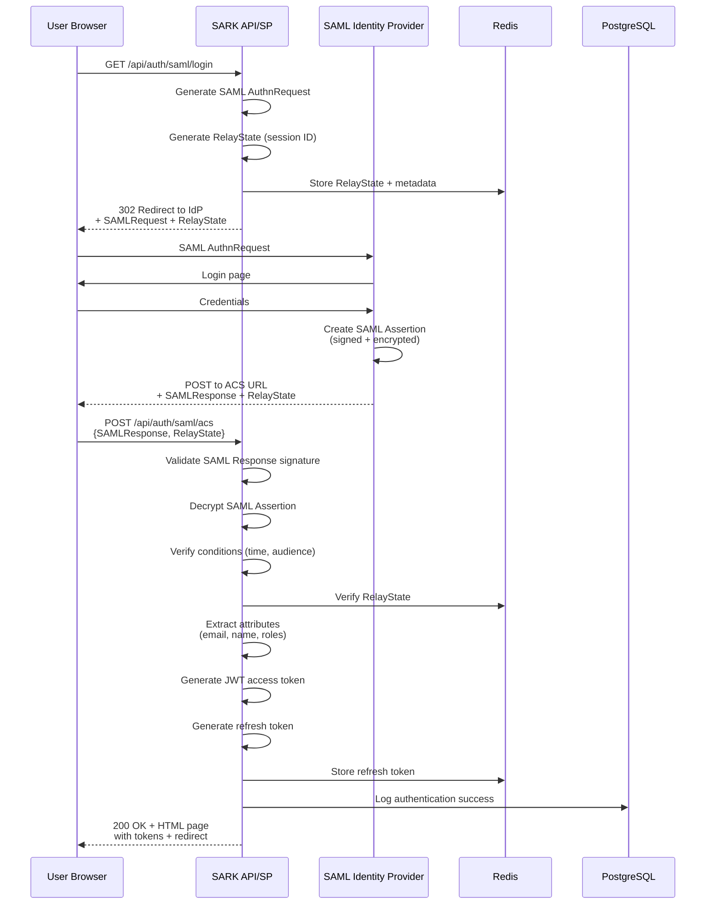

---

### Session Management Flow

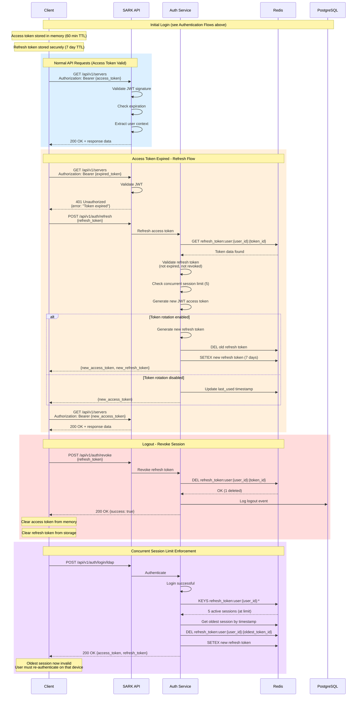

---

### Authorization Flow (OPA Policy Evaluation)

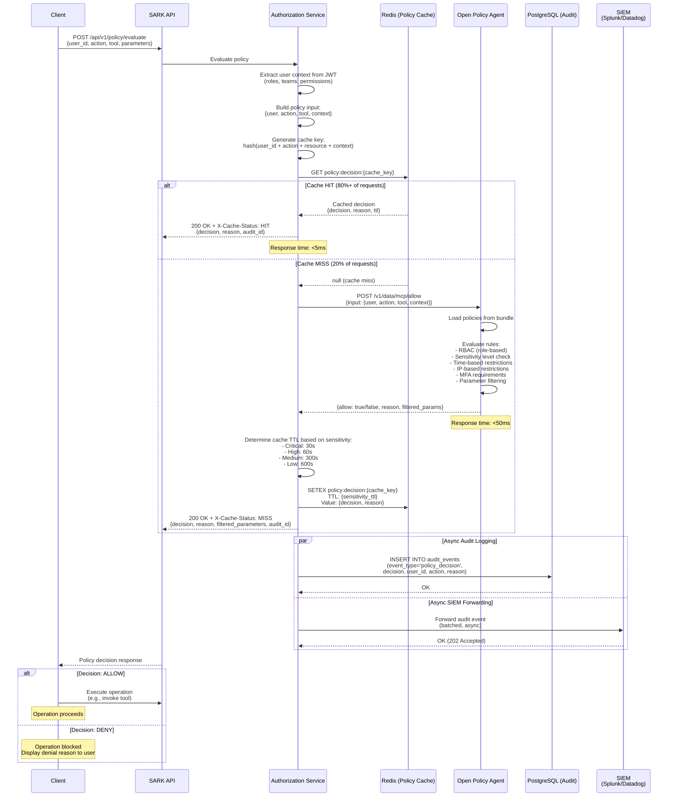

---

### SIEM Integration Flow

```mermaid
sequenceDiagram
    participant App as SARK Application
    participant Queue as SIEM Event Queue<br/>(In-Memory)
    participant Forwarder as SIEM Forwarder
    participant Redis as Redis<br/>(Circuit Breaker)
    participant Splunk as Splunk HEC
    participant Datadog as Datadog Logs API

    Note over App,Datadog: Audit Event Generated

    rect rgb(220, 255, 220)
        Note over App,Queue: Event Queuing (Non-Blocking)
        App->>App: Generate audit event:<br/>{event_type, severity, user, action, timestamp}
        App->>Queue: Enqueue event (async)
        Queue-->>App: Queued (non-blocking)
        Note over App: Application continues<br/>(< 1ms overhead)
    end

    rect rgb(220, 240, 255)
        Note over Queue,Forwarder: Batch Processing
        loop Every 5 seconds OR 100 events
            Forwarder->>Queue: Dequeue batch (up to 100 events)
            Queue-->>Forwarder: Batch of events

            Forwarder->>Forwarder: Compress payload (gzip)
            Forwarder->>Forwarder: Format for target SIEM
        end
    end

    rect rgb(255, 240, 220)
        Note over Forwarder,Redis: Circuit Breaker Check
        Forwarder->>Redis: GET circuit:splunk:state

        alt Circuit CLOSED (Normal)
            Redis-->>Forwarder: "closed"
            Note over Forwarder: Proceed with request
        else Circuit OPEN (Too many failures)
            Redis-->>Forwarder: "open"
            Forwarder->>Forwarder: Skip SIEM forwarding
            Forwarder->>Forwarder: Log to local file
            Note over Forwarder: Wait for circuit to recover<br/>(30 seconds)
        else Circuit HALF-OPEN (Testing)
            Redis-->>Forwarder: "half_open"
            Note over Forwarder: Send single test request
        end
    end

    par Forward to Splunk
        rect rgb(255, 250, 220)
            Forwarder->>Splunk: POST /services/collector/event<br/>Authorization: Splunk {hec_token}<br/>Body: {events: [...], compressed}

            alt Splunk Success
                Splunk-->>Forwarder: 200 OK {ackId}
                Forwarder->>Redis: INCR circuit:splunk:success
                Forwarder->>Forwarder: Mark events as sent
                Note over Forwarder: Success! Events forwarded
            else Splunk Failure (503, timeout)
                Splunk-->>Forwarder: 503 Service Unavailable
                Forwarder->>Redis: INCR circuit:splunk:failure
                Forwarder->>Redis: Check failure threshold (5 consecutive)

                alt Threshold exceeded
                    Forwarder->>Redis: SET circuit:splunk:state = "open"<br/>EXPIRE 30s
                    Note over Redis: Circuit opened for 30s
                end

                Forwarder->>Forwarder: Retry with exponential backoff<br/>(2s, 4s, 8s, 16s, 32s)

                loop Retry up to 5 times
                    Forwarder->>Splunk: Retry POST
                    alt Retry success
                        Splunk-->>Forwarder: 200 OK
                        Forwarder->>Redis: RESET circuit:splunk:failure
                    else All retries exhausted
                        Forwarder->>Forwarder: Log failure to disk
                        Forwarder->>Forwarder: Dead letter queue
                        Note over Forwarder: Alert: SIEM forwarding failed
                    end
                end
            end
        end
    and Forward to Datadog
        rect rgb(220, 240, 255)
            Forwarder->>Datadog: POST /api/v2/logs<br/>DD-API-KEY: {api_key}<br/>Content-Encoding: gzip<br/>Body: {logs: [...]}

            alt Datadog Success
                Datadog-->>Forwarder: 202 Accepted
                Forwarder->>Redis: INCR circuit:datadog:success
                Note over Forwarder: Events forwarded to Datadog
            else Datadog Failure
                Datadog-->>Forwarder: 429 Rate Limited
                Forwarder->>Redis: INCR circuit:datadog:failure
                Forwarder->>Forwarder: Apply backoff + retry logic
            end
        end
    end

    rect rgb(220, 255, 240)
        Note over Forwarder,Datadog: Monitoring & Metrics
        Forwarder->>Forwarder: Update metrics:<br/>- siem_events_forwarded_total{siem="splunk"}<br/>- siem_events_failed_total<br/>- siem_batch_size_bytes<br/>- siem_forward_duration_seconds
    end
```

---

### Rate Limiting Flow

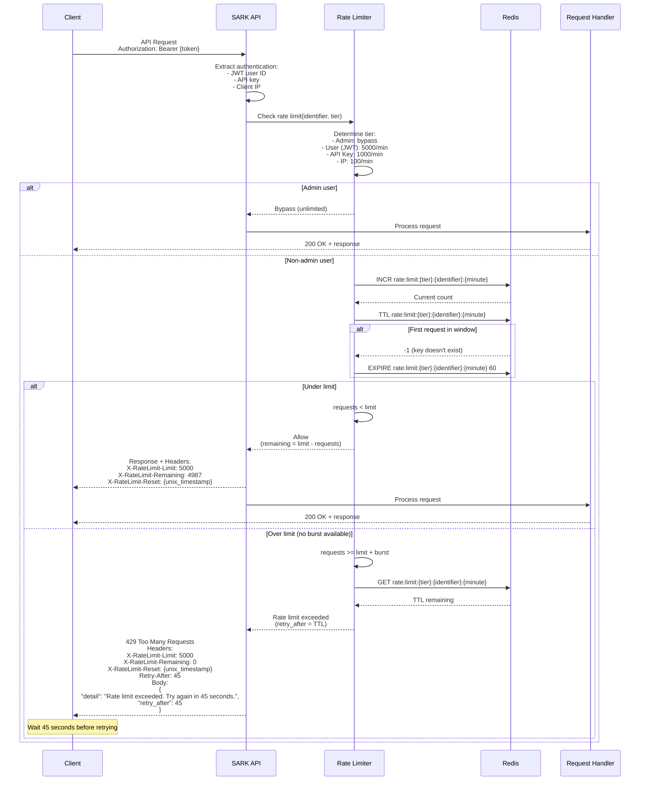

#### Orchestration Engine
- Workflow definition and execution
- State machine implementation
- Error handling and retry logic
- Compensation transactions
- Event-driven architecture

#### Task Scheduler
- Cron-based scheduling
- Event-triggered execution
- Priority queue management
- Dependency resolution
- Distributed coordination

#### Worker Pool
- Horizontal scaling capabilities
- Task isolation and sandboxing
- Resource management
- Health checking
- Graceful shutdown

#### Plugin Manager
- Dynamic plugin loading
- Dependency injection
- Plugin lifecycle management
- Isolation and security
- Hot-reload capabilities

## Data Flow

### Request Processing Flow

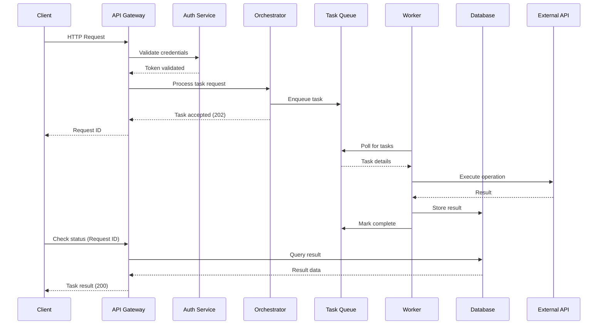

### Event-Driven Architecture

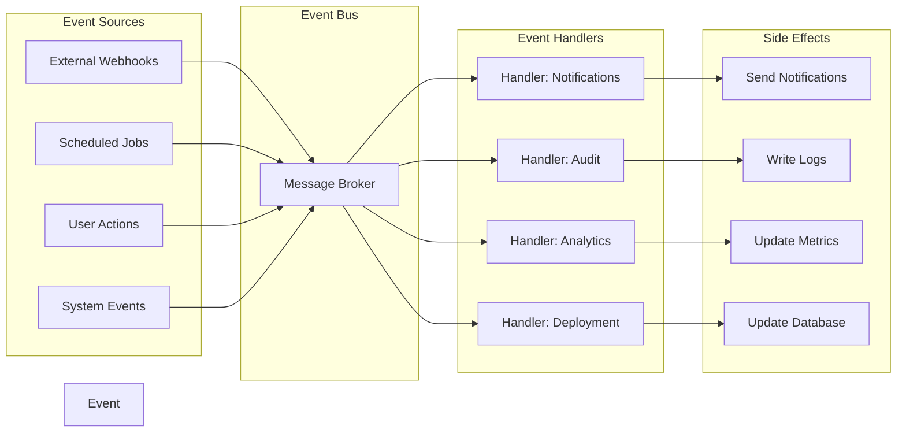

### Enterprise Integration Patterns

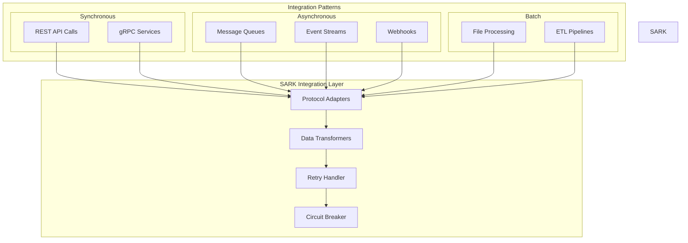

## Technology Stack

### Core Technologies

- **Language**: Python 3.11
- **Containerization**: Docker with Docker Compose v2
- **Testing**: pytest with coverage
- **Type Checking**: MyPy (strict mode)
- **Code Quality**: Black, Ruff, Bandit

### Development Tools

- **Version Control**: Git with Conventional Commits
- **CI/CD**: GitHub Actions
- **Pre-commit Hooks**: Automated quality checks
- **Dependency Management**: pip with requirements files

## Design Principles

1. **Type Safety**: Strict type checking with MyPy
2. **Code Quality**: Automated linting and formatting
3. **Testing**: High test coverage (>80%)
4. **Security**: Regular security scans with Bandit
5. **Maintainability**: Clear documentation and code standards
6. **Scalability**: Docker-based deployment ready for scaling

## Deployment Architecture

### Container Deployment Model

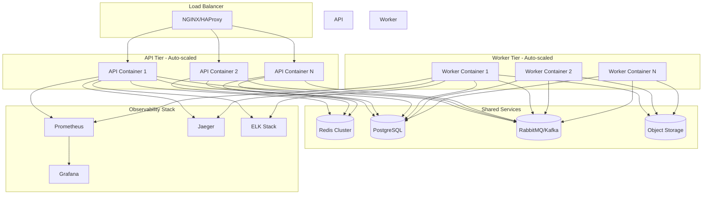

### Multi-Environment Strategy

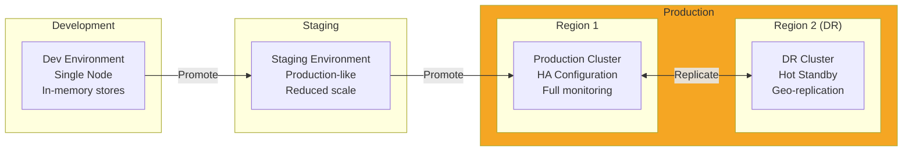

### Security Architecture

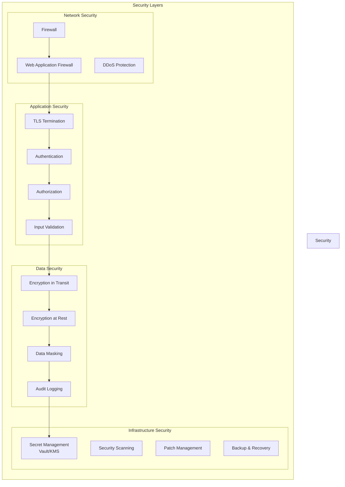

## Scalability Patterns

### Horizontal Scaling

- **API Layer**: Stateless design allows unlimited horizontal scaling
- **Worker Pool**: Auto-scaling based on queue depth and CPU/memory metrics
- **Database**: Read replicas for query distribution, sharding for write scaling
- **Cache**: Redis cluster with consistent hashing for distribution

### Performance Optimization

- **Caching Strategy**: Multi-tier caching (in-memory, distributed, CDN)
- **Database Optimization**: Indexing, query optimization, connection pooling
- **Async Processing**: Long-running tasks moved to background workers
- **Resource Pooling**: Connection pools, thread pools, object pools

## Resilience & Reliability

### Fault Tolerance

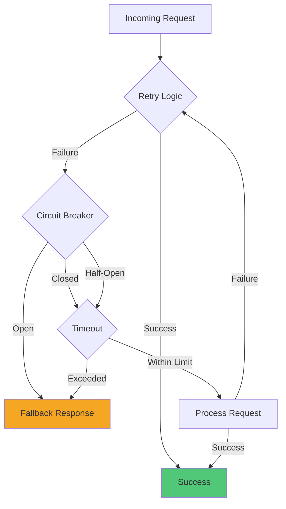

### High Availability Features

- **Multi-AZ Deployment**: Resources distributed across availability zones
- **Health Checks**: Automated health monitoring with auto-recovery
- **Graceful Degradation**: Fallback mechanisms for non-critical services
- **Data Replication**: Synchronous and asynchronous replication strategies
- **Backup Strategy**: Automated backups with point-in-time recovery

## Monitoring & Observability

### The Three Pillars

1. **Metrics** (Prometheus + Grafana)
   - Application metrics (requests, latency, errors)
   - System metrics (CPU, memory, disk, network)
   - Business metrics (task completion, user activity)

2. **Logs** (ELK Stack)
   - Structured JSON logging
   - Centralized log aggregation
   - Log retention and archival
   - Searchable audit trails

3. **Traces** (Jaeger)
   - Distributed tracing
   - Request flow visualization
   - Performance bottleneck identification
   - Service dependency mapping

## Future Considerations

### Planned Enhancements

- **Multi-tenancy**: Tenant isolation and resource quotas
- **Service Mesh**: Istio/Linkerd for advanced traffic management
- **GraphQL API**: Alternative API interface alongside REST
- **Real-time Streaming**: WebSocket/SSE for live updates
- **ML/AI Integration**: Intelligent task routing and anomaly detection
- **Federation**: Multi-cluster deployment and management
- **Progressive Delivery**: Canary deployments, blue-green deployments, feature flags

### Technology Evaluation

- Database architecture (PostgreSQL + TimescaleDB for time-series)
- Caching strategy (Redis Cluster + local caching)
- Message queue selection (Kafka for high-throughput, RabbitMQ for reliability)
- Service mesh adoption timeline
- Kubernetes vs. Docker Swarm for orchestration

---

**This document evolves with the project. Refer to commit history for architectural decisions and their rationale.**
