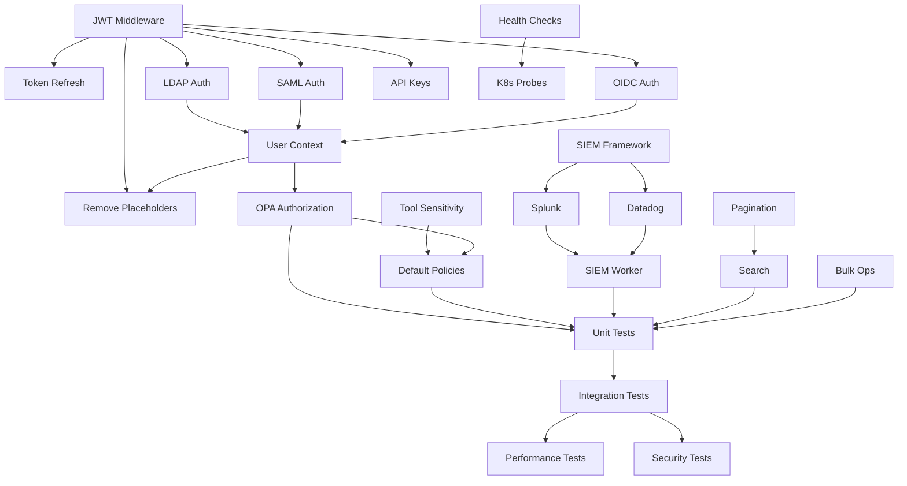

# SARK Implementation Plan - Detailed Task Breakdown

**Document Version:** 1.0
**Last Updated:** 2025-11-20
**Purpose:** Granular task breakdown with dependencies, effort estimates, and assignees

---

## How to Use This Document

This implementation plan breaks down the [ROADMAP.md](./ROADMAP.md) into specific, actionable tasks with:
- **Effort Estimates:** Story points (1-13 Fibonacci scale) and days
- **Dependencies:** What must be complete before this task starts
- **Assignees:** Suggested role or team member
- **Acceptance Criteria:** Clear definition of done
- **Files Involved:** Specific code locations

**Story Point Scale:**
- 1 point = 0.5 day (simple, clear task)
- 2 points = 1 day (straightforward implementation)
- 3 points = 1.5 days (moderate complexity)
- 5 points = 2-3 days (complex, requires design)
- 8 points = 4-5 days (very complex, multiple components)
- 13 points = 1+ week (should be broken down further)

---

## Phase 2: Security Hardening & Core Features

### Sprint 1: Authentication Foundation (Week 1)

#### TASK-101: JWT Middleware Implementation

**Priority:** P0 - Critical Blocker
**Effort:** 3 points (1.5 days)
**Assignee:** Senior Backend Engineer
**Dependencies:** None

**Description:**
Implement JWT token extraction and validation middleware for all API endpoints.

**Implementation Details:**
1. Create middleware in `src/sark/api/middleware/auth.py`
2. Support RS256 (asymmetric) and HS256 (symmetric) algorithms
3. Extract token from `Authorization: Bearer <token>` header
4. Validate token signature, expiry, and required claims
5. Attach user identity to request context
6. Handle token validation errors with proper HTTP status codes

**Files to Create/Modify:**
- `src/sark/api/middleware/auth.py` (new)
- `src/sark/api/main.py` (modify - add middleware)
- `src/sark/config/settings.py` (modify - add JWT config)
- `tests/test_auth_middleware.py` (new)

**Acceptance Criteria:**
- [ ] JWT tokens extracted from Authorization header
- [ ] RS256 and HS256 algorithms supported
- [ ] Token expiry validated (returns 401 if expired)
- [ ] Invalid signatures rejected (returns 401)
- [ ] User identity attached to `request.state.user`
- [ ] 100% test coverage for middleware
- [ ] Comprehensive error messages for debugging

**Configuration Required:**
```python
JWT_SECRET_KEY = "..."  # For HS256
JWT_PUBLIC_KEY = "..."  # For RS256 (PEM format)
JWT_ALGORITHM = "RS256"  # or HS256
JWT_EXPIRATION_MINUTES = 60
```

---

#### TASK-102: Token Refresh Mechanism

**Priority:** P1 - High
**Effort:** 2 points (1 day)
**Assignee:** Backend Engineer
**Dependencies:** TASK-101

**Description:**
Implement token refresh endpoint to allow clients to obtain new access tokens using refresh tokens.

**Implementation Details:**
1. Create refresh token endpoint `POST /api/v1/auth/refresh`
2. Validate refresh token (longer expiry than access token)
3. Issue new access token with fresh expiry
4. Optionally rotate refresh token
5. Store refresh tokens in Redis with TTL
6. Implement refresh token revocation

**Files to Create/Modify:**
- `src/sark/api/routers/auth.py` (new)
- `src/sark/services/auth/tokens.py` (new)
- `tests/test_token_refresh.py` (new)

**Acceptance Criteria:**
- [ ] Refresh endpoint accepts refresh tokens
- [ ] New access token issued with valid claims
- [ ] Refresh tokens stored in Redis
- [ ] Expired refresh tokens rejected
- [ ] Revoked tokens cannot be used
- [ ] Refresh token rotation optional (configurable)
- [ ] Test coverage 100%

**Configuration:**
```python
REFRESH_TOKEN_EXPIRATION_DAYS = 7
REFRESH_TOKEN_ROTATION_ENABLED = True
```

---

#### TASK-103: LDAP/Active Directory Integration

**Priority:** P0 - Critical Blocker
**Effort:** 5 points (2.5 days)
**Assignee:** Senior Backend Engineer
**Dependencies:** TASK-101

**Description:**
Implement LDAP/Active Directory authentication connector for enterprise SSO.

**Implementation Details:**
1. Create LDAP connector in `src/sark/services/auth/providers/ldap.py`
2. Support LDAP and LDAPS protocols
3. Implement user authentication via LDAP bind
4. Extract user attributes (email, name, groups)
5. Map LDAP groups to SARK roles
6. Connection pooling for performance
7. Handle LDAP connection errors gracefully

**Files to Create/Modify:**
- `src/sark/services/auth/providers/ldap.py` (new)
- `src/sark/services/auth/providers/__init__.py` (new)
- `src/sark/config/settings.py` (modify - LDAP config)
- `tests/test_ldap_auth.py` (new)

**Dependencies (Python packages):**
- `ldap3>=2.9.1`

**Acceptance Criteria:**
- [ ] LDAP bind authentication works
- [ ] User attributes extracted (email, name, groups)
- [ ] LDAP groups mapped to SARK roles
- [ ] Connection pooling implemented
- [ ] LDAPS (SSL/TLS) supported
- [ ] Timeout handling (5 second default)
- [ ] Comprehensive error handling
- [ ] Mock LDAP server used in tests
- [ ] Test coverage 90%+

**Configuration:**
```python
LDAP_ENABLED = True
LDAP_SERVER = "ldaps://ldap.example.com:636"
LDAP_BIND_DN = "cn=sark,ou=service,dc=example,dc=com"
LDAP_BIND_PASSWORD = "..."
LDAP_USER_BASE_DN = "ou=users,dc=example,dc=com"
LDAP_GROUP_BASE_DN = "ou=groups,dc=example,dc=com"
LDAP_USER_FILTER = "(uid={username})"
LDAP_GROUP_FILTER = "(member={user_dn})"
```

---

#### TASK-104: SAML 2.0 Authentication

**Priority:** P1 - High
**Effort:** 8 points (4 days)
**Assignee:** Senior Backend Engineer
**Dependencies:** TASK-101

**Description:**
Implement SAML 2.0 Service Provider (SP) for enterprise SSO with SAML Identity Providers.

**Implementation Details:**
1. Create SAML SP connector in `src/sark/services/auth/providers/saml.py`
2. Support SP-initiated and IdP-initiated SSO flows
3. Generate and validate SAML assertions
4. Implement Single Logout (SLO)
5. Support multiple IdP configurations
6. Extract user attributes from SAML assertions
7. Map SAML attributes to SARK user model

**Files to Create/Modify:**
- `src/sark/services/auth/providers/saml.py` (new)
- `src/sark/api/routers/auth_saml.py` (new - SAML endpoints)
- `src/sark/config/saml/` (new - SAML metadata)
- `tests/test_saml_auth.py` (new)

**SAML Endpoints:**
- `GET /api/v1/auth/saml/metadata` - SP metadata
- `POST /api/v1/auth/saml/acs` - Assertion Consumer Service
- `GET /api/v1/auth/saml/login` - Initiate SSO
- `POST /api/v1/auth/saml/logout` - Single Logout

**Dependencies (Python packages):**
- `python3-saml>=1.15.0`

**Acceptance Criteria:**
- [ ] SP metadata generated correctly
- [ ] SP-initiated SSO flow works
- [ ] IdP-initiated SSO flow works
- [ ] SAML assertions validated (signature, expiry)
- [ ] User attributes extracted from assertions
- [ ] Single Logout (SLO) functional
- [ ] Multiple IdP configurations supported
- [ ] Mock IdP used in tests
- [ ] Test coverage 85%+

**Configuration:**
```python
SAML_ENABLED = True
SAML_ENTITY_ID = "https://sark.example.com/saml/metadata"
SAML_ACS_URL = "https://sark.example.com/api/v1/auth/saml/acs"
SAML_SLO_URL = "https://sark.example.com/api/v1/auth/saml/logout"
SAML_IDP_METADATA_URL = "https://idp.example.com/metadata"
SAML_ATTRIBUTE_MAPPING = {
    "email": "urn:oid:0.9.2342.19200300.100.1.3",
    "name": "urn:oid:2.5.4.3",
    "groups": "urn:oid:1.3.6.1.4.1.5923.1.5.1.1"
}
```

---

#### TASK-105: OIDC (OpenID Connect) Integration

**Priority:** P1 - High
**Effort:** 5 points (2.5 days)
**Assignee:** Backend Engineer
**Dependencies:** TASK-101

**Description:**
Implement OpenID Connect (OIDC) authentication for modern cloud identity providers.

**Implementation Details:**
1. Create OIDC connector in `src/sark/services/auth/providers/oidc.py`
2. Implement authorization code flow
3. Support PKCE (Proof Key for Code Exchange)
4. Discover IdP configuration via `.well-known/openid-configuration`
5. Validate ID tokens (signature, nonce, expiry)
6. Extract user info from ID token and UserInfo endpoint
7. Support multiple OIDC providers (Azure AD, Okta, Google, etc.)

**Files to Create/Modify:**
- `src/sark/services/auth/providers/oidc.py` (new)
- `src/sark/api/routers/auth_oidc.py` (new)
- `tests/test_oidc_auth.py` (new)

**OIDC Endpoints:**
- `GET /api/v1/auth/oidc/login` - Initiate OIDC flow
- `GET /api/v1/auth/oidc/callback` - OIDC callback

**Dependencies (Python packages):**
- `authlib>=1.2.0`

**Acceptance Criteria:**
- [ ] Authorization code flow implemented
- [ ] PKCE supported for security
- [ ] IdP discovery working (`.well-known/openid-configuration`)
- [ ] ID token validation (signature, nonce, expiry)
- [ ] User info extracted from ID token
- [ ] UserInfo endpoint queried if needed
- [ ] Multiple OIDC providers supported
- [ ] Mock OIDC provider used in tests
- [ ] Test coverage 90%+

**Configuration:**
```python
OIDC_ENABLED = True
OIDC_DISCOVERY_URL = "https://idp.example.com/.well-known/openid-configuration"
OIDC_CLIENT_ID = "sark-client-id"
OIDC_CLIENT_SECRET = "..."
OIDC_REDIRECT_URI = "https://sark.example.com/api/v1/auth/oidc/callback"
OIDC_SCOPES = ["openid", "profile", "email", "groups"]
```

---

### Sprint 2: API Keys & User Context (Week 2)

#### TASK-201: API Key Management System

**Priority:** P1 - High
**Effort:** 5 points (2.5 days)
**Assignee:** Backend Engineer
**Dependencies:** TASK-101

**Description:**
Implement API key generation, storage, rotation, and validation for programmatic access.

**Implementation Details:**
1. Create API key model with scopes and metadata
2. Generate cryptographically secure API keys
3. Store hashed API keys in database (never plaintext)
4. Implement API key validation in auth middleware
5. Support scope-based permissions (read, write, admin)
6. API key rotation mechanism
7. API key revocation
8. Rate limiting per API key

**Files to Create/Modify:**
- `src/sark/models/api_key.py` (new)
- `src/sark/services/auth/api_keys.py` (new)
- `src/sark/api/routers/api_keys.py` (new)
- `src/sark/api/middleware/auth.py` (modify - add API key validation)
- `tests/test_api_keys.py` (new)
- `alembic/versions/xxx_add_api_keys.py` (new migration)

**API Endpoints:**
- `POST /api/v1/api-keys` - Create new API key
- `GET /api/v1/api-keys` - List user's API keys
- `GET /api/v1/api-keys/{id}` - Get API key details
- `PUT /api/v1/api-keys/{id}/rotate` - Rotate API key
- `DELETE /api/v1/api-keys/{id}` - Revoke API key

**Acceptance Criteria:**
- [ ] API keys generated with cryptographic randomness (32+ bytes)
- [ ] API keys hashed before storage (bcrypt or argon2)
- [ ] API key validation in middleware (<10ms)
- [ ] Scope-based permissions enforced
- [ ] API key rotation preserves old key for grace period (24h)
- [ ] Revoked API keys rejected immediately
- [ ] Rate limiting: 1000 requests/minute per API key
- [ ] Audit logging for API key creation/rotation/revocation
- [ ] Test coverage 95%+

**Database Schema:**
```sql
CREATE TABLE api_keys (
    id UUID PRIMARY KEY,
    user_id UUID NOT NULL REFERENCES users(id),
    name VARCHAR(255) NOT NULL,
    key_hash VARCHAR(255) NOT NULL,
    scopes TEXT[] NOT NULL,
    last_used_at TIMESTAMP,
    expires_at TIMESTAMP,
    created_at TIMESTAMP NOT NULL,
    revoked_at TIMESTAMP,
    UNIQUE(key_hash)
);
```

---

#### TASK-202: User Context Service

**Priority:** P0 - Critical Blocker
**Effort:** 3 points (1.5 days)
**Assignee:** Backend Engineer
**Dependencies:** TASK-103, TASK-104, TASK-105

**Description:**
Extract and aggregate user context (roles, teams, permissions) from identity providers.

**Implementation Details:**
1. Create user context service in `src/sark/services/auth/user_context.py`
2. Extract user roles from identity provider (LDAP groups, SAML attributes, OIDC claims)
3. Resolve team membership from organizational directory
4. Aggregate permissions from roles
5. Cache user context in Redis (15 minute TTL)
6. Implement context refresh on role changes
7. Provide context to OPA policy evaluations

**Files to Create/Modify:**
- `src/sark/services/auth/user_context.py` (new)
- `src/sark/models/user.py` (modify - add roles, teams)
- `src/sark/api/dependencies.py` (new - get_current_user dependency)
- `tests/test_user_context.py` (new)
- `alembic/versions/xxx_add_user_roles.py` (new migration)

**Acceptance Criteria:**
- [ ] User roles extracted from identity provider
- [ ] Team membership resolved correctly
- [ ] Permissions aggregated from roles
- [ ] User context cached in Redis
- [ ] Cache invalidation on role changes
- [ ] Context available via `request.state.user`
- [ ] Test coverage 90%+

**User Context Structure:**
```python
@dataclass
class UserContext:
    user_id: str
    email: str
    name: str
    roles: List[str]  # ["admin", "policy_author", "viewer"]
    teams: List[str]  # ["security", "engineering"]
    permissions: Set[str]  # ["servers:write", "policy:read"]
```

---

#### TASK-203: Replace Placeholder Authentication in API

**Priority:** P0 - Critical Blocker
**Effort:** 2 points (1 day)
**Assignee:** Backend Engineer
**Dependencies:** TASK-101, TASK-202

**Description:**
Remove all placeholder authentication code and replace with real user context extraction.

**Implementation Details:**
1. Remove hardcoded `user_id="system"` in `src/sark/api/routers/servers.py:72`
2. Use `request.state.user` from authentication middleware
3. Extract real user information for audit logs
4. Ensure all API endpoints require authentication
5. Update API tests to use authentication

**Files to Modify:**
- `src/sark/api/routers/servers.py` (lines 72, 77, etc.)
- `src/sark/api/routers/policy.py` (lines 54-55, 60, 64)
- `tests/test_api_servers.py` (add authentication)
- `tests/test_api_policy.py` (add authentication)

**Acceptance Criteria:**
- [ ] No hardcoded user IDs in codebase
- [ ] All endpoints extract user from `request.state.user`
- [ ] Unauthenticated requests return 401
- [ ] Audit logs contain real user information
- [ ] All API tests updated with authentication
- [ ] Test coverage maintained at 85%+

---

### Sprint 3: Authorization Enforcement (Week 3)

#### TASK-301: OPA Authorization Checks on Server Registration

**Priority:** P0 - Critical Blocker
**Effort:** 3 points (1.5 days)
**Assignee:** Senior Backend Engineer
**Dependencies:** TASK-202

**Description:**
Enforce OPA policy evaluation on server registration endpoint.

**Implementation Details:**
1. Modify `POST /api/v1/servers/` to call OPA before allowing registration
2. Build policy evaluation context with user, server metadata
3. Handle policy denials with clear error messages
4. Log authorization decisions to audit trail
5. Cache policy decisions (5 minute TTL)
6. Performance optimization (<50ms policy evaluation)

**Files to Modify:**
- `src/sark/api/routers/servers.py` (line 77 - enable authorization)
- `src/sark/services/policy/policy_service.py` (optimize)
- `tests/test_server_authorization.py` (new)

**Policy Context:**
```python
{
    "input": {
        "user": {
            "id": "user-123",
            "email": "alice@example.com",
            "roles": ["engineer"],
            "teams": ["security"]
        },
        "action": "server:register",
        "resource": {
            "server_name": "my-mcp-server",
            "sensitivity": "high",
            "owner_team": "security"
        },
        "environment": {
            "time": "2025-11-20T10:00:00Z",
            "ip_address": "10.0.0.1"
        }
    }
}
```

**Acceptance Criteria:**
- [ ] OPA policy called on every server registration
- [ ] Policy denials return 403 Forbidden
- [ ] Clear error message indicates policy violation
- [ ] Authorization decisions logged to audit trail
- [ ] Policy decisions cached for performance
- [ ] Policy evaluation time <50ms (p95)
- [ ] Negative test cases (unauthorized attempts)
- [ ] Test coverage 95%+

---

#### TASK-302: Tool Sensitivity Classification

**Priority:** P1 - High
**Effort:** 5 points (2.5 days)
**Assignee:** Backend Engineer
**Dependencies:** None

**Description:**
Implement tool registry with automatic sensitivity level detection and manual override.

**Implementation Details:**
1. Create tool registry service
2. Automatic sensitivity detection based on:
   - Tool name patterns (e.g., "delete", "admin" → high)
   - Tool capabilities (write vs read)
   - Resource types (database, filesystem, network)
3. Manual override via API or configuration
4. Sensitivity levels: low, medium, high, critical
5. Store sensitivity in database with tools
6. Provide sensitivity to OPA policy evaluations

**Files to Create/Modify:**
- `src/sark/services/discovery/tool_registry.py` (new)
- `src/sark/models/mcp_server.py` (modify - add sensitivity to tools)
- `src/sark/api/routers/tools.py` (new - tool management)
- `tests/test_tool_sensitivity.py` (new)
- `alembic/versions/xxx_add_tool_sensitivity.py` (new migration)

**Sensitivity Detection Rules:**
```python
SENSITIVITY_PATTERNS = {
    "critical": [r".*delete.*", r".*admin.*", r".*sudo.*"],
    "high": [r".*write.*", r".*create.*", r".*modify.*"],
    "medium": [r".*read.*", r".*list.*", r".*get.*"],
    "low": [r".*info.*", r".*help.*", r".*ping.*"]
}
```

**API Endpoints:**
- `GET /api/v1/tools` - List tools with sensitivity
- `PUT /api/v1/tools/{id}/sensitivity` - Override sensitivity

**Acceptance Criteria:**
- [ ] Automatic sensitivity detection working
- [ ] Manual sensitivity override via API
- [ ] Sensitivity levels stored in database
- [ ] Sensitivity included in policy context
- [ ] 90%+ accuracy on sensitivity detection
- [ ] Audit logging for sensitivity changes
- [ ] Test coverage 90%+

---

#### TASK-303: Default Policy Library

**Priority:** P0 - Critical Blocker
**Effort:** 5 points (2.5 days)
**Assignee:** Security Engineer + Backend Engineer
**Dependencies:** TASK-301, TASK-302

**Description:**
Create production-ready default OPA policies for common authorization scenarios.

**Implementation Details:**
1. Define default policies in `opa/policies/defaults/`
2. Implement ReBAC (Relationship-Based Access Control)
3. Implement ABAC (Attribute-Based Access Control)
4. Support environment-based policies (dev/staging/prod)
5. Policy versioning system
6. Policy testing framework
7. Policy documentation

**Policies to Implement:**

1. **Server Registration Policy:**
   - Users can only register servers for their own teams
   - Admins can register servers for any team
   - High sensitivity servers require approval

2. **Tool Access Policy:**
   - Users can access tools based on sensitivity and role
   - Critical tools require admin role
   - High sensitivity tools require team membership

3. **Audit Log Access Policy:**
   - Users can view audit logs for their own actions
   - Team leads can view team audit logs
   - Admins can view all audit logs

4. **Policy Management Policy:**
   - Only policy authors can create/update policies
   - Only admins can deploy policies to production

5. **Time-based Access Policy:**
   - Restrict high sensitivity operations to business hours
   - Emergency override for on-call users

**Files to Create:**
- `opa/policies/defaults/server_registration.rego`
- `opa/policies/defaults/tool_access.rego`
- `opa/policies/defaults/audit_access.rego`
- `opa/policies/defaults/policy_management.rego`
- `opa/policies/defaults/time_based_access.rego`
- `opa/policies/tests/` (policy tests)
- `docs/policies/DEFAULT_POLICIES.md` (documentation)

**Acceptance Criteria:**
- [ ] 5+ default policies implemented
- [ ] All policies tested with OPA test framework
- [ ] Policy test coverage 100%
- [ ] Policies documented with examples
- [ ] Environment-specific policy bundles (dev/staging/prod)
- [ ] Policy versioning implemented
- [ ] Policy deployment tested

**Example Policy:**
```rego
package sark.server_registration

import future.keywords

default allow = false

# Allow if user is registering for their own team
allow if {
    input.user.teams[_] == input.resource.owner_team
    input.resource.sensitivity != "critical"
}

# Admins can register any server
allow if {
    input.user.roles[_] == "admin"
}

# High sensitivity servers require approval
allow if {
    input.resource.sensitivity == "high"
    input.resource.approval_status == "approved"
}
```

---

### Sprint 4: SIEM Integration (Week 4)

#### TASK-401: SIEM Adapter Framework

**Priority:** P1 - High
**Effort:** 3 points (1.5 days)
**Assignee:** Backend Engineer
**Dependencies:** None

**Description:**
Create abstract SIEM adapter framework for pluggable SIEM integrations.

**Implementation Details:**
1. Define abstract `SIEMAdapter` interface
2. Implement retry logic with exponential backoff
3. Batch event forwarding (configurable batch size)
4. Dead letter queue for failed events (Kafka DLQ)
5. SIEM adapter registry
6. Health checks for SIEM connectivity
7. Metrics for SIEM forwarding (success rate, latency)

**Files to Create:**
- `src/sark/services/audit/siem/base.py` (new - abstract adapter)
- `src/sark/services/audit/siem/registry.py` (new - adapter registry)
- `src/sark/workers/siem_forwarder.py` (new - background worker)
- `tests/test_siem_adapter.py` (new)

**SIEM Adapter Interface:**
```python
from abc import ABC, abstractmethod

class SIEMAdapter(ABC):
    @abstractmethod
    async def send_event(self, event: AuditEvent) -> bool:
        """Send single audit event to SIEM"""
        pass

    @abstractmethod
    async def send_batch(self, events: List[AuditEvent]) -> int:
        """Send batch of events, return success count"""
        pass

    @abstractmethod
    async def health_check(self) -> bool:
        """Check SIEM connectivity"""
        pass
```

**Acceptance Criteria:**
- [ ] Abstract adapter interface defined
- [ ] Retry logic: exponential backoff (1s, 2s, 4s, 8s, max 5 retries)
- [ ] Batch forwarding: configurable batch size (default 100)
- [ ] Dead letter queue for failures (Kafka DLQ)
- [ ] Health check interface implemented
- [ ] Metrics exported (Prometheus)
- [ ] Test coverage 90%+

---

#### TASK-402: Splunk Integration

**Priority:** P1 - High
**Effort:** 3 points (1.5 days)
**Assignee:** Backend Engineer
**Dependencies:** TASK-401

**Description:**
Implement Splunk HTTP Event Collector (HEC) adapter for audit event forwarding.

**Implementation Details:**
1. Create Splunk adapter implementing `SIEMAdapter`
2. Use Splunk HEC API for event ingestion
3. Support custom index and sourcetype
4. SSL/TLS certificate validation
5. Handle Splunk-specific errors
6. Support Splunk Cloud and Enterprise

**Files to Create:**
- `src/sark/services/audit/siem/splunk.py` (new)
- `tests/test_splunk_adapter.py` (new)

**Dependencies (Python packages):**
- `aiohttp>=3.9.0`

**Acceptance Criteria:**
- [ ] Events sent to Splunk HEC successfully
- [ ] Custom index and sourcetype configurable
- [ ] SSL/TLS certificate validation working
- [ ] Splunk errors handled gracefully
- [ ] Connection pooling for performance
- [ ] Mock Splunk server used in tests
- [ ] Test coverage 90%+

**Configuration:**
```python
SPLUNK_ENABLED = True
SPLUNK_HEC_URL = "https://splunk.example.com:8088/services/collector/event"
SPLUNK_HEC_TOKEN = "..."
SPLUNK_INDEX = "sark_audit"
SPLUNK_SOURCETYPE = "sark:audit:event"
SPLUNK_VERIFY_SSL = True
```

**Event Format:**
```json
{
    "time": 1700000000,
    "host": "sark-api-01",
    "source": "sark",
    "sourcetype": "sark:audit:event",
    "index": "sark_audit",
    "event": {
        "event_type": "server_registered",
        "user_id": "user-123",
        "server_id": "server-456",
        "timestamp": "2025-11-20T10:00:00Z"
    }
}
```

---

#### TASK-403: Datadog Integration

**Priority:** P2 - Medium
**Effort:** 2 points (1 day)
**Assignee:** Backend Engineer
**Dependencies:** TASK-401

**Description:**
Implement Datadog Logs API adapter for audit event forwarding.

**Implementation Details:**
1. Create Datadog adapter implementing `SIEMAdapter`
2. Use Datadog Logs API
3. Tag events for categorization
4. Support Datadog regions (US, EU)
5. Handle Datadog rate limits

**Files to Create:**
- `src/sark/services/audit/siem/datadog.py` (new)
- `tests/test_datadog_adapter.py` (new)

**Acceptance Criteria:**
- [ ] Events sent to Datadog Logs API
- [ ] Events tagged appropriately
- [ ] Datadog regions supported (US/EU)
- [ ] Rate limiting handled
- [ ] Mock Datadog API used in tests
- [ ] Test coverage 90%+

**Configuration:**
```python
DATADOG_ENABLED = True
DATADOG_API_KEY = "..."
DATADOG_APP_KEY = "..."
DATADOG_SITE = "datadoghq.com"  # or "datadoghq.eu"
DATADOG_SERVICE = "sark"
```

---

#### TASK-404: Background SIEM Forwarder Worker

**Priority:** P1 - High
**Effort:** 5 points (2.5 days)
**Assignee:** Senior Backend Engineer
**Dependencies:** TASK-401, TASK-402, TASK-403

**Description:**
Implement background worker to consume audit events from Kafka and forward to SIEM.

**Implementation Details:**
1. Kafka consumer for `audit-events` topic
2. Parallel processing with configurable workers
3. Batch processing for efficiency
4. Error handling with DLQ
5. Graceful shutdown
6. Consumer offset management
7. Monitoring and metrics

**Files to Create:**
- `src/sark/workers/siem_forwarder.py` (new)
- `src/sark/workers/__init__.py` (new)
- `scripts/run_siem_forwarder.sh` (new)
- `k8s/siem-forwarder-deployment.yaml` (new)
- `tests/test_siem_forwarder.py` (new)

**Acceptance Criteria:**
- [ ] Consumes events from Kafka topic
- [ ] Forwards events to configured SIEM(s)
- [ ] Batch processing: 100 events per batch
- [ ] Parallel workers: configurable (default 4)
- [ ] Failed events sent to DLQ
- [ ] Graceful shutdown on SIGTERM
- [ ] Metrics: events processed, success rate, latency
- [ ] Consumer offset committed on success
- [ ] Test coverage 85%+

**Metrics:**
- `siem_events_processed_total{siem="splunk",status="success"}`
- `siem_forwarding_duration_seconds{siem="splunk"}`
- `siem_batch_size{siem="splunk"}`

---

### Sprint 5: API Enhancements (Week 5)

#### TASK-501: API Pagination Implementation

**Priority:** P2 - Medium
**Effort:** 3 points (1.5 days)
**Assignee:** Backend Engineer
**Dependencies:** None

**Description:**
Implement cursor-based pagination for server listing and other list endpoints.

**Implementation Details:**
1. Implement cursor-based pagination (not offset-based for performance)
2. Pagination parameters: `cursor`, `limit` (default 50, max 200)
3. Return pagination metadata: `next_cursor`, `has_more`, `total_count`
4. Consistent ordering for pagination (by `created_at`, `id`)
5. Apply to all list endpoints

**Files to Modify:**
- `src/sark/api/routers/servers.py` (line 171 - add pagination)
- `src/sark/api/pagination.py` (new - pagination utilities)
- `src/sark/api/routers/audit.py` (add pagination)
- `tests/test_pagination.py` (new)

**API Request:**
```
GET /api/v1/servers?limit=50&cursor=eyJpZCI6MTIzfQ==
```

**API Response:**
```json
{
    "data": [...],
    "pagination": {
        "next_cursor": "eyJpZCI6MTczfQ==",
        "has_more": true,
        "total_count": 10000
    }
}
```

**Acceptance Criteria:**
- [ ] Cursor-based pagination on `/api/v1/servers`
- [ ] Configurable page size (default 50, max 200)
- [ ] Pagination metadata in response
- [ ] Consistent ordering (created_at, id)
- [ ] Performance: <100ms for 10,000+ servers
- [ ] Test with large datasets (10,000+ records)
- [ ] Test coverage 95%+

---

#### TASK-502: Search & Filtering

**Priority:** P2 - Medium
**Effort:** 5 points (2.5 days)
**Assignee:** Backend Engineer
**Dependencies:** TASK-501

**Description:**
Implement search and filtering capabilities for server listing.

**Implementation Details:**
1. Full-text search on server name and description (PostgreSQL `ts_vector`)
2. Filter by: team, sensitivity, status, tags
3. Combined filters with AND/OR logic
4. Efficient database indexes
5. Search result ranking

**Files to Create/Modify:**
- `src/sark/services/discovery/search.py` (new)
- `src/sark/api/routers/servers.py` (modify - add search params)
- `alembic/versions/xxx_add_search_indexes.py` (new migration)
- `tests/test_search.py` (new)

**Search API:**
```
GET /api/v1/servers?q=mcp&team=security&sensitivity=high&status=active
```

**Acceptance Criteria:**
- [ ] Full-text search on name and description
- [ ] Filter by team, sensitivity, status, tags
- [ ] Combined filters work (AND/OR logic)
- [ ] Database indexes created for performance
- [ ] Search response time <100ms
- [ ] Pagination works with search
- [ ] Test coverage 90%+

**Database Indexes:**
```sql
CREATE INDEX idx_servers_search ON mcp_servers USING gin(to_tsvector('english', name || ' ' || description));
CREATE INDEX idx_servers_team ON mcp_servers(team_id);
CREATE INDEX idx_servers_sensitivity ON mcp_servers(sensitivity);
```

---

#### TASK-503: Bulk Operations

**Priority:** P2 - Medium
**Effort:** 3 points (1.5 days)
**Assignee:** Backend Engineer
**Dependencies:** None

**Description:**
Implement bulk operations for server registration, updates, and policy evaluation.

**Implementation Details:**
1. Bulk server registration (up to 100 servers)
2. Bulk status updates
3. Batch policy evaluation
4. Validation before processing
5. Partial success handling (return successes and failures)
6. Transaction safety

**Files to Create:**
- `src/sark/api/routers/bulk.py` (new)
- `src/sark/services/bulk_operations.py` (new)
- `tests/test_bulk_operations.py` (new)

**Bulk Endpoints:**
- `POST /api/v1/bulk/servers` - Bulk register servers
- `PUT /api/v1/bulk/servers/status` - Bulk update status
- `POST /api/v1/bulk/policy/evaluate` - Batch policy evaluation

**Request Format:**
```json
{
    "servers": [
        {"name": "server1", "team": "security"},
        {"name": "server2", "team": "engineering"}
    ]
}
```

**Response Format:**
```json
{
    "success_count": 98,
    "failure_count": 2,
    "successes": [...],
    "failures": [
        {"index": 5, "error": "Server name already exists"},
        {"index": 12, "error": "Authorization denied"}
    ]
}
```

**Acceptance Criteria:**
- [ ] Bulk registration supports 100+ servers
- [ ] Partial success handled gracefully
- [ ] Validation before processing
- [ ] Transaction safety (rollback on critical errors)
- [ ] Performance: <5 seconds for 100 servers
- [ ] Test coverage 90%+

---

### Sprint 6: Health Checks & Testing (Week 6)

#### TASK-601: Dependency Health Checks

**Priority:** P1 - High
**Effort:** 3 points (1.5 days)
**Assignee:** Backend Engineer
**Dependencies:** None

**Description:**
Implement comprehensive dependency health checks for all external services.

**Implementation Details:**
1. PostgreSQL connection check with timeout
2. Redis connectivity verification
3. OPA endpoint health check
4. Consul service status
5. Vault seal status check
6. Kafka broker connectivity
7. Aggregate health status

**Files to Modify:**
- `src/sark/api/routers/health.py` (line 50 - implement checks)
- `src/sark/services/health/` (new - health check services)
- `tests/test_health_checks.py` (new)

**Health Check Response:**
```json
{
    "status": "healthy",
    "version": "1.0.0",
    "timestamp": "2025-11-20T10:00:00Z",
    "dependencies": {
        "database": {"status": "healthy", "latency_ms": 5},
        "redis": {"status": "healthy", "latency_ms": 2},
        "opa": {"status": "healthy", "latency_ms": 10},
        "consul": {"status": "healthy"},
        "vault": {"status": "healthy", "sealed": false},
        "kafka": {"status": "healthy"}
    }
}
```

**Acceptance Criteria:**
- [ ] All dependencies checked
- [ ] Health check completes in <1 second
- [ ] Degraded status if non-critical dependency fails
- [ ] Unhealthy status if critical dependency fails
- [ ] Latency metrics included
- [ ] Test with mock dependencies
- [ ] Test coverage 95%+

---

#### TASK-602: Kubernetes Probes Configuration

**Priority:** P1 - High
**Effort:** 2 points (1 day)
**Assignee:** DevOps Engineer
**Dependencies:** TASK-601

**Description:**
Configure Kubernetes liveness, readiness, and startup probes correctly.

**Implementation Details:**
1. `/live` - Liveness probe (basic process check)
2. `/ready` - Readiness probe (dependencies ready)
3. `/startup` - Startup probe (initialization complete)
4. Configure probe timeouts and thresholds
5. Test probe behavior in Kubernetes

**Files to Modify:**
- `k8s/deployment.yaml` (update probes)
- `helm/sark/templates/deployment.yaml` (update probes)
- `src/sark/api/routers/health.py` (implement probe endpoints)

**Kubernetes Configuration:**
```yaml
livenessProbe:
  httpGet:
    path: /live
    port: 8000
  initialDelaySeconds: 10
  periodSeconds: 10
  timeoutSeconds: 1
  failureThreshold: 3

readinessProbe:
  httpGet:
    path: /ready
    port: 8000
  initialDelaySeconds: 5
  periodSeconds: 5
  timeoutSeconds: 2
  failureThreshold: 2

startupProbe:
  httpGet:
    path: /startup
    port: 8000
  initialDelaySeconds: 0
  periodSeconds: 5
  timeoutSeconds: 2
  failureThreshold: 30  # 150 seconds max startup time
```

**Acceptance Criteria:**
- [ ] Liveness probe fails only on process crash
- [ ] Readiness probe fails if dependencies unhealthy
- [ ] Startup probe succeeds after initialization
- [ ] Probes tested in Kubernetes cluster
- [ ] No false positives
- [ ] Documentation updated

---

#### TASK-603: Unit Test Expansion

**Priority:** P0 - Critical (Quality Gate)
**Effort:** 8 points (4 days)
**Assignee:** All Engineers
**Dependencies:** All Phase 2 features complete

**Description:**
Expand unit test coverage to achieve 85%+ overall coverage.

**Implementation Details:**
1. Identify untested code paths
2. Write unit tests for all new features
3. Mock external dependencies
4. Test edge cases and error handling
5. Refactor for testability if needed

**Coverage Targets by Module:**
- `api/` - 90%+
- `services/auth/` - 95%+
- `services/policy/` - 90%+
- `services/discovery/` - 85%+
- `services/audit/` - 90%+
- `models/` - 100%
- Overall: 85%+

**Acceptance Criteria:**
- [ ] Overall coverage ≥85%
- [ ] All critical paths tested
- [ ] Edge cases covered
- [ ] Error handling tested
- [ ] Mock external dependencies
- [ ] Fast test suite (<60 seconds)

---

#### TASK-604: Integration Tests

**Priority:** P0 - Critical (Quality Gate)
**Effort:** 8 points (4 days)
**Assignee:** QA Engineer + Backend Engineer
**Dependencies:** All Phase 2 features complete

**Description:**
Create comprehensive integration test suite with real database and dependencies.

**Implementation Details:**
1. End-to-end API tests with real PostgreSQL
2. Authentication flow integration tests
3. Authorization flow integration tests
4. Audit logging integration tests
5. OPA policy evaluation tests
6. SIEM forwarding tests
7. Database migration tests

**Test Scenarios:**
1. User registration → authentication → server registration → audit event
2. Policy denial → audit event → SIEM forwarding
3. API key creation → API request with key → rate limiting
4. Server registration → tool discovery → sensitivity classification
5. Database migration → rollback

**Acceptance Criteria:**
- [ ] 20+ end-to-end scenarios tested
- [ ] All critical workflows tested
- [ ] Real database used (test container)
- [ ] Real Redis used (test container)
- [ ] Mock OPA used
- [ ] Mock SIEM used
- [ ] Test suite runs in <5 minutes
- [ ] Cleanup after tests

---

#### TASK-605: Performance Tests

**Priority:** P1 - High (Quality Gate)
**Effort:** 5 points (2.5 days)
**Assignee:** Performance Engineer
**Dependencies:** TASK-603, TASK-604

**Description:**
Execute performance tests to validate targets are met.

**Implementation Details:**
1. Load test: 1000 requests/second sustained
2. Stress test: Find maximum capacity
3. Spike test: Handle sudden traffic increases
4. Endurance test: 24 hour stability
5. Scalability test: Performance with 10,000+ servers

**Tools:**
- Locust or k6 for load testing
- Prometheus for metrics collection
- Grafana for visualization

**Performance Targets:**
- API response time (p95): <100ms
- Server registration: <200ms
- Policy evaluation: <50ms
- Database queries: <20ms
- Concurrent users: 1000+
- Throughput: 10,000 events/second

**Acceptance Criteria:**
- [ ] All performance targets met
- [ ] Load test report generated
- [ ] Bottlenecks identified and optimized
- [ ] Performance regression tests automated

---

#### TASK-606: Security Testing

**Priority:** P0 - Critical (Quality Gate)
**Effort:** 5 points (2.5 days)
**Assignee:** Security Engineer
**Dependencies:** All Phase 2 features complete

**Description:**
Execute comprehensive security testing to identify vulnerabilities.

**Implementation Details:**
1. OWASP Top 10 vulnerability scanning
2. Dependency vulnerability checks (Snyk/Trivy)
3. Secrets scanning (TruffleHog)
4. SQL injection testing
5. XSS testing
6. CSRF testing
7. Command injection testing
8. Authentication bypass attempts
9. Authorization bypass attempts

**Tools:**
- Bandit (Python SAST)
- Trivy (container scanning)
- Snyk (dependency scanning)
- OWASP ZAP (DAST)
- TruffleHog (secrets)

**Acceptance Criteria:**
- [ ] Zero P0/P1 vulnerabilities
- [ ] All P2 vulnerabilities documented with mitigation
- [ ] No secrets in codebase or git history
- [ ] Security scan reports generated
- [ ] Remediation plan for P2/P3 issues

---

## Phase 3: Production Polish & Deployment

### Sprint 7-8: Web UI (Week 7-8)

(Tasks 701-709 for Web UI development - detailed in [ROADMAP.md](./ROADMAP.md))

### Sprint 9: CLI & Documentation (Week 8-9)

(Tasks 801-806 for CLI tool and documentation - detailed in [ROADMAP.md](./ROADMAP.md))

### Sprint 10: Pilot (Week 10)

(Tasks 901-905 for pilot program - detailed in [ROADMAP.md](./ROADMAP.md))

### Sprint 11-12: Production Launch (Week 11-12)

(Tasks 1001-1006 for production deployment - detailed in [ROADMAP.md](./ROADMAP.md))

---

## Task Dependencies Diagram



---

## Effort Summary

### Phase 2 Breakdown

| Sprint | Tasks | Story Points | Days | Engineers |
|--------|-------|--------------|------|-----------|
| Sprint 1 | 5 | 23 | 11.5 | 2 |
| Sprint 2 | 3 | 10 | 5 | 2 |
| Sprint 3 | 3 | 13 | 6.5 | 2 |
| Sprint 4 | 4 | 13 | 6.5 | 1 |
| Sprint 5 | 3 | 11 | 5.5 | 1 |
| Sprint 6 | 6 | 31 | 15.5 | 3 |
| **Total** | **24** | **101** | **50.5** | **2-3 avg** |

**Phase 2 Duration:** 6 weeks (allowing buffer for issues)

---

## Related Documentation

- **[ROADMAP.md](./ROADMAP.md)** - High-level roadmap and timeline
- **[PRODUCTION_READINESS.md](./PRODUCTION_READINESS.md)** - Production readiness checklist
- **[ARCHITECTURE.md](./ARCHITECTURE.md)** - System architecture
- **[DEVELOPMENT.md](./DEVELOPMENT.md)** - Development setup

---

**Document Control**

| Version | Date | Author | Changes |
|---------|------|--------|---------|
| 1.0 | 2025-11-20 | SARK Team | Initial implementation plan |

**Review Schedule:** Weekly sprint planning

**Next Review:** Start of Sprint 1
