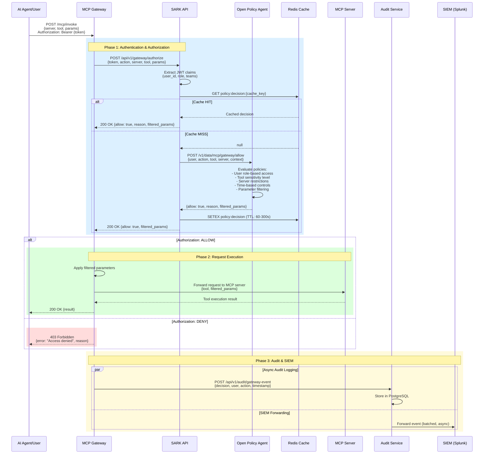
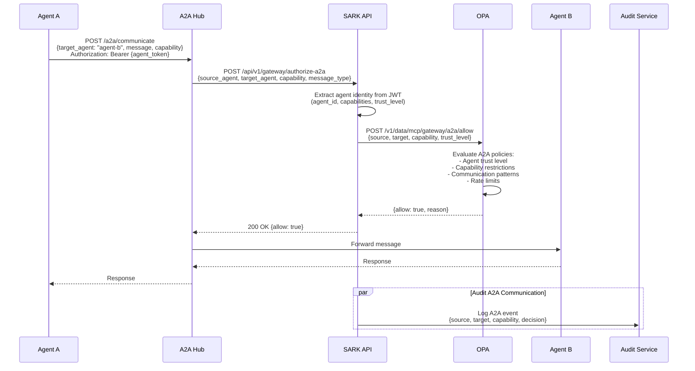

# MCP Gateway Registry Integration Plan

**SARK Enhancement for MCP Gateway Governance**

---

## Executive Summary

This document outlines the implementation plan for integrating SARK with MCP Gateway Registry to provide enterprise-grade governance, security, and policy enforcement for gateway-managed MCP servers and agent-to-agent (A2A) communications.

**Integration Goals:**
- SARK provides **policy enforcement layer** for MCP Gateway Registry
- MCP Gateway handles **routing, discovery, and A2A communication**
- Combined solution delivers **governed gateway access** with zero-trust security

**Key Benefits:**
- Centralized policy enforcement for all gateway-routed requests
- Unified audit trail across gateway and SARK
- Fine-grained authorization for A2A communications
- Enterprise compliance for distributed MCP deployments

---

## 1. Integration Architecture

### 1.1 High-Level Architecture

```mermaid
graph TB
    subgraph "Client Layer"
        AI[AI Agents]
        USER[Human Users]
        TOOL[MCP Clients]
    end

    subgraph "MCP Gateway Registry (Data Plane)"
        NGINX[NGINX Reverse Proxy]
        GW[Gateway Core]
        REG[Server Registry]
        A2A[A2A Communication Hub]
        SEARCH[Semantic Search]
    end

    subgraph "SARK (Control Plane)"
        SARK_API[SARK API Gateway]
        AUTH[Authentication Service]
        AUTHZ[Authorization Service<br/>OPA]
        AUDIT[Audit Service]
        CACHE[Policy Cache<br/>Redis]
        SIEM[SIEM Integration]
    end

    subgraph "MCP Servers"
        MCP1[MCP Server 1]
        MCP2[MCP Server 2]
        MCPN[MCP Server N]
    end

    subgraph "Identity"
        IDP[Identity Provider<br/>OIDC/LDAP/SAML]
    end

    AI --> NGINX
    USER --> NGINX
    TOOL --> NGINX

    NGINX --> GW
    GW --> REG
    GW --> A2A
    GW --> SEARCH

    GW -.->|1. Pre-request authz| SARK_API
    SARK_API --> AUTH
    AUTH --> IDP
    AUTH --> AUTHZ
    AUTHZ --> CACHE
    AUTHZ --> AUDIT
    AUDIT --> SIEM

    GW -->|2. Allowed requests| MCP1
    GW --> MCP2
    GW --> MCPN

    A2A -.->|Agent authz| SARK_API

    style "SARK (Control Plane)" fill:#4a90e2
    style "MCP Gateway Registry (Data Plane)" fill:#50c878
```

### 1.2 Integration Points

| Integration Point | Direction | Purpose |
|------------------|-----------|---------|
| **Gateway → SARK Pre-Authorization** | Gateway calls SARK | Authorize requests before routing to MCP servers |
| **Gateway → SARK Post-Audit** | Gateway calls SARK | Log all gateway operations to SARK audit trail |
| **SARK → Gateway Discovery** | SARK queries Gateway | Discover available servers/tools via Gateway registry |
| **A2A → SARK Authorization** | A2A Hub calls SARK | Authorize agent-to-agent communication requests |
| **SARK Admin → Gateway Management** | SARK provides UI/API | Manage Gateway configuration via SARK |

---

## 2. Data Flow Diagrams

### 2.1 Tool Invocation Flow (Gateway + SARK)



### 2.2 Agent-to-Agent Authorization Flow



---

## 3. Implementation Components

### 3.1 New SARK API Endpoints

#### 3.1.1 Gateway Authorization Endpoint

**File:** `src/sark/api/routers/gateway.py`

```python
@router.post("/authorize")
async def authorize_gateway_request(
    request: GatewayAuthorizationRequest,
    user: UserContext = Depends(get_current_user),
) -> GatewayAuthorizationResponse:
    """
    Authorize MCP Gateway request.

    Called by Gateway before routing requests to MCP servers.
    """
```

**Request Model:**
```python
class GatewayAuthorizationRequest(BaseModel):
    action: str  # "tool:invoke", "server:list", "tool:discover"
    server_name: str | None = None
    tool_name: str | None = None
    parameters: dict[str, Any] = {}
    gateway_metadata: dict[str, Any] = {}  # Gateway-specific context
```

**Response Model:**
```python
class GatewayAuthorizationResponse(BaseModel):
    allow: bool
    reason: str
    filtered_parameters: dict[str, Any] | None = None
    audit_id: str
    cache_ttl: int  # Suggest cache TTL to Gateway
```

#### 3.1.2 A2A Authorization Endpoint

**File:** `src/sark/api/routers/gateway.py`

```python
@router.post("/authorize-a2a")
async def authorize_a2a_communication(
    request: A2AAuthorizationRequest,
    agent: AgentContext = Depends(get_current_agent),
) -> GatewayAuthorizationResponse:
    """
    Authorize agent-to-agent communication.

    Called by A2A Hub before routing messages between agents.
    """
```

**Request Model:**
```python
class A2AAuthorizationRequest(BaseModel):
    source_agent_id: str
    target_agent_id: str
    capability: str  # "execute", "query", "delegate"
    message_type: str  # "request", "response", "notification"
    payload_metadata: dict[str, Any] = {}
```

#### 3.1.3 Gateway Discovery Endpoint

**File:** `src/sark/api/routers/gateway.py`

```python
@router.get("/servers")
async def list_gateway_servers(
    user: UserContext = Depends(get_current_user),
    gateway_client: GatewayClient = Depends(get_gateway_client),
) -> list[GatewayServerInfo]:
    """
    List MCP servers available via Gateway, filtered by user permissions.
    """

@router.get("/tools")
async def list_gateway_tools(
    server_name: str | None = None,
    user: UserContext = Depends(get_current_user),
) -> list[GatewayToolInfo]:
    """
    List tools available via Gateway, filtered by authorization.
    """
```

#### 3.1.4 Gateway Audit Endpoint

**File:** `src/sark/api/routers/gateway.py`

```python
@router.post("/audit")
async def log_gateway_event(
    event: GatewayAuditEvent,
    gateway_auth: str = Depends(verify_gateway_auth),
) -> AuditResponse:
    """
    Log Gateway operation to SARK audit trail.

    Requires Gateway API key authentication.
    """
```

### 3.2 OPA Policy Extensions

#### 3.2.1 Gateway Authorization Policy

**File:** `opa/policies/gateway_authorization.rego`

```rego
package mcp.gateway

import future.keywords.if
import future.keywords.in

default allow := false

# ============================================================================
# Gateway Tool Invocation Authorization
# ============================================================================

# Admins can invoke any non-critical tool via gateway
allow if {
    input.action == "gateway:tool:invoke"
    input.user.role == "admin"
    input.tool.sensitivity_level != "critical"
    is_work_hours(input.context.timestamp)
}

# Developers can invoke low/medium sensitivity tools
allow if {
    input.action == "gateway:tool:invoke"
    input.user.role in ["developer", "engineer"]
    input.tool.sensitivity_level in ["low", "medium"]
    server_access_allowed(input.user, input.server)
}

# Team-based access for gateway-managed tools
allow if {
    input.action == "gateway:tool:invoke"
    some team_id in input.user.teams
    team_id in input.server.authorized_teams
    input.tool.sensitivity_level in ["low", "medium", "high"]
}

# ============================================================================
# Gateway Discovery Authorization
# ============================================================================

allow if {
    input.action == "gateway:server:list"
    input.user.role in ["admin", "developer", "viewer"]
}

allow if {
    input.action == "gateway:tool:discover"
    input.user.role in ["admin", "developer"]
}

# ============================================================================
# Parameter Filtering
# ============================================================================

filtered_parameters := sanitized if {
    input.action == "gateway:tool:invoke"
    allow
    sanitized := filter_sensitive_params(input.parameters, input.tool.sensitive_params)
}

filtered_parameters := input.parameters if {
    allow
    not input.tool.sensitive_params
}

# ============================================================================
# Helper Functions
# ============================================================================

server_access_allowed(user, server) if {
    # Server has no restrictions
    not server.access_restrictions
}

server_access_allowed(user, server) if {
    # User's team is in server's authorized teams
    some team_id in user.teams
    team_id in server.authorized_teams
}

filter_sensitive_params(params, sensitive_keys) := filtered if {
    filtered := {k: v |
        some k, v in params
        not k in sensitive_keys
    }
}

# ============================================================================
# Audit Reason
# ============================================================================

audit_reason := sprintf("Gateway %s allowed for %s (role: %s)",
    [input.action, input.user.id, input.user.role]) if {
    allow
}

audit_reason := sprintf("Gateway %s denied for %s (insufficient permissions)",
    [input.action, input.user.id]) if {
    not allow
}
```

#### 3.2.2 A2A Authorization Policy

**File:** `opa/policies/a2a_authorization.rego`

```rego
package mcp.gateway.a2a

import future.keywords.if
import future.keywords.in

default allow := false

# ============================================================================
# Agent-to-Agent Communication Authorization
# ============================================================================

# Trusted agents can communicate with each other
allow if {
    input.source_agent.trust_level == "trusted"
    input.target_agent.trust_level == "trusted"
    input.capability in input.source_agent.capabilities
    not is_restricted_communication(input)
}

# Service agents can execute on worker agents
allow if {
    input.source_agent.type == "service"
    input.target_agent.type == "worker"
    input.capability == "execute"
    input.message_type in ["request", "command"]
}

# Query-only agents can only perform queries
allow if {
    input.source_agent.capabilities == ["query"]
    input.capability == "query"
    input.message_type == "request"
}

# ============================================================================
# Restrictions
# ============================================================================

is_restricted_communication(input) if {
    # Block cross-environment communication (prod <-> dev)
    input.source_agent.environment != input.target_agent.environment
}

is_restricted_communication(input) if {
    # Block if source agent is rate-limited
    input.source_agent.rate_limited == true
}

# ============================================================================
# Audit Reason
# ============================================================================

audit_reason := sprintf("A2A %s:%s->%s allowed (trust: %s)",
    [input.capability, input.source_agent.id, input.target_agent.id,
     input.source_agent.trust_level]) if {
    allow
}

audit_reason := sprintf("A2A %s:%s->%s denied",
    [input.capability, input.source_agent.id, input.target_agent.id]) if {
    not allow
}
```

### 3.3 Data Models

#### 3.3.1 Gateway Integration Models

**File:** `src/sark/models/gateway.py`

```python
from pydantic import BaseModel, Field
from typing import Any
from uuid import UUID

class GatewayServerInfo(BaseModel):
    """Gateway-managed MCP server information."""

    server_id: str
    server_name: str
    server_url: str
    sensitivity_level: str
    authorized_teams: list[str] = []
    access_restrictions: dict[str, Any] | None = None
    health_status: str
    tools_count: int

class GatewayToolInfo(BaseModel):
    """Gateway-discovered tool information."""

    tool_name: str
    server_name: str
    description: str
    sensitivity_level: str
    parameters: list[dict[str, Any]]
    sensitive_params: list[str] = []

class AgentContext(BaseModel):
    """Agent authentication context for A2A."""

    agent_id: str
    agent_type: str  # "service", "worker", "query"
    trust_level: str  # "trusted", "limited", "untrusted"
    capabilities: list[str]
    environment: str
    rate_limited: bool = False

class GatewayAuditEvent(BaseModel):
    """Audit event from Gateway."""

    event_type: str  # "tool_invoke", "a2a_communication", "discovery"
    user_id: str | None = None
    agent_id: str | None = None
    server_name: str | None = None
    tool_name: str | None = None
    decision: str  # "allow" or "deny"
    reason: str
    timestamp: int
    gateway_request_id: str
    metadata: dict[str, Any] = {}
```

### 3.4 Gateway Client Service

**File:** `src/sark/services/gateway/client.py`

```python
"""Client for interacting with MCP Gateway Registry."""

import httpx
from typing import Any
import structlog

from sark.config import get_settings
from sark.models.gateway import GatewayServerInfo, GatewayToolInfo

logger = structlog.get_logger()
settings = get_settings()


class GatewayClient:
    """Client for MCP Gateway Registry API."""

    def __init__(
        self,
        gateway_url: str | None = None,
        api_key: str | None = None,
        timeout: float = 10.0,
    ) -> None:
        self.gateway_url = gateway_url or settings.gateway_url
        self.api_key = api_key or settings.gateway_api_key
        self.timeout = timeout
        self.client = httpx.AsyncClient(
            timeout=self.timeout,
            headers={"Authorization": f"Bearer {self.api_key}"},
        )

    async def list_servers(self) -> list[GatewayServerInfo]:
        """List all MCP servers registered with Gateway."""
        try:
            response = await self.client.get(f"{self.gateway_url}/api/servers")
            response.raise_for_status()

            servers_data = response.json()
            return [GatewayServerInfo(**s) for s in servers_data]

        except httpx.HTTPError as e:
            logger.error("gateway_list_servers_failed", error=str(e))
            raise

    async def list_tools(
        self,
        server_name: str | None = None
    ) -> list[GatewayToolInfo]:
        """List tools available via Gateway."""
        try:
            url = f"{self.gateway_url}/api/tools"
            params = {"server": server_name} if server_name else {}

            response = await self.client.get(url, params=params)
            response.raise_for_status()

            tools_data = response.json()
            return [GatewayToolInfo(**t) for t in tools_data]

        except httpx.HTTPError as e:
            logger.error("gateway_list_tools_failed", error=str(e))
            raise

    async def get_server_info(self, server_name: str) -> GatewayServerInfo:
        """Get detailed information about a specific server."""
        try:
            response = await self.client.get(
                f"{self.gateway_url}/api/servers/{server_name}"
            )
            response.raise_for_status()

            return GatewayServerInfo(**response.json())

        except httpx.HTTPError as e:
            logger.error("gateway_get_server_failed", error=str(e))
            raise

    async def close(self) -> None:
        """Close HTTP client."""
        await self.client.aclose()
```

### 3.5 Configuration Extensions

**File:** `src/sark/config.py` (additions)

```python
class Settings(BaseSettings):
    # ... existing settings ...

    # MCP Gateway Integration
    gateway_enabled: bool = Field(
        default=False,
        description="Enable MCP Gateway integration",
    )
    gateway_url: str = Field(
        default="http://gateway:8080",
        description="MCP Gateway Registry URL",
    )
    gateway_api_key: str = Field(
        default="",
        description="API key for Gateway authentication",
    )
    gateway_timeout_seconds: float = Field(
        default=10.0,
        description="Gateway API request timeout",
    )

    # A2A Authorization
    a2a_enabled: bool = Field(
        default=False,
        description="Enable Agent-to-Agent authorization",
    )
    a2a_trust_levels: list[str] = Field(
        default=["trusted", "limited", "untrusted"],
        description="Valid agent trust levels",
    )
```

---

## 4. Implementation Phases

### Phase 1: Foundation (Week 1-2)

**Objectives:**
- Set up Gateway integration infrastructure
- Implement basic authorization endpoint
- Create OPA policies for gateway requests

**Deliverables:**
- [ ] Gateway client service (`gateway/client.py`)
- [ ] Gateway router with `/authorize` endpoint
- [ ] Base OPA policy (`gateway_authorization.rego`)
- [ ] Data models for Gateway integration
- [ ] Configuration settings for Gateway URL/credentials
- [ ] Unit tests for Gateway client
- [ ] Integration test with mock Gateway

**Acceptance Criteria:**
- SARK can connect to Gateway API
- Basic authorization flow works (allow/deny)
- OPA policy evaluates Gateway requests correctly

### Phase 2: Tool Invocation Authorization (Week 3-4)

**Objectives:**
- Implement full tool invocation authorization flow
- Add parameter filtering
- Integrate with existing audit system

**Deliverables:**
- [ ] Enhanced OPA policies with sensitivity levels
- [ ] Parameter filtering logic in OPA
- [ ] Gateway audit event logging
- [ ] SIEM integration for Gateway events
- [ ] Cache optimization for Gateway requests
- [ ] Documentation for Gateway authorization
- [ ] Load testing with 1000+ req/s

**Acceptance Criteria:**
- Tool invocation requests are authorized in <50ms
- Sensitive parameters are filtered correctly
- All Gateway events are audited to PostgreSQL and SIEM
- Policy cache hit rate >90%

### Phase 3: A2A Authorization (Week 5-6)

**Objectives:**
- Implement agent-to-agent authorization
- Add agent trust level management
- Create A2A audit trail

**Deliverables:**
- [ ] A2A authorization endpoint (`/authorize-a2a`)
- [ ] A2A OPA policies (`a2a_authorization.rego`)
- [ ] Agent identity extraction from JWT
- [ ] Agent trust level management API
- [ ] A2A-specific audit events
- [ ] Documentation for A2A integration

**Acceptance Criteria:**
- A2A requests are authorized based on trust levels
- Agent capabilities are enforced
- Cross-environment communication is blocked
- A2A events appear in audit trail

### Phase 4: Discovery Integration (Week 7)

**Objectives:**
- Integrate Gateway server/tool discovery
- Add user-specific filtering
- Create unified discovery API

**Deliverables:**
- [ ] Gateway discovery endpoints (`/gateway/servers`, `/gateway/tools`)
- [ ] User permission-based filtering
- [ ] Semantic search integration (optional)
- [ ] Discovery API documentation
- [ ] Frontend integration (if applicable)

**Acceptance Criteria:**
- Users see only servers/tools they're authorized to access
- Discovery queries are fast (<100ms)
- Results are accurate and up-to-date

### Phase 5: Production Hardening (Week 8-9)

**Objectives:**
- Performance optimization
- Security hardening
- Operational readiness

**Deliverables:**
- [ ] Circuit breaker for Gateway API calls
- [ ] Retry logic with exponential backoff
- [ ] Rate limiting for Gateway endpoints
- [ ] Monitoring dashboards (Grafana)
- [ ] Alerting rules (Prometheus)
- [ ] Runbook for Gateway integration
- [ ] Security audit and penetration testing
- [ ] Load testing report (5000+ req/s)

**Acceptance Criteria:**
- P95 latency <100ms under load
- Circuit breaker activates on Gateway failures
- All critical paths have alerts configured
- Security scan shows 0 P0/P1 vulnerabilities

### Phase 6: Documentation & Training (Week 10)

**Objectives:**
- Comprehensive documentation
- Team training
- Deployment guides

**Deliverables:**
- [ ] Integration architecture guide
- [ ] Deployment guide for Gateway + SARK
- [ ] OPA policy authoring guide for Gateway
- [ ] Troubleshooting guide
- [ ] API reference documentation
- [ ] Training materials for ops team

**Acceptance Criteria:**
- Documentation is complete and reviewed
- Ops team can deploy and manage integration
- Developers can write custom policies

---

## 5. Deployment Architecture

### 5.1 Combined Deployment Diagram

```mermaid
graph TB
    subgraph "Load Balancer Layer"
        LB[Load Balancer<br/>NGINX/HAProxy]
    end

    subgraph "Gateway Tier"
        GW1[Gateway Instance 1]
        GW2[Gateway Instance 2]
        GW3[Gateway Instance N]
    end

    subgraph "SARK Tier"
        SARK1[SARK Instance 1]
        SARK2[SARK Instance 2]
        SARK3[SARK Instance N]
    end

    subgraph "Policy Tier"
        OPA1[OPA Instance 1]
        OPA2[OPA Instance 2]
        OPA3[OPA Instance N]
    end

    subgraph "Data Tier"
        REDIS[(Redis Cluster<br/>Policy Cache)]
        PG[(PostgreSQL<br/>Audit + Metadata)]
        TS[(TimescaleDB<br/>Audit Archive)]
    end

    subgraph "Identity Tier"
        KEYCLOAK[Keycloak/Cognito<br/>Identity Provider]
    end

    subgraph "Observability"
        PROM[Prometheus]
        GRAF[Grafana]
        SPLUNK[Splunk/Datadog]
    end

    LB --> GW1
    LB --> GW2
    LB --> GW3

    GW1 -.->|Authorize| SARK1
    GW2 -.->|Authorize| SARK2
    GW3 -.->|Authorize| SARK3

    SARK1 --> OPA1
    SARK2 --> OPA2
    SARK3 --> OPA3

    SARK1 --> REDIS
    SARK2 --> REDIS
    SARK3 --> REDIS

    SARK1 --> PG
    SARK2 --> PG
    SARK3 --> PG

    PG --> TS

    SARK1 --> KEYCLOAK
    SARK2 --> KEYCLOAK

    GW1 --> PROM
    SARK1 --> PROM
    PROM --> GRAF

    SARK1 --> SPLUNK

    style "SARK Tier" fill:#4a90e2
    style "Gateway Tier" fill:#50c878
```

### 5.2 Kubernetes Deployment

**File:** `k8s/gateway-integration/deployment.yaml`

```yaml
apiVersion: v1
kind: ConfigMap
metadata:
  name: sark-gateway-config
  namespace: mcp-platform
data:
  GATEWAY_ENABLED: "true"
  GATEWAY_URL: "http://mcp-gateway.mcp-platform.svc.cluster.local:8080"
  A2A_ENABLED: "true"

---
apiVersion: v1
kind: Secret
metadata:
  name: sark-gateway-secret
  namespace: mcp-platform
type: Opaque
stringData:
  GATEWAY_API_KEY: "<generated-api-key>"

---
apiVersion: apps/v1
kind: Deployment
metadata:
  name: sark-with-gateway
  namespace: mcp-platform
spec:
  replicas: 3
  selector:
    matchLabels:
      app: sark
      tier: api
  template:
    metadata:
      labels:
        app: sark
        tier: api
    spec:
      containers:
      - name: sark
        image: sark:latest
        ports:
        - containerPort: 8000
        env:
        - name: GATEWAY_ENABLED
          valueFrom:
            configMapKeyRef:
              name: sark-gateway-config
              key: GATEWAY_ENABLED
        - name: GATEWAY_URL
          valueFrom:
            configMapKeyRef:
              name: sark-gateway-config
              key: GATEWAY_URL
        - name: GATEWAY_API_KEY
          valueFrom:
            secretKeyRef:
              name: sark-gateway-secret
              key: GATEWAY_API_KEY
        resources:
          requests:
            cpu: "500m"
            memory: "512Mi"
          limits:
            cpu: "2000m"
            memory: "2Gi"
        livenessProbe:
          httpGet:
            path: /health
            port: 8000
          initialDelaySeconds: 30
          periodSeconds: 10
        readinessProbe:
          httpGet:
            path: /ready
            port: 8000
          initialDelaySeconds: 10
          periodSeconds: 5
```

---

## 6. Testing Strategy

### 6.1 Unit Tests

**Test Coverage:**
- Gateway client methods (list_servers, list_tools, get_server_info)
- Authorization endpoint logic
- OPA policy evaluation for Gateway requests
- A2A authorization logic
- Parameter filtering

**Files:**
- `tests/unit/services/gateway/test_client.py`
- `tests/unit/api/routers/test_gateway.py`
- `tests/unit/services/policy/test_gateway_policies.py`

### 6.2 Integration Tests

**Test Scenarios:**
- SARK authorizes Gateway tool invocation (allow)
- SARK denies unauthorized Gateway request (deny)
- Parameter filtering removes sensitive fields
- A2A authorization blocks cross-environment communication
- Audit events are logged correctly
- Cache improves performance for repeated requests

**Files:**
- `tests/integration/test_gateway_integration.py`
- `tests/integration/test_a2a_authorization.py`

### 6.3 Performance Tests

**Benchmarks:**
- Authorization latency: P50 <20ms, P95 <50ms, P99 <100ms
- Throughput: 5000+ req/s with 3 SARK instances
- Cache hit rate: >90% for typical workloads
- Gateway discovery: <100ms for 1000+ servers

**Files:**
- `tests/performance/test_gateway_authorization_load.py`

### 6.4 Security Tests

**Scenarios:**
- Unauthorized Gateway requests are rejected
- Expired JWT tokens are rejected
- Parameter injection attempts are blocked
- A2A trust levels are enforced
- SIEM events contain no PII

**Files:**
- `tests/security/test_gateway_security.py`

---

## 7. Monitoring & Observability

### 7.1 Metrics (Prometheus)

```python
# Gateway integration metrics
gateway_authorization_requests_total = Counter(
    "sark_gateway_authz_requests_total",
    "Total Gateway authorization requests",
    ["decision", "action", "server"],
)

gateway_authorization_latency_seconds = Histogram(
    "sark_gateway_authz_latency_seconds",
    "Gateway authorization latency",
    ["action"],
)

gateway_policy_cache_hits_total = Counter(
    "sark_gateway_cache_hits_total",
    "Gateway policy cache hits",
)

a2a_authorization_requests_total = Counter(
    "sark_a2a_authz_requests_total",
    "A2A authorization requests",
    ["decision", "source_type", "target_type"],
)

gateway_client_errors_total = Counter(
    "sark_gateway_client_errors_total",
    "Gateway client errors",
    ["operation", "error_type"],
)
```

### 7.2 Alerts (Prometheus AlertManager)

```yaml
groups:
- name: gateway_integration
  rules:
  - alert: HighGatewayAuthorizationLatency
    expr: histogram_quantile(0.95, sark_gateway_authz_latency_seconds) > 0.1
    for: 5m
    labels:
      severity: warning
    annotations:
      summary: "High Gateway authorization latency"
      description: "P95 latency > 100ms for 5 minutes"

  - alert: GatewayClientErrors
    expr: rate(sark_gateway_client_errors_total[5m]) > 0.1
    for: 2m
    labels:
      severity: critical
    annotations:
      summary: "Gateway client errors detected"
      description: "Error rate > 0.1/s for 2 minutes"

  - alert: LowPolicyCacheHitRate
    expr: rate(sark_gateway_cache_hits_total[10m]) / rate(sark_gateway_authz_requests_total[10m]) < 0.8
    for: 10m
    labels:
      severity: warning
    annotations:
      summary: "Low policy cache hit rate"
      description: "Cache hit rate < 80% for 10 minutes"
```

### 7.3 Dashboards (Grafana)

**Dashboard:** "SARK Gateway Integration"

**Panels:**
1. Authorization Requests (rate)
2. Authorization Latency (P50, P95, P99)
3. Allow/Deny Ratio
4. Cache Hit Rate
5. A2A Requests
6. Gateway Client Errors
7. OPA Policy Evaluation Time
8. Top Denied Requests

---

## 8. Security Considerations

### 8.1 Authentication

**Gateway → SARK:**
- API key authentication for Gateway service account
- Mutual TLS for production deployments
- Short-lived tokens (JWT) for end-users forwarded through Gateway

**A2A Hub → SARK:**
- Agent-specific JWT tokens with capabilities claim
- Trust level validation
- Rate limiting per agent

### 8.2 Authorization

**Defense in Depth:**
1. Gateway authenticates user/agent
2. Gateway calls SARK for authorization
3. SARK validates JWT token
4. OPA evaluates fine-grained policies
5. SARK returns decision + filtered parameters
6. Gateway applies filtering before forwarding to MCP server

### 8.3 Audit & Compliance

**Requirements:**
- All Gateway→SARK authorization requests logged
- All A2A communications logged
- Audit events include: user_id, action, resource, decision, timestamp
- SIEM forwarding for security monitoring
- Immutable audit trail in TimescaleDB

### 8.4 Secrets Management

**Sensitive Data:**
- Gateway API key stored in Kubernetes Secret or Vault
- OPA policies can reference secrets for dynamic authorization
- Parameter filtering removes credentials from tool invocations

---

## 9. Success Metrics

### 9.1 Performance KPIs

| Metric | Target | Measurement |
|--------|--------|-------------|
| **Authorization Latency (P95)** | <50ms | Prometheus histogram |
| **Throughput** | 5000+ req/s | Load testing |
| **Cache Hit Rate** | >90% | Redis metrics |
| **Availability** | 99.9% | Uptime monitoring |

### 9.2 Security KPIs

| Metric | Target | Measurement |
|--------|--------|-------------|
| **Unauthorized Access Attempts** | 0 successful | Audit logs |
| **Policy Violations** | <0.1% false positives | Manual review |
| **Audit Coverage** | 100% of requests | SIEM validation |

### 9.3 Operational KPIs

| Metric | Target | Measurement |
|--------|--------|-------------|
| **Mean Time to Detect (MTTD)** | <5min | Alert latency |
| **Mean Time to Respond (MTTR)** | <15min | Incident response |
| **Policy Update Deployment** | <1min | OPA bundle update |

---

## 10. Rollout Plan

### 10.1 Development Environment

**Week 1-6:**
- Deploy Gateway + SARK integration in dev environment
- Continuous testing and iteration
- Developer feedback loop

### 10.2 Staging Environment

**Week 7-8:**
- Deploy to staging with production-like configuration
- Load testing and performance validation
- Security scanning and penetration testing
- User acceptance testing (UAT)

### 10.3 Production Rollout

**Week 9-10:**

**Phase 1: Canary Deployment (10% traffic)**
- Deploy SARK Gateway integration alongside existing setup
- Route 10% of Gateway requests through SARK authorization
- Monitor for errors and latency issues
- Duration: 48 hours

**Phase 2: Gradual Rollout (50% traffic)**
- Increase to 50% of traffic
- Validate cache performance and OPA stability
- Monitor SIEM events for anomalies
- Duration: 72 hours

**Phase 3: Full Rollout (100% traffic)**
- Route all Gateway requests through SARK
- Enable A2A authorization
- Monitor all metrics continuously
- Prepare rollback plan if needed

---

## 11. Maintenance & Operations

### 11.1 OPA Policy Updates

**Process:**
1. Write new policy in `opa/policies/gateway_*.rego`
2. Test locally with OPA CLI
3. Submit PR with policy + tests
4. CI runs OPA unit tests
5. Deploy to staging
6. Validate in staging
7. Deploy to production (OPA bundle update)
8. Monitor for policy violations

**Rollback:**
- Keep previous 5 policy bundles
- Can rollback in <1 minute via OPA bundle endpoint

### 11.2 Gateway Configuration Changes

**Scenarios:**
- New server added to Gateway → Automatically discovered by SARK
- Server sensitivity level changed → Update OPA policy if needed
- New tool added → No SARK changes required (uses default policies)

### 11.3 Incident Response

**Runbook:** `docs/runbooks/GATEWAY_INTEGRATION_INCIDENTS.md`

**Common Scenarios:**
1. **Gateway authorization failures spike**
   - Check OPA health
   - Check Redis cache connectivity
   - Review recent policy changes
   - Verify Gateway API key validity

2. **High latency in authorization**
   - Check OPA pod CPU/memory
   - Review cache hit rate
   - Check database connection pool
   - Scale OPA horizontally if needed

3. **Audit events not appearing in SIEM**
   - Check Kafka/SIEM forwarder status
   - Review circuit breaker state
   - Check SIEM API credentials
   - Validate network connectivity

---

## 12. Future Enhancements

### 12.1 Short-term (3-6 months)

- **Smart caching:** ML-based cache TTL optimization
- **Policy recommendations:** Analyze audit logs to suggest policy improvements
- **Gateway health monitoring:** Integrate Gateway health checks into SARK
- **Semantic authorization:** Use Gateway's semantic search for policy matching

### 12.2 Long-term (6-12 months)

- **Policy testing framework:** Visual policy testing and simulation
- **Federated authorization:** Multi-region Gateway + SARK deployment
- **Real-time policy updates:** WebSocket-based policy push to OPA
- **AI-powered threat detection:** Anomaly detection in Gateway usage patterns

---

## Appendix A: API Reference

### Gateway Authorization API

**Endpoint:** `POST /api/v1/gateway/authorize`

**Request:**
```json
{
  "action": "gateway:tool:invoke",
  "server_name": "postgres-mcp",
  "tool_name": "execute_query",
  "parameters": {
    "query": "SELECT * FROM users",
    "database": "production"
  },
  "gateway_metadata": {
    "request_id": "gw-req-123",
    "client_ip": "10.0.1.100"
  }
}
```

**Response (Allow):**
```json
{
  "allow": true,
  "reason": "Gateway gateway:tool:invoke allowed for user-123 (role: developer)",
  "filtered_parameters": {
    "query": "SELECT * FROM users",
    "database": "production"
  },
  "audit_id": "audit-789",
  "cache_ttl": 60
}
```

**Response (Deny):**
```json
{
  "allow": false,
  "reason": "Gateway gateway:tool:invoke denied for user-123 (insufficient permissions)",
  "filtered_parameters": null,
  "audit_id": "audit-790",
  "cache_ttl": 0
}
```

---

## Appendix B: Configuration Example

**File:** `.env.gateway`

```bash
# MCP Gateway Integration
GATEWAY_ENABLED=true
GATEWAY_URL=https://gateway.example.com
GATEWAY_API_KEY=gw_sk_live_abc123def456
GATEWAY_TIMEOUT_SECONDS=10.0

# A2A Authorization
A2A_ENABLED=true
A2A_TRUST_LEVELS=trusted,limited,untrusted

# OPA Policy Path for Gateway
OPA_GATEWAY_POLICY_PATH=/v1/data/mcp/gateway/allow
OPA_A2A_POLICY_PATH=/v1/data/mcp/gateway/a2a/allow

# Cache Configuration for Gateway Requests
GATEWAY_CACHE_TTL_CRITICAL=30
GATEWAY_CACHE_TTL_HIGH=60
GATEWAY_CACHE_TTL_MEDIUM=180
GATEWAY_CACHE_TTL_LOW=300
```

---

## Appendix C: Example Integration Code

**Gateway-side integration (pseudocode):**

```python
# In MCP Gateway: Before routing request to MCP server

async def invoke_tool(request: ToolInvocationRequest, user_token: str):
    # Step 1: Authorize with SARK
    sark_response = await http_client.post(
        "https://sark.example.com/api/v1/gateway/authorize",
        headers={"Authorization": f"Bearer {user_token}"},
        json={
            "action": "gateway:tool:invoke",
            "server_name": request.server_name,
            "tool_name": request.tool_name,
            "parameters": request.parameters,
            "gateway_metadata": {
                "request_id": request.id,
                "client_ip": request.client_ip,
            },
        },
    )

    # Step 2: Check authorization decision
    if not sark_response["allow"]:
        raise Forbidden(sark_response["reason"])

    # Step 3: Apply filtered parameters
    filtered_params = sark_response["filtered_parameters"]

    # Step 4: Forward to MCP server
    result = await mcp_client.invoke_tool(
        server=request.server_name,
        tool=request.tool_name,
        parameters=filtered_params,
    )

    # Step 5: Audit to SARK (async)
    asyncio.create_task(
        audit_to_sark(
            event_type="tool_invoke",
            decision="allow",
            request_id=request.id,
            user_token=user_token,
        )
    )

    return result
```

---

**End of Implementation Plan**
