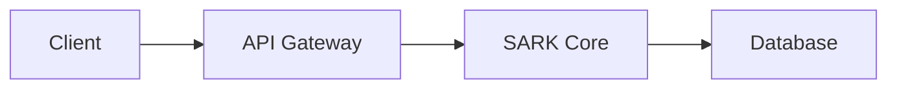

# SARK Documentation

This directory contains the complete documentation for SARK (Security Audit and Resource Kontroler).

## Documentation Structure

The documentation is organized into the following sections:

### Getting Started
- **Quick Start**: 15-minute getting started guide
- **Installation**: Detailed installation instructions
- **Quick Reference**: Quick reference for common tasks

### Architecture
- **Overview**: System architecture and design
- **Security**: Security architecture and best practices
- **Performance**: Performance characteristics and optimization

### Deployment
- **Deployment Guide**: Complete deployment instructions
- **Docker Deployment**: Docker and Docker Compose setup
- **Production Deployment**: Production deployment procedures
- **Production Config**: Production configuration guide
- **Production Readiness**: Production readiness checklist
- **Deployment Checklist**: Pre-deployment checklist
- **Disaster Recovery**: Disaster recovery procedures
- **Rollback Procedures**: Rollback and recovery procedures

### Authentication & Authorization
- **Authentication**: Authentication methods and setup
- **Authorization**: Authorization and policy enforcement
- **OIDC Setup**: OpenID Connect configuration
- **LDAP Setup**: LDAP/Active Directory integration
- **SAML Setup**: SAML 2.0 integration
- **API Keys**: API key management

### Policies
- **OPA Policy Guide**: Open Policy Agent policy authoring
- **Advanced OPA Policies**: Advanced policy patterns
- **Policy Optimization**: Policy performance optimization
- **Policy Caching**: Policy caching strategies
- **Policy Audit Guide**: Policy auditing and compliance
- **Policy Audit Trail**: Audit trail management

### Operations
- **Monitoring**: Monitoring setup and dashboards
- **Monitoring Setup**: Detailed monitoring configuration
- **Operational Runbook**: Day-to-day operations guide
- **Operations Runbook**: Operational procedures
- **Incident Response**: Incident response procedures
- **Troubleshooting**: Common issues and solutions

### Database
- **Database Migrations**: Database schema migrations
- **Database Optimization**: Database performance tuning
- **Redis Optimization**: Redis cache optimization

### Performance
- **Performance Testing**: Performance testing procedures
- **Performance Tuning**: Performance tuning guide
- **Performance Optimization**: Optimization techniques
- **Performance Report**: Performance benchmark results
- **Policy Performance**: Policy evaluation performance

### API Reference
- **API Reference**: Complete API documentation
- **API Integration**: API integration guide

### Development
- **Development Guide**: Development setup and workflow
- **Migration Guide**: Migration and upgrade guide
- **Development Log**: Development history and changes
- **Testing Strategy**: Testing approach and coverage
- **Integration Testing**: Integration test procedures

### Reports
- **Executive Summary**: Project overview
- **Roadmap**: Development roadmap
- **Implementation Plan**: Implementation timeline
- **Gap Analysis**: Feature gap analysis
- **Phase 2 Completion**: Phase 2 completion report
- **Release Notes**: Version release notes
- **Final Test Report**: Final testing results
- **Test Coverage Report**: Test coverage analysis
- **Known Issues**: Known issues and limitations
- **Lessons Learned**: Project lessons learned

### Planning
- **Repository Improvement Plan**: Repository improvement roadmap
- **Work Breakdown Sessions**: Detailed work breakdown
- **Work Tasks**: Task lists and assignments
- **Phase Plans**: Phase-specific plans and summaries

### Reference
- **Glossary**: Terminology and definitions
- **FAQ**: Frequently asked questions
- **Security Best Practices**: Security recommendations
- **Security Hardening**: Security hardening guide
- **Security Audit**: Security audit procedures
- **Production Handoff**: Production handoff checklist

## Building the Documentation

### Local Development

Build and serve the documentation locally:

```bash
# Install dependencies
pip install mkdocs mkdocs-material mkdocs-mermaid2-plugin mkdocs-awesome-pages-plugin pymdown-extensions

# Serve documentation (auto-reloads on changes)
mkdocs serve

# Build static site
mkdocs build

# Or use make commands
make docs-serve  # Serve locally
make docs-build  # Build static site
```

The documentation will be available at http://localhost:8000

### Building for Production

```bash
# Build with strict mode (fails on warnings)
mkdocs build --strict

# Or use make
make docs-build
```

### Deploying to GitHub Pages

```bash
# Deploy to GitHub Pages
mkdocs gh-deploy --force

# Or use make
make docs-deploy
```

The documentation will be published to `https://<username>.github.io/sark/`

## Documentation Tools

This project uses:

- **[MkDocs](https://www.mkdocs.org/)**: Static site generator
- **[Material for MkDocs](https://squidfunk.github.io/mkdocs-material/)**: Modern theme with advanced features
- **[Mermaid](https://mermaid-js.github.io/)**: Diagram and flowchart support
- **[PyMdown Extensions](https://facelessuser.github.io/pymdown-extensions/)**: Markdown extensions for advanced formatting

## Writing Documentation

### Markdown Style Guide

1. **Headings**: Use ATX-style headings (`#`, `##`, `###`)
2. **Code Blocks**: Use fenced code blocks with language specifiers
3. **Links**: Use reference-style links for better readability
4. **Images**: Store images in `docs/images/` directory
5. **Admonitions**: Use for notes, warnings, and tips

### Code Examples

Use syntax highlighting for code blocks:

````markdown
```python
def hello_world():
    print("Hello, SARK!")
```
````

### Diagrams

Use Mermaid for diagrams:

````markdown

````

### Admonitions

Use admonitions for callouts:

```markdown
!!! note "Important Note"
    This is an important note.

!!! warning "Warning"
    This requires careful attention.

!!! tip "Pro Tip"
    This is a helpful tip.
```

### Links

Reference other documentation pages:

```markdown
See the [Deployment Guide](DEPLOYMENT.md) for details.
```

## Continuous Integration

Documentation is automatically built and deployed on:

- **Pull Requests**: Documentation is built and validated
- **Main Branch**: Documentation is built and deployed to GitHub Pages

The CI workflow is defined in `.github/workflows/docs.yml`

## Contributing

When adding or updating documentation:

1. Follow the existing structure and style
2. Test locally with `mkdocs serve` before committing
3. Ensure `mkdocs build --strict` passes without errors
4. Update the navigation in `mkdocs.yml` if adding new pages
5. Add cross-references to related documentation

## Documentation Versioning

Documentation versions are managed using [mike](https://github.com/jimporter/mike):

```bash
# Deploy version
mike deploy --push --update-aliases 0.2.0 latest

# Set default version
mike set-default --push latest

# List versions
mike list
```

## Support

For documentation issues or suggestions:

- Open an [issue on GitHub](https://github.com/apathy-ca/sark/issues)
- Submit a pull request with improvements
- Ask in [GitHub Discussions](https://github.com/apathy-ca/sark/discussions)
