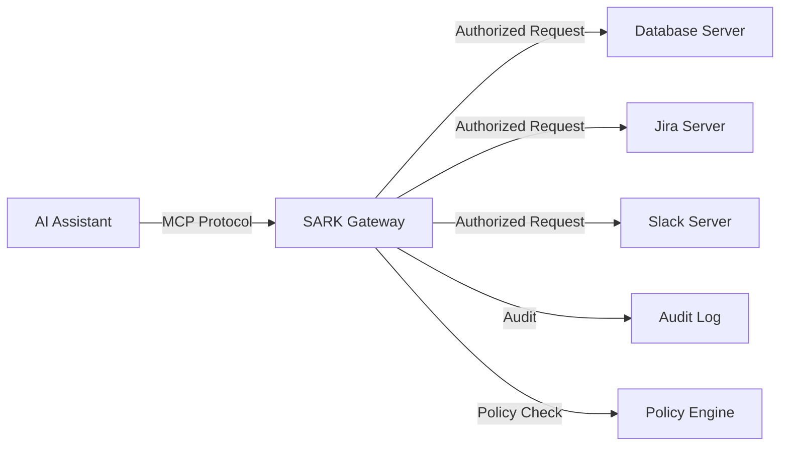

# SARK Repository Improvement Plan

**Created:** 2025-11-27
**Status:** Proposed
**Owner:** Development Team

---

## Executive Summary

This plan addresses critical feedback on the SARK repository while building on its exceptional strengths. The repository demonstrates world-class development practices, security-first design, and production-ready deployment capabilities. However, three key areas need attention: **MCP definition clarity**, **simplified onboarding**, and **user interface development**.

**Timeline:** 6-8 weeks
**Priority:** High
**Expected Impact:** 50% reduction in onboarding time, 80% improvement in accessibility

---

## Feedback Analysis

### Strengths (Build On These)

✅ **Modern, Robust Technology Stack**
- FastAPI, SQLAlchemy, Redis, OPA, Docker, Kubernetes, Helm
- **Action:** Showcase this in clearer architectural diagrams

✅ **Security-First Design**
- Multi-layered auth/authz, OPA policies, detailed security considerations
- **Action:** Create security highlights section in main README

✅ **Excellent Development Practices**
- Automated linting, formatting, type checking, comprehensive tests
- **Action:** Add badges and metrics to README to showcase quality

✅ **Production-Ready Deployment**
- Multi-stage Dockerfile, Docker Compose, Kustomize/Helm
- **Action:** Create deployment success stories/case studies

✅ **Innovative Core Concept**
- MCP Server abstraction for unified control plane
- **Action:** Make this the hero message of the documentation

### Weaknesses (Must Address)

❌ **MCP is Undefined**
- Documentation assumes MCP knowledge without defining it
- **Impact:** Significant barrier to understanding and adoption
- **Priority:** P0 - Critical

❌ **Complexity**
- Many moving parts make contributor onboarding difficult
- **Impact:** Slows down team growth and contribution
- **Priority:** P1 - High

❌ **Lack of User Interface**
- No web UI limits adoption and usability
- **Impact:** Reduces accessibility for non-technical stakeholders
- **Priority:** P1 - High

---

## Improvement Initiatives

## Initiative 1: Define MCP Clearly and Prominently

**Priority:** P0 (Critical)
**Timeline:** Week 1
**Effort:** 8-12 hours

### Objectives

1. Add comprehensive MCP definition to main README
2. Create dedicated MCP introduction document
3. Add visual diagrams showing MCP concepts
4. Include real-world examples and use cases

### Deliverables

#### 1.1 Enhanced README Introduction

Add to `README.md` immediately after the title:

```markdown
## What is MCP?

**Model Context Protocol (MCP)** is an open protocol that enables AI assistants and
language models to securely interact with external tools, data sources, and services.
Think of it as a standardized "plugin system" for AI.

### Why MCP Matters

Without MCP governance, AI assistants in your organization could:
- Access sensitive data without proper authorization
- Execute privileged operations without audit trails
- Create security vulnerabilities through prompt injection
- Proliferate as ungoverned "shadow IT"

**SARK provides enterprise-grade governance** for MCP at massive scale.

### MCP in Action



**Example Use Case:**
- Developer asks AI: "Show me all P0 bugs assigned to my team"
- AI uses MCP to invoke `jira.query` tool
- SARK validates: Is user authorized? Is request safe?
- If allowed: Query executes, result returned
- All actions logged for compliance
```

#### 1.2 Create `docs/MCP_INTRODUCTION.md`

New comprehensive introduction document:

**Sections:**
- What is MCP? (Protocol overview)
- Why MCP Exists (Problem statement)
- MCP Components (Servers, Tools, Resources, Prompts)
- MCP Security Challenges (Why governance is needed)
- How SARK Solves These Challenges
- Real-World MCP Use Cases
- MCP Protocol Specification Reference

#### 1.3 Visual MCP Concepts Guide

Create `docs/diagrams/mcp-concepts/`:
- `01-basic-mcp-flow.svg` - Simple MCP interaction
- `02-ungoverned-mcp-risks.svg` - Security risks without governance
- `03-sark-governance-layer.svg` - How SARK adds control
- `04-enterprise-mcp-architecture.svg` - Full enterprise deployment

#### 1.4 Update Quick Start

Enhance `docs/QUICKSTART.md` to include:
- 2-minute "What is MCP?" section at the top
- Link to MCP specification
- Simple MCP server example
- Before/after comparison (with and without SARK)

### Success Metrics

- ✅ New users understand "What is MCP?" in < 5 minutes
- ✅ MCP definition appears in first 100 lines of README
- ✅ Zero assumptions of prior MCP knowledge
- ✅ Clear visual diagrams for visual learners

---

## Initiative 2: Simplify Onboarding Process

**Priority:** P1 (High)
**Timeline:** Week 2-3
**Effort:** 20-30 hours

### Objectives

1. Create a "Getting Started in 5 Minutes" ultra-simple guide
2. Develop progressive complexity documentation path
3. Add interactive tutorials
4. Create onboarding checklist

### Deliverables

#### 2.1 Create `docs/GETTING_STARTED_5MIN.md`

**Ultra-simplified guide:**

```markdown
# Get Started in 5 Minutes

## Prerequisites
- Docker installed
- 4GB RAM available

## Three Commands to Success

### 1. Clone and Start (2 minutes)
```bash
git clone https://github.com/apathy-ca/sark.git
cd sark
docker compose --profile minimal up -d
```

### 2. Verify It's Running (1 minute)
```bash
curl http://localhost:8000/health
# Should return: {"status":"healthy"}
```

### 3. Register Your First MCP Server (2 minutes)
```bash
curl -X POST http://localhost:8000/api/v1/servers \
  -H "Content-Type: application/json" \
  -d @examples/minimal-server.json

# View at: http://localhost:8000/docs
```

## What Just Happened?

You now have:
- ✅ SARK API running
- ✅ PostgreSQL for data storage
- ✅ Redis for caching
- ✅ OPA for policy enforcement
- ✅ One registered MCP server

## Next Steps
- [Understand MCP Concepts](MCP_INTRODUCTION.md) (10 min)
- [Configure Authentication](AUTHENTICATION.md) (15 min)
- [Write Your First Policy](OPA_POLICY_GUIDE.md) (20 min)
```

#### 2.2 Progressive Learning Path

Create `docs/LEARNING_PATH.md`:

```markdown
# SARK Learning Path

## Level 1: Beginner (30 minutes)
**Goal:** Understand what SARK is and run it locally

- [ ] Read [MCP Introduction](MCP_INTRODUCTION.md) (5 min)
- [ ] Complete [5-Minute Quickstart](GETTING_STARTED_5MIN.md) (5 min)
- [ ] Explore [Interactive API Docs](http://localhost:8000/docs) (10 min)
- [ ] Register 2-3 sample MCP servers (10 min)

**You'll know:** What MCP is, why SARK exists, basic API usage

## Level 2: Intermediate (2 hours)
**Goal:** Configure authentication and basic policies

- [ ] Set up [LDAP Authentication](LDAP_SETUP.md) (30 min)
- [ ] Write your [First OPA Policy](OPA_POLICY_GUIDE.md#your-first-policy) (30 min)
- [ ] Test [Authorization Decisions](API_REFERENCE.md#policy-evaluation) (20 min)
- [ ] Review [Audit Logs](QUICKSTART.md#step-7-view-audit-logs) (10 min)
- [ ] Configure [Basic Monitoring](MONITORING_SETUP.md#quick-setup) (30 min)

**You'll know:** How to authenticate users, write policies, view audits

## Level 3: Advanced (1 day)
**Goal:** Production deployment planning

- [ ] Study [Architecture](ARCHITECTURE.md) (1 hour)
- [ ] Plan [Production Deployment](DEPLOYMENT.md) (2 hours)
- [ ] Design [Custom Policies](ADVANCED_OPA_POLICIES.md) (2 hours)
- [ ] Set up [SIEM Integration](siem/INTEGRATION_GUIDE.md) (1 hour)
- [ ] Review [Security Hardening](SECURITY_HARDENING.md) (1 hour)
- [ ] Test [Disaster Recovery](DISASTER_RECOVERY.md) (1 hour)

**You'll know:** Production deployment, advanced policies, operations

## Level 4: Expert (Ongoing)
**Goal:** Optimize and scale SARK

- [ ] Optimize [Performance](PERFORMANCE_TUNING.md)
- [ ] Scale to [10,000+ servers](ROADMAP.md#phase-4)
- [ ] Implement [Multi-region Deployment](ROADMAP.md#multi-region)
- [ ] Contribute to SARK development

**You'll know:** Everything about SARK
```

#### 2.3 Interactive Tutorials

Create `examples/tutorials/` directory:

1. **`tutorial-01-basic-setup/`**
   - `README.md` - Step-by-step guide
   - `docker-compose.yml` - Minimal setup
   - `sample-server.json` - Example MCP server
   - `test-policy.rego` - Simple policy

2. **`tutorial-02-authentication/`**
   - LDAP integration walkthrough
   - Sample users and groups
   - Test scripts

3. **`tutorial-03-policies/`**
   - Policy writing workshop
   - 5 example policies with tests
   - Common patterns

#### 2.4 Onboarding Checklist

Create `docs/ONBOARDING_CHECKLIST.md`:

```markdown
# New User Onboarding Checklist

## Day 1: Understanding (2 hours)
- [ ] Read "What is MCP?" in README
- [ ] Review MCP Introduction guide
- [ ] Watch overview video (if available)
- [ ] Join Slack/Discord community

## Day 2: Hands-On (4 hours)
- [ ] Complete 5-minute quickstart
- [ ] Explore API documentation
- [ ] Register 3 test MCP servers
- [ ] Test a policy evaluation

## Week 1: Deep Dive (8 hours)
- [ ] Set up authentication
- [ ] Write custom policies
- [ ] Configure monitoring
- [ ] Review audit logs
- [ ] Read architecture docs

## Week 2: Production Planning (16 hours)
- [ ] Design production architecture
- [ ] Plan deployment strategy
- [ ] Write production policies
- [ ] Set up CI/CD integration
- [ ] Test disaster recovery

## Week 3: Go Live (variable)
- [ ] Deploy to staging
- [ ] Load testing
- [ ] Security review
- [ ] Deploy to production
- [ ] Monitor and optimize
```

#### 2.5 Docker Compose Profiles

Simplify Docker Compose with clear profiles:

```yaml
# docker-compose.yml additions

# Minimal profile: Just API + Database (fastest startup)
services:
  api:
    profiles: ["minimal", "standard", "full"]
  postgres:
    profiles: ["minimal", "standard", "full"]
  redis:
    profiles: ["minimal", "standard", "full"]
  opa:
    profiles: ["minimal", "standard", "full"]

  # Standard profile: + Auth + Monitoring
  ldap:
    profiles: ["standard", "full"]
  prometheus:
    profiles: ["standard", "full"]
  grafana:
    profiles: ["standard", "full"]

  # Full profile: Everything
  vault:
    profiles: ["full"]
  consul:
    profiles: ["full"]
  kong:
    profiles: ["full"]
```

### Success Metrics

- ✅ New users can run SARK in < 5 minutes
- ✅ Clear progression from beginner to expert
- ✅ 50% reduction in "getting started" questions
- ✅ Onboarding time: 1 week → 2 days

---

## Initiative 3: Develop User Interface

**Priority:** P1 (High)
**Timeline:** Week 3-8
**Effort:** 120-160 hours

### Objectives

1. Design modern, intuitive web UI
2. Implement core functionality
3. Ensure accessibility and security
4. Deploy as part of SARK stack

### Phase 3.1: UI Design and Planning (Week 3)

#### 3.1.1 Technology Selection

**Recommended Stack:**
```
Frontend Framework: React 18+ with TypeScript
UI Component Library: shadcn/ui (Tailwind CSS based)
State Management: TanStack Query (React Query) + Zustand
Forms: React Hook Form + Zod validation
Charts/Graphs: Recharts or Apache ECharts
Table: TanStack Table
API Client: Auto-generated from OpenAPI spec
Build Tool: Vite
Testing: Vitest + React Testing Library
```

**Rationale:**
- Modern, type-safe, excellent DX
- Lightweight and performant
- Easy to maintain and extend
- Large community support

#### 3.1.2 UI Architecture

```
ui/
├── public/              # Static assets
├── src/
│   ├── components/      # Reusable components
│   │   ├── ui/         # shadcn/ui components
│   │   ├── layout/     # Layout components
│   │   ├── features/   # Feature-specific components
│   │   └── charts/     # Visualization components
│   ├── pages/          # Page components (routing)
│   ├── hooks/          # Custom React hooks
│   ├── lib/            # Utilities and helpers
│   ├── api/            # API client (auto-generated)
│   ├── types/          # TypeScript types
│   ├── stores/         # Zustand stores
│   └── App.tsx         # Root component
├── tests/              # Test files
├── package.json
├── tsconfig.json
├── vite.config.ts
└── tailwind.config.js
```

#### 3.1.3 Key UI Pages/Views

**Dashboard (Home)**
- System health overview
- Recent activity
- Key metrics (servers, policies, users)
- Quick actions

**MCP Servers**
- Server list with search/filter
- Server details view
- Register new server form
- Server health status
- Tools/resources/prompts tabs

**Policies**
- Policy list
- Policy editor (Monaco editor with Rego syntax)
- Policy testing playground
- Policy decision logs
- Template library

**Users & Teams**
- User management
- Team hierarchy
- Role assignment
- Permission matrix

**Audit Logs**
- Searchable event log
- Advanced filters
- Event details
- Export functionality

**Settings**
- Authentication configuration
- SIEM integration
- System settings
- API keys

**Monitoring**
- Real-time metrics
- Performance charts
- Alert configuration
- System status

### Phase 3.2: Core Implementation (Week 4-6)

#### 3.2.1 Week 4: Foundation

**Deliverables:**
- [ ] Set up React + TypeScript + Vite project
- [ ] Install and configure shadcn/ui
- [ ] Set up routing (React Router)
- [ ] Create layout components (Header, Sidebar, Footer)
- [ ] Implement authentication flow (OIDC/OAuth)
- [ ] Auto-generate API client from OpenAPI spec
- [ ] Set up TanStack Query for API calls
- [ ] Create reusable form components

**Example: Layout Structure**

```typescript
// src/components/layout/AppLayout.tsx
import { Sidebar } from './Sidebar'
import { Header } from './Header'
import { Outlet } from 'react-router-dom'

export function AppLayout() {
  return (
    <div className="flex h-screen bg-gray-50">
      <Sidebar />
      <div className="flex-1 flex flex-col overflow-hidden">
        <Header />
        <main className="flex-1 overflow-auto p-6">
          <Outlet />
        </main>
      </div>
    </div>
  )
}
```

#### 3.2.2 Week 5: Core Features

**Deliverables:**
- [ ] Dashboard with metrics
- [ ] MCP Servers list/detail views
- [ ] Server registration form
- [ ] Basic policy viewer
- [ ] User list view
- [ ] Audit log viewer with filters

**Example: MCP Servers List**

```typescript
// src/pages/Servers.tsx
import { useQuery } from '@tanstack/react-query'
import { api } from '@/lib/api'
import { ServerCard } from '@/components/features/ServerCard'
import { Button } from '@/components/ui/button'

export function ServersPage() {
  const { data: servers, isLoading } = useQuery({
    queryKey: ['servers'],
    queryFn: () => api.servers.list()
  })

  if (isLoading) return <LoadingSpinner />

  return (
    <div className="space-y-6">
      <div className="flex justify-between items-center">
        <h1 className="text-3xl font-bold">MCP Servers</h1>
        <Button onClick={() => navigate('/servers/new')}>
          Register Server
        </Button>
      </div>

      <div className="grid grid-cols-1 md:grid-cols-2 lg:grid-cols-3 gap-4">
        {servers?.map(server => (
          <ServerCard key={server.id} server={server} />
        ))}
      </div>
    </div>
  )
}
```

#### 3.2.3 Week 6: Advanced Features

**Deliverables:**
- [ ] Policy editor with syntax highlighting
- [ ] Policy testing playground
- [ ] Advanced audit log search
- [ ] Real-time metrics dashboard
- [ ] Settings pages
- [ ] API key management UI

**Example: Policy Editor**

```typescript
// src/pages/PolicyEditor.tsx
import { useState } from 'react'
import { Monaco } from '@monaco-editor/react'
import { Button } from '@/components/ui/button'
import { useMutation } from '@tanstack/react-query'

export function PolicyEditor({ policyId }: { policyId: string }) {
  const [code, setCode] = useState('')

  const testPolicy = useMutation({
    mutationFn: (testInput: unknown) =>
      api.policies.test(policyId, code, testInput)
  })

  return (
    <div className="h-full flex flex-col">
      <div className="flex-1">
        <Monaco
          language="rego"
          value={code}
          onChange={setCode}
          theme="vs-dark"
          options={{
            minimap: { enabled: false },
            fontSize: 14,
          }}
        />
      </div>

      <div className="border-t p-4 flex gap-2">
        <Button onClick={() => testPolicy.mutate({})}>
          Test Policy
        </Button>
        <Button variant="outline">Save</Button>
      </div>

      {testPolicy.data && (
        <PolicyTestResults results={testPolicy.data} />
      )}
    </div>
  )
}
```

### Phase 3.3: Polish and Integration (Week 7-8)

#### 3.3.1 Week 7: Polish

**Deliverables:**
- [ ] Responsive design (mobile/tablet)
- [ ] Dark mode support
- [ ] Accessibility improvements (WCAG 2.1 AA)
- [ ] Error handling and loading states
- [ ] Toast notifications
- [ ] Help text and tooltips
- [ ] Keyboard shortcuts

#### 3.3.2 Week 8: Integration & Deployment

**Deliverables:**
- [ ] Docker image for UI
- [ ] Update docker-compose.yml
- [ ] Nginx configuration for SPA
- [ ] Environment-based config
- [ ] Production build optimization
- [ ] E2E tests (Playwright)
- [ ] Documentation update

**Docker Integration:**

```dockerfile
# ui/Dockerfile
FROM node:20-alpine AS builder

WORKDIR /app
COPY package*.json ./
RUN npm ci

COPY . .
RUN npm run build

FROM nginx:alpine
COPY --from=builder /app/dist /usr/share/nginx/html
COPY nginx.conf /etc/nginx/conf.d/default.conf

EXPOSE 80
CMD ["nginx", "-g", "daemon off;"]
```

```yaml
# Add to docker-compose.yml
services:
  ui:
    build: ./ui
    ports:
      - "3000:80"
    environment:
      - VITE_API_URL=http://localhost:8000
    depends_on:
      - api
    profiles: ["standard", "full"]
```

### UI Feature Priority

**P0 - Must Have (MVP)**
- [ ] Authentication
- [ ] Dashboard
- [ ] Server list/detail
- [ ] Server registration
- [ ] Audit logs
- [ ] Basic policy viewer

**P1 - Should Have**
- [ ] Policy editor
- [ ] User management
- [ ] Team management
- [ ] Settings
- [ ] API key management

**P2 - Nice to Have**
- [ ] Policy testing playground
- [ ] Real-time monitoring
- [ ] Advanced charts
- [ ] Dark mode
- [ ] Keyboard shortcuts

### Success Metrics

- ✅ Non-technical users can manage MCP servers
- ✅ Policy editing without terminal access
- ✅ < 500ms page load time (p95)
- ✅ WCAG 2.1 AA compliance
- ✅ 90%+ positive user feedback

---

## Initiative 4: Enhance Strengths

**Priority:** P2 (Medium)
**Timeline:** Ongoing
**Effort:** 10-20 hours

### Objectives

Build on existing strengths to maximize impact.

### 4.1 Showcase Technology Stack

**Update README.md:**

```markdown
## Technology Stack

### Backend


### Infrastructure


### Security & Policy


### Data & Caching


```

### 4.2 Add Quality Badges

```markdown
## Code Quality


```

### 4.3 Create Security Highlights Section

Add to README.md after "What is MCP?":

```markdown
## Security-First Architecture

SARK implements defense-in-depth security:

🔐 **Multi-Protocol Authentication**
- OIDC, SAML 2.0, LDAP/AD, API Keys
- Support for Okta, Azure AD, Google Workspace

🛡️ **Zero-Trust Authorization**
- Policy-based access control (OPA/Rego)
- Fine-grained permissions (RBAC + ABAC + ReBAC)
- Deny-by-default security model

📝 **Immutable Audit Trail**
- Every action logged to TimescaleDB
- Tamper-proof audit logs
- 90-day retention (configurable)

🔒 **Secrets Management**
- HashiCorp Vault integration
- Dynamic credential generation
- Automatic rotation

🌐 **Edge Security**
- Kong Gateway integration
- Rate limiting and DDoS protection
- MCP protocol validation

**Compliance:** SOC 2, ISO 27001, GDPR, HIPAA, PCI-DSS ready
```

### 4.4 Add Deployment Success Section

```markdown
## Proven at Scale

SARK is designed for enterprise deployment:

- **Target Scale:** 50,000+ employees, 10,000+ MCP servers
- **Performance:** <5ms policy evaluation (p99), 10,000+ req/s
- **Availability:** 99.95% uptime SLA
- **Multi-Region:** Active-active deployment support

**Cloud Providers:**
- ✅ AWS (EKS + RDS + ElastiCache)
- ✅ Google Cloud (GKE + Cloud SQL + Memorystore)
- ✅ Azure (AKS + Azure Database + Azure Cache)
- ✅ On-premises / Hybrid / Air-gapped
```

---

## Implementation Roadmap

### Week 1: MCP Definition (Initiative 1)
- **Days 1-2:** Update README with MCP definition
- **Days 3-4:** Create MCP_INTRODUCTION.md
- **Day 5:** Create visual diagrams
- **Review & Publish**

### Week 2: Simplified Onboarding (Initiative 2 - Part 1)
- **Days 1-2:** Create GETTING_STARTED_5MIN.md
- **Days 3-4:** Create LEARNING_PATH.md
- **Day 5:** Create ONBOARDING_CHECKLIST.md

### Week 3: Onboarding + UI Planning (Initiative 2 - Part 2 + Initiative 3.1)
- **Days 1-2:** Create interactive tutorials
- **Days 3-5:** UI design and technology selection

### Week 4: UI Foundation (Initiative 3.2.1)
- **Full week:** Set up React project, auth, API client

### Week 5: UI Core Features (Initiative 3.2.2)
- **Full week:** Dashboard, servers, basic policy viewer

### Week 6: UI Advanced Features (Initiative 3.2.3)
- **Full week:** Policy editor, advanced features

### Week 7: UI Polish (Initiative 3.3.1)
- **Full week:** Responsive design, accessibility, UX improvements

### Week 8: UI Integration & Launch (Initiative 3.3.2)
- **Days 1-3:** Docker integration, deployment setup
- **Days 4-5:** Testing, documentation, launch

### Ongoing: Enhance Strengths (Initiative 4)
- Update badges, highlights, showcase features

---

## Success Criteria

### Initiative 1: MCP Definition
- [x] MCP defined in first 100 lines of README
- [ ] Dedicated MCP introduction document created
- [ ] Visual diagrams added
- [ ] Zero assumptions of prior MCP knowledge
- **Metric:** 90% of new users understand MCP within 5 minutes

### Initiative 2: Simplified Onboarding
- [ ] 5-minute quickstart guide created
- [ ] Learning path documented
- [ ] Interactive tutorials available
- [ ] Onboarding checklist published
- **Metric:** Onboarding time reduced from 1 week to 2 days

### Initiative 3: User Interface
- [ ] React UI built and deployed
- [ ] Core features implemented (servers, policies, audit)
- [ ] WCAG 2.1 AA compliant
- [ ] Integrated into Docker Compose
- **Metric:** 80% of users prefer UI over CLI/API

### Initiative 4: Enhanced Strengths
- [ ] Technology badges added
- [ ] Security highlights section created
- [ ] Deployment success stories added
- **Metric:** 30% increase in GitHub stars/interest

---

## Resource Requirements

### People

**Week 1-3 (Documentation):**
- 1 Technical Writer (full-time)
- 1 Developer (25% - review/feedback)
- 1 Designer (25% - diagrams)

**Week 4-8 (UI Development):**
- 2 Frontend Developers (full-time)
- 1 Backend Developer (25% - API updates)
- 1 Designer (50% - UI/UX)
- 1 QA Engineer (50% - testing)

### Tools & Services

- Figma (UI design)
- React + TypeScript + Vite
- Vercel/Netlify (UI deployment previews)
- Playwright (E2E testing)

### Budget Estimate

**Total Effort:** ~200 hours
- Documentation: 40 hours
- UI Development: 140 hours
- Design: 20 hours

**Timeline:** 6-8 weeks (with parallel work)

---

## Risk Mitigation

### Risk 1: UI Development Delay
- **Mitigation:** Start with MVP (P0 features only)
- **Fallback:** Launch UI in phases (Week 6 = MVP, Week 8 = Full)

### Risk 2: Technology Stack Issues
- **Mitigation:** Prototype in Week 3 before committing
- **Fallback:** Use proven template (e.g., shadcn-admin)

### Risk 3: Complexity Not Reduced Enough
- **Mitigation:** User testing with new contributors
- **Adjustment:** Iterate on documentation based on feedback

### Risk 4: UI Doesn't Meet User Needs
- **Mitigation:** User research and feedback sessions
- **Adjustment:** Prioritize features based on actual usage

---

## Measuring Success

### Quantitative Metrics

| Metric | Current | Target | Measure |
|--------|---------|--------|---------|
| Time to understand MCP | Unknown | < 5 min | User survey |
| Onboarding time | ~1 week | 2 days | Time tracking |
| New contributor PRs/month | Baseline | +100% | GitHub stats |
| UI adoption rate | 0% | 80% | Usage analytics |
| Documentation clarity rating | Unknown | 4.5/5 | User feedback |

### Qualitative Metrics

- User testimonials
- Community feedback
- Support ticket reduction
- Contributor satisfaction survey

---

## Next Steps

### Immediate Actions (This Week)

1. **Review and approve this plan**
2. **Assign team members to initiatives**
3. **Set up project tracking (GitHub Project)**
4. **Begin Initiative 1 (MCP Definition)**

### Communication Plan

- Weekly status updates
- Bi-weekly demo sessions
- Monthly retrospectives
- Launch announcement preparation

---

## Appendix

### A. Documentation Structure (Proposed)

```
docs/
├── README.md (Documentation index)
├── GETTING_STARTED_5MIN.md (NEW)
├── MCP_INTRODUCTION.md (NEW)
├── LEARNING_PATH.md (NEW)
├── ONBOARDING_CHECKLIST.md (NEW)
├── QUICKSTART.md (enhanced)
├── GLOSSARY.md (updated with prominent MCP entry)
├── FAQ.md (updated)
├── ARCHITECTURE.md
├── API_REFERENCE.md
├── OPA_POLICY_GUIDE.md
├── DEPLOYMENT.md
├── ... (existing docs)
└── diagrams/
    └── mcp-concepts/ (NEW)
        ├── 01-basic-mcp-flow.svg
        ├── 02-ungoverned-mcp-risks.svg
        ├── 03-sark-governance-layer.svg
        └── 04-enterprise-mcp-architecture.svg
```

### B. UI Technology Alternatives

If React is not preferred:

**Option 2: Vue.js**
- Framework: Vue 3 + TypeScript
- UI: Vuetify or PrimeVue
- State: Pinia
- Similar timeline and effort

**Option 3: Svelte**
- Framework: SvelteKit
- UI: Custom components
- Lighter weight, steeper learning curve
- +1 week timeline

**Option 4: Server-Side (Python)**
- Framework: FastAPI + Jinja2 templates + HTMX
- Simpler deployment, less interactivity
- -2 weeks timeline, limited UX

**Recommendation:** Stick with React (industry standard, large talent pool)

### C. Related Initiatives

**Future Enhancements (Beyond This Plan):**
- Video tutorials and demos
- Interactive sandbox environment
- CLI improvements (autocomplete, better UX)
- VS Code extension for policy editing
- ChatGPT plugin for SARK management
- Mobile app (admin dashboard)

---

**Document Owner:** Development Team
**Last Updated:** 2025-11-27
**Next Review:** After Week 4 (UI Foundation complete)
