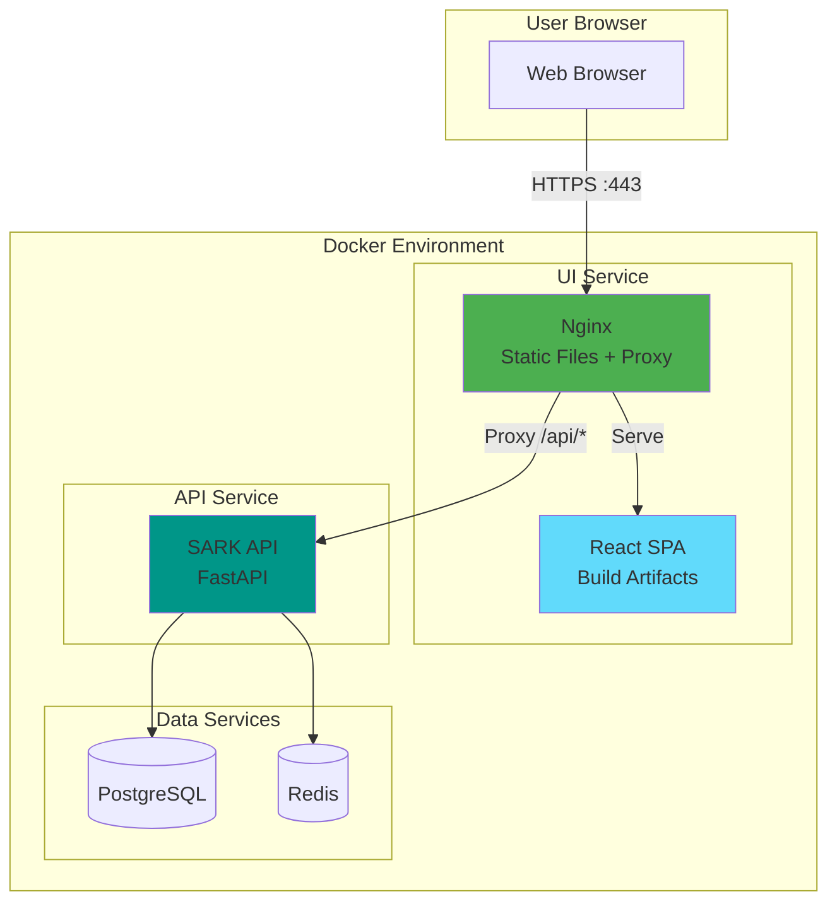
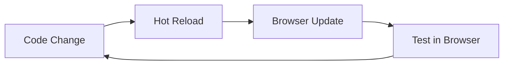
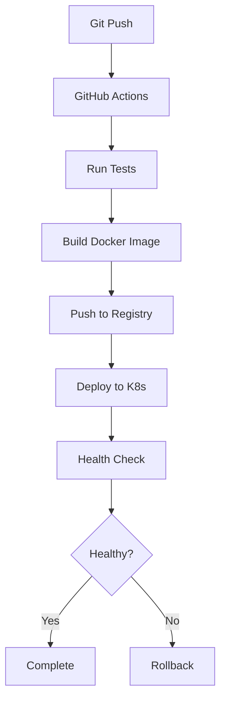
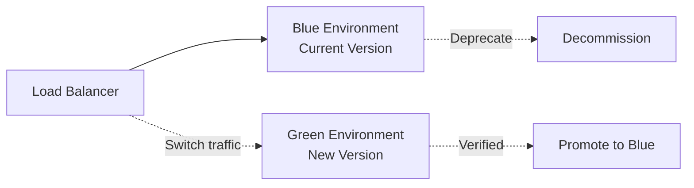
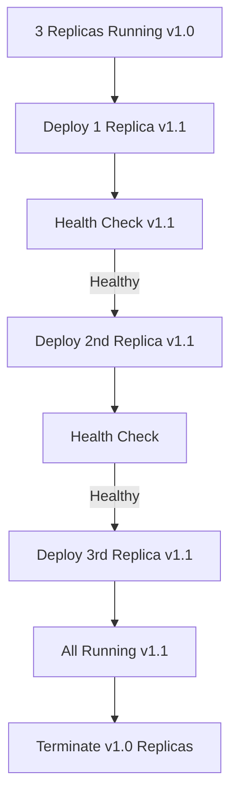

# SARK UI Docker Integration Plan

**Engineer:** Engineer 4 (DevOps/Infrastructure)
**Task:** W3-E4-01 - Plan Docker integration for UI
**Date:** 2025-11-27
**Status:** Planning Complete

---

## Executive Summary

This document outlines the Docker integration strategy for the SARK UI, a React + TypeScript SPA that will provide a web-based interface for managing MCP governance. The UI will be containerized, integrated with the existing Docker Compose setup, and deployed using both Docker and Kubernetes.

**Key Decisions:**
- **Technology:** React + TypeScript + Vite
- **Web Server:** Nginx (production) / Vite dev server (development)
- **Build Strategy:** Multi-stage Docker builds
- **Deployment:** Docker Compose profiles + Kubernetes
- **CDN:** CloudFront/CloudFlare for static assets (production)

---

## Architecture Overview

### High-Level Architecture



### Component Architecture

```
┌─────────────────────────────────────────────────────┐
│ SARK UI Container                                   │
├─────────────────────────────────────────────────────┤
│                                                     │
│  ┌──────────────┐        ┌──────────────┐          │
│  │ Nginx        │        │ Static Files │          │
│  │ - Port 80    │───────▶│ - HTML       │          │
│  │ - Port 443   │        │ - JS/CSS     │          │
│  │ - Proxy      │        │ - Assets     │          │
│  └──────────────┘        └──────────────┘          │
│         │                                           │
│         │ Proxy /api/*                              │
│         ▼                                           │
│  ┌──────────────────────────────────────┐          │
│  │ Upstream: sark-api:8000              │          │
│  └──────────────────────────────────────┘          │
│                                                     │
└─────────────────────────────────────────────────────┘
```

---

## Docker Integration Strategy

### 1. Development Environment

**Goal:** Hot-reload, fast iteration, debugging support

**Architecture:**
- Vite dev server running in development mode
- Volume-mounted source code for hot-reload
- Proxying API requests to backend service
- Port 3000 exposed for UI access

**Docker Compose Service:**
```yaml
ui-dev:
  build:
    context: ./ui
    dockerfile: Dockerfile
    target: development
  container_name: sark-ui-dev
  profiles:
    - ui-dev
  volumes:
    - ./ui/src:/app/src:ro
    - ./ui/public:/app/public:ro
    - /app/node_modules  # Prevent overwriting
  ports:
    - "3000:3000"
  environment:
    - VITE_API_URL=http://localhost:8000
    - NODE_ENV=development
  networks:
    - sark-network
  depends_on:
    - app
```

**Benefits:**
- Fast hot-module replacement (HMR)
- Source maps for debugging
- No build step needed
- Instant feedback loop

**Trade-offs:**
- Larger container size
- Not suitable for production
- Requires node_modules volume

---

### 2. Production Environment

**Goal:** Optimized, secure, fast-loading production build

**Architecture:**
- Multi-stage Docker build
- Nginx serving pre-built static files
- Gzip compression enabled
- Security headers configured
- SSL/TLS termination

**Docker Compose Service:**
```yaml
ui:
  build:
    context: ./ui
    dockerfile: Dockerfile
    target: production
  container_name: sark-ui
  profiles:
    - standard
    - full
  ports:
    - "80:80"
    - "443:443"
  environment:
    - API_URL=http://app:8000
  networks:
    - sark-network
  depends_on:
    - app
  restart: unless-stopped
  healthcheck:
    test: ["CMD", "curl", "-f", "http://localhost/health"]
    interval: 30s
    timeout: 10s
    retries: 3
```

**Benefits:**
- Small image size (~50MB vs 1GB+)
- Fast startup (<1s)
- Production-optimized
- Secure by default

---

### 3. Staging Environment

**Goal:** Production-like testing environment

**Architecture:**
- Same as production but with:
  - Debug logging enabled
  - Source maps included
  - Test data seeding
  - Relaxed CORS policies

**Docker Compose Service:**
```yaml
ui-staging:
  build:
    context: ./ui
    dockerfile: Dockerfile
    target: staging
  container_name: sark-ui-staging
  profiles:
    - staging
  ports:
    - "80:80"
  environment:
    - API_URL=http://app:8000
    - ENVIRONMENT=staging
  networks:
    - sark-network
```

---

## Multi-Stage Dockerfile Strategy

### Stage Overview

```dockerfile
# Stage 1: Dependencies
FROM node:20-alpine AS deps
# Install dependencies only

# Stage 2: Builder
FROM node:20-alpine AS builder
# Copy deps + source, run build

# Stage 3: Development
FROM node:20-alpine AS development
# Development server with hot-reload

# Stage 4: Staging
FROM nginx:alpine AS staging
# Production build + debug tools

# Stage 5: Production
FROM nginx:alpine AS production
# Minimal production image
```

### Image Size Comparison

| Stage | Base Image | Final Size | Use Case |
|-------|------------|------------|----------|
| Development | node:20-alpine | ~1.2GB | Local development |
| Staging | nginx:alpine | ~80MB | Staging environment |
| Production | nginx:alpine | ~50MB | Production deployment |

---

## Nginx Configuration Strategy

### 1. Reverse Proxy for API

**Purpose:** Route API requests to backend service

```nginx
location /api/ {
    proxy_pass http://app:8000;
    proxy_http_version 1.1;
    proxy_set_header Upgrade $http_upgrade;
    proxy_set_header Connection 'upgrade';
    proxy_set_header Host $host;
    proxy_cache_bypass $http_upgrade;
    proxy_set_header X-Real-IP $remote_addr;
    proxy_set_header X-Forwarded-For $proxy_add_x_forwarded_for;
    proxy_set_header X-Forwarded-Proto $scheme;
}
```

### 2. SPA Routing

**Purpose:** Support client-side routing

```nginx
location / {
    root /usr/share/nginx/html;
    try_files $uri $uri/ /index.html;
}
```

### 3. Static Asset Caching

**Purpose:** Optimize performance with aggressive caching

```nginx
location ~* \.(js|css|png|jpg|jpeg|gif|ico|svg|woff|woff2|ttf|eot)$ {
    expires 1y;
    add_header Cache-Control "public, immutable";
}
```

### 4. Security Headers

**Purpose:** Enhance security posture

```nginx
add_header X-Frame-Options "SAMEORIGIN" always;
add_header X-Content-Type-Options "nosniff" always;
add_header X-XSS-Protection "1; mode=block" always;
add_header Referrer-Policy "strict-origin-when-cross-origin" always;
add_header Content-Security-Policy "default-src 'self'; script-src 'self' 'unsafe-inline'; style-src 'self' 'unsafe-inline';" always;
```

### 5. Gzip Compression

**Purpose:** Reduce bandwidth usage

```nginx
gzip on;
gzip_vary on;
gzip_min_length 1024;
gzip_types text/plain text/css text/xml text/javascript application/javascript application/json;
```

---

## Docker Compose Integration

### Profile Integration Strategy

**Profiles:**
1. **ui-dev** - Development UI with hot-reload
2. **standard** - Production UI + standard backend
3. **full** - Complete stack including UI

### Integration with Existing Profiles

```yaml
# Existing: minimal (app only) - no UI
# Existing: standard (app + db + cache) - add optional UI
# Existing: full (complete stack) - include UI by default
# New: ui-dev - development UI with hot-reload
```

### Commands

```bash
# Development with UI
docker compose --profile ui-dev up -d

# Standard deployment with UI
docker compose --profile standard up -d

# Full stack with UI
docker compose --profile full up -d

# UI only (for testing)
docker compose up -d ui
```

---

## Kubernetes Integration Strategy

### Deployment Architecture

```yaml
apiVersion: apps/v1
kind: Deployment
metadata:
  name: sark-ui
spec:
  replicas: 3
  selector:
    matchLabels:
      app: sark-ui
  template:
    metadata:
      labels:
        app: sark-ui
    spec:
      containers:
      - name: ui
        image: sark-ui:latest
        ports:
        - containerPort: 80
        resources:
          requests:
            memory: "64Mi"
            cpu: "100m"
          limits:
            memory: "128Mi"
            cpu: "200m"
```

### Service Configuration

```yaml
apiVersion: v1
kind: Service
metadata:
  name: sark-ui
spec:
  selector:
    app: sark-ui
  ports:
  - port: 80
    targetPort: 80
  type: ClusterIP
```

### Ingress Configuration

```yaml
apiVersion: networking.k8s.io/v1
kind: Ingress
metadata:
  name: sark-ui
  annotations:
    nginx.ingress.kubernetes.io/rewrite-target: /
    cert-manager.io/cluster-issuer: letsencrypt-prod
spec:
  tls:
  - hosts:
    - sark.example.com
    secretName: sark-tls
  rules:
  - host: sark.example.com
    http:
      paths:
      - path: /
        pathType: Prefix
        backend:
          service:
            name: sark-ui
            port:
              number: 80
      - path: /api
        pathType: Prefix
        backend:
          service:
            name: sark-api
            port:
              number: 8000
```

---

## Build Pipeline Strategy

### Development Workflow



### Production Build Pipeline



### CI/CD Pipeline

```yaml
# .github/workflows/ui-build.yml
name: Build and Deploy UI

on:
  push:
    branches: [main]
    paths:
      - 'ui/**'

jobs:
  build:
    runs-on: ubuntu-latest
    steps:
      - uses: actions/checkout@v4

      - name: Build Docker image
        run: |
          docker build -t sark-ui:${{ github.sha }} \
            --target production \
            ./ui

      - name: Push to registry
        run: |
          docker tag sark-ui:${{ github.sha }} registry.example.com/sark-ui:latest
          docker push registry.example.com/sark-ui:latest
```

---

## Performance Optimization Strategy

### 1. Build Optimization

**Techniques:**
- Code splitting
- Tree shaking
- Minification
- Gzip/Brotli compression

**Expected Results:**
- Initial bundle: <300KB
- Lazy-loaded chunks: <100KB each
- Time to interactive: <3s

### 2. Caching Strategy

**Levels:**
1. **Browser Cache:** 1 year for immutable assets
2. **CDN Cache:** Edge caching for static files
3. **Service Worker:** Offline support (optional)

### 3. Asset Optimization

**Images:**
- WebP format with fallbacks
- Responsive images
- Lazy loading

**Fonts:**
- Subsetting
- Preloading critical fonts
- Font-display: swap

---

## Security Considerations

### 1. Container Security

**Measures:**
- Non-root user in container
- Read-only filesystem where possible
- No privileged mode
- Security scanning (Trivy, Snyk)

### 2. Network Security

**Measures:**
- TLS/SSL for all connections
- CORS properly configured
- CSP headers enforced
- Rate limiting at Nginx level

### 3. Secrets Management

**Strategy:**
- No secrets in Docker images
- Environment variables for configuration
- Kubernetes secrets for sensitive data
- HashiCorp Vault integration (production)

---

## Resource Requirements

### Development Environment

| Component | CPU | Memory | Disk |
|-----------|-----|--------|------|
| UI Dev | 500m | 512Mi | 2GB |
| API | 500m | 512Mi | - |
| PostgreSQL | 250m | 256Mi | 5GB |
| Redis | 100m | 128Mi | 1GB |
| **Total** | **1.35 cores** | **~1.4GB** | **8GB** |

### Production Environment (per replica)

| Component | CPU | Memory | Disk |
|-----------|-----|--------|------|
| UI | 100m | 64Mi | - |
| Nginx overhead | 50m | 32Mi | - |
| **Total** | **150m** | **96Mi** | **< 100MB** |

---

## Deployment Strategy

### Blue-Green Deployment



### Rolling Update



---

## Monitoring and Observability

### Metrics to Track

**Container Metrics:**
- CPU usage
- Memory usage
- Network I/O
- Disk I/O

**Application Metrics:**
- Request rate (req/s)
- Response time (p50, p95, p99)
- Error rate (4xx, 5xx)
- Cache hit rate

**Business Metrics:**
- Active users
- Page views
- API calls
- Feature usage

### Health Checks

**Liveness Probe:**
```yaml
livenessProbe:
  httpGet:
    path: /health
    port: 80
  initialDelaySeconds: 10
  periodSeconds: 30
```

**Readiness Probe:**
```yaml
readinessProbe:
  httpGet:
    path: /ready
    port: 80
  initialDelaySeconds: 5
  periodSeconds: 10
```

---

## Disaster Recovery

### Backup Strategy

**What to Backup:**
- Docker images (registry)
- Configuration files
- SSL certificates
- Environment variables

**Backup Frequency:**
- Docker images: On every build
- Config: Daily
- Certificates: Weekly

### Recovery Procedures

**Scenario 1: Container Crash**
- Automatic restart by Docker/Kubernetes
- RTO: <1 minute

**Scenario 2: Image Corruption**
- Rollback to previous image
- RTO: <5 minutes

**Scenario 3: Complete Environment Loss**
- Restore from registry
- Reconfigure from IaC
- RTO: <30 minutes

---

## Cost Optimization

### Container Right-Sizing

**Recommendations:**
- Start with minimal resources
- Monitor and adjust based on metrics
- Use HPA for auto-scaling
- Set appropriate limits

### Multi-Stage Build Benefits

**Savings:**
- Development image: 1.2GB → No change (needed for dev)
- Production image: 1.2GB → 50MB (96% reduction)
- Bandwidth savings: ~1.15GB per deployment
- Storage savings: Significant in registry

### CDN Usage

**Cost-Benefit:**
- Reduced origin traffic: 80-95%
- Lower compute costs
- Faster global performance
- CDN costs offset by savings

---

## Testing Strategy

### Container Testing

**Levels:**
1. **Build Test:** Ensure image builds successfully
2. **Security Test:** Scan for vulnerabilities
3. **Performance Test:** Measure startup time, resource usage
4. **Integration Test:** Verify API connectivity

### Automated Tests

```bash
# Test Docker build
docker build -t sark-ui:test --target production ./ui

# Test container starts
docker run -d --name test-ui sark-ui:test

# Test health endpoint
curl -f http://localhost/health

# Cleanup
docker rm -f test-ui
```

---

## Migration Plan

### Phase 1: Infrastructure Setup (Week 3)
- ✅ Create Docker integration plan
- Create Nginx configuration
- Set up development environment

### Phase 2: Development Integration (Week 4)
- Create Vite configuration
- Create multi-stage Dockerfile
- Integrate with docker-compose

### Phase 3: Optimization (Week 5-6)
- Optimize build process
- Add health checks
- Set up monitoring

### Phase 4: Production Readiness (Week 7-8)
- CDN integration
- Kubernetes manifests
- Security hardening
- Load testing

---

## Decision Matrix

| Aspect | Option A | Option B | **Decision** | Rationale |
|--------|----------|----------|--------------|-----------|
| Web Server | Apache | **Nginx** | Nginx | Lighter, faster, better for SPAs |
| Build Tool | Webpack | **Vite** | Vite | Faster builds, better DX |
| Base Image | Node | **Nginx Alpine** | Nginx Alpine | Smaller, more secure |
| Deployment | Docker Swarm | **Kubernetes** | Kubernetes | Better orchestration, industry standard |
| Registry | Docker Hub | **Private** | Private | Security, control |

---

## Risks and Mitigation

| Risk | Impact | Probability | Mitigation |
|------|--------|-------------|------------|
| Build failures | High | Medium | Comprehensive CI/CD testing |
| Security vulnerabilities | High | Medium | Regular scanning, updates |
| Performance issues | Medium | Low | Load testing, monitoring |
| Network connectivity | High | Low | Health checks, retries |
| Resource exhaustion | Medium | Low | Resource limits, monitoring |

---

## Success Criteria

**Technical:**
- [ ] Docker image builds successfully
- [ ] Container starts in <5 seconds
- [ ] Image size <100MB
- [ ] Zero critical vulnerabilities
- [ ] All health checks pass

**Performance:**
- [ ] Initial load <3 seconds
- [ ] API latency <100ms (p95)
- [ ] 99.9% uptime
- [ ] Handles 1000 concurrent users

**Operations:**
- [ ] One-command deployment
- [ ] Automated rollback
- [ ] Complete monitoring
- [ ] Documented procedures

---

## Next Steps

1. **Week 3 Remaining:**
   - Create Nginx configuration for SPA
   - Test reverse proxy setup

2. **Week 4:**
   - Set up Vite build configuration
   - Create multi-stage Dockerfile
   - Integrate UI with docker-compose

3. **Week 5-6:**
   - Optimize Docker builds
   - Add health checks
   - Set up production pipeline

4. **Week 7-8:**
   - Performance optimization
   - CDN integration
   - Kubernetes deployment
   - Final testing

---

## References

- [Docker Multi-Stage Builds](https://docs.docker.com/build/building/multi-stage/)
- [Nginx SPA Configuration](https://www.nginx.com/blog/deploying-nginx-nginx-plus-docker/)
- [Vite Production Build](https://vitejs.dev/guide/build.html)
- [Kubernetes Best Practices](https://kubernetes.io/docs/concepts/configuration/overview/)

---

**Plan Status:** ✅ Complete
**Next Task:** W3-E4-02 - Create Nginx config for SPA
**Approved By:** Engineer 4 (DevOps/Infrastructure)
**Date:** 2025-11-27
