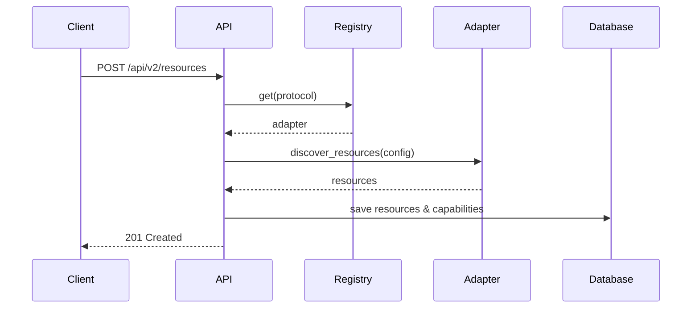
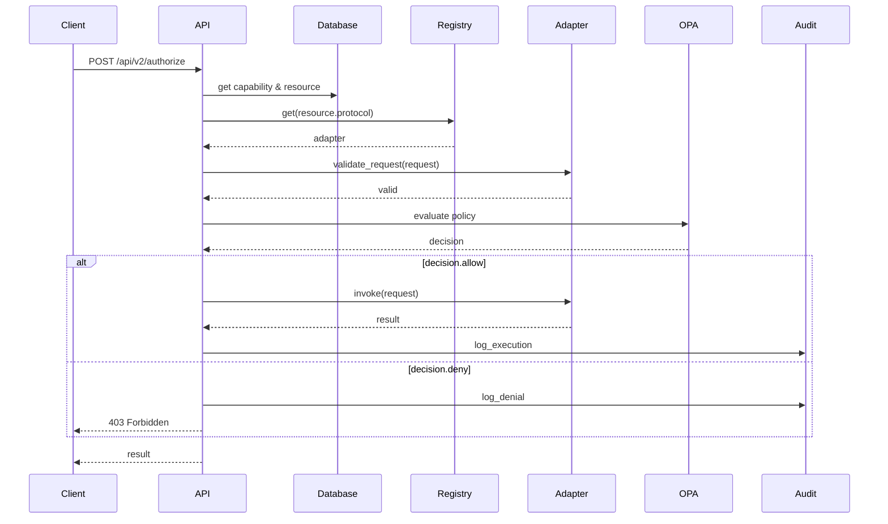

# Protocol Adapter Interface Contract

**Version:** 2.0.0
**Status:** 🔒 **FROZEN** (Week 1 Foundation Complete)
**Last Updated:** November 28, 2025
**Owner:** ENGINEER-1 (Lead Architect)

---

## Purpose

This document defines the **complete and frozen** interface contract for all SARK v2.0 protocol adapters. All adapter implementations (MCP, HTTP, gRPC, custom) **MUST** adhere to this contract.

**🚨 CRITICAL:** This interface is now **FROZEN** for v2.0 implementation. Changes require architecture review and approval from ENGINEER-1.

---

## Table of Contents

1. [Core Concept](#core-concept)
2. [Interface Definition](#interface-definition)
3. [Required Methods](#required-methods)
4. [Optional Methods](#optional-methods)
5. [Exception Handling](#exception-handling)
6. [Integration Points](#integration-points)
7. [Testing Requirements](#testing-requirements)
8. [Examples](#examples)
9. [Sign-Off](#sign-off)

---

## Core Concept

### The Adapter Pattern

```
┌─────────────────────────────────────────────────────┐
│           SARK Core (Protocol-Agnostic)             │
│  ┌──────────┐  ┌──────┐  ┌──────┐  ┌──────────┐    │
│  │ Policy   │  │ Audit │  │ Auth │  │ Gateway  │    │
│  │ (OPA)    │  │ (TS) │  │      │  │          │    │
│  └──────────┘  └──────┘  └──────┘  └──────────┘    │
└───────────────────┬─────────────────────────────────┘
                    │ ProtocolAdapter Interface
        ┏━━━━━━━━━━━┻━━━━━━━━━━━━━━┓
        ┃                           ┃
   ┌────┴────┐   ┌──────────┐  ┌───┴────┐
   │   MCP   │   │   HTTP   │  │  gRPC  │
   │ Adapter │   │ Adapter  │  │ Adapter│
   └────┬────┘   └────┬─────┘  └────┬───┘
        │             │              │
   [MCP Servers] [REST APIs]   [gRPC Services]
```

**Key Principle:** Adapters translate protocol-specific concepts into GRID's universal abstractions (Resource, Capability, Invocation).

---

## Interface Definition

### Location

```python
from sark.adapters.base import ProtocolAdapter
```

**File:** `src/sark/adapters/base.py` (389 lines)

### Base Class

```python
class ProtocolAdapter(ABC):
    """
    Abstract base class for all protocol adapters.

    Each adapter translates protocol-specific concepts into GRID's
    universal abstractions (Resource, Capability, Action).
    """
```

---

## Required Methods

All adapters **MUST** implement these abstract methods.

### 1. Protocol Identification

#### `protocol_name` (property)

```python
@property
@abstractmethod
def protocol_name(self) -> str:
    """
    Return the protocol identifier.

    Returns:
        str: Protocol name in lowercase (e.g., 'mcp', 'http', 'grpc')

    Examples:
        - 'mcp' for Model Context Protocol
        - 'http' for REST/HTTP APIs
        - 'grpc' for gRPC services
        - 'graphql' for GraphQL APIs
    """
```

**Contract:**
- MUST return lowercase string
- MUST be unique across all registered adapters
- SHOULD be stable across versions
- MUST NOT contain spaces or special characters (use underscores)

#### `protocol_version` (property)

```python
@property
@abstractmethod
def protocol_version(self) -> str:
    """
    Return the protocol version this adapter supports.

    Returns:
        str: Protocol version string (e.g., '2024-11-05', '1.0', 'v3')

    Examples:
        - '2024-11-05' for MCP specification version
        - '3.0' for OpenAPI 3.0
        - '1.44.0' for gRPC version
    """
```

**Contract:**
- MUST return non-empty string
- SHOULD use semantic versioning or spec dates
- MUST be the version the adapter is coded against

---

### 2. Resource Discovery

#### `discover_resources()`

```python
@abstractmethod
async def discover_resources(
    self,
    discovery_config: Dict[str, Any]
) -> List[ResourceSchema]:
    """
    Discover available resources for this protocol.

    Args:
        discovery_config: Protocol-specific discovery configuration

    Returns:
        List[ResourceSchema]: Discovered resources with their capabilities

    Raises:
        DiscoveryError: If discovery fails
        ConnectionError: If cannot connect to discovery endpoint
        AuthenticationError: If authentication fails during discovery
        ValidationError: If discovery_config is invalid
    """
```

**Contract:**

**Input (`discovery_config`):**
- Format is protocol-specific (documented per adapter)
- MUST include all required fields for discovery
- MAY include authentication credentials
- MUST be validated before use

**Output (`List[ResourceSchema]`):**
- MUST return list (empty list if no resources found)
- Each `ResourceSchema` MUST have:
  - `id`: Unique identifier for the resource
  - `name`: Human-readable name
  - `protocol`: Matches `self.protocol_name`
  - `endpoint`: Connection endpoint (URL, command, host:port, etc.)
  - `sensitivity_level`: One of 'low', 'medium', 'high', 'critical'
  - `metadata`: Protocol-specific metadata (dict)
  - `created_at`: Discovery timestamp
  - `updated_at`: Discovery timestamp

**Error Handling:**
- MUST raise `DiscoveryError` for discovery failures
- MUST raise `ConnectionError` for network/connection issues
- MUST raise `AuthenticationError` if credentials are invalid
- MUST include descriptive error messages with `details`

**Examples:**

```python
# MCP Discovery
discovery_config = {
    "transport": "stdio",
    "command": "npx",
    "args": ["-y", "@modelcontextprotocol/server-filesystem"],
    "env": {"PATH": "/usr/bin"}
}

# HTTP Discovery
discovery_config = {
    "base_url": "https://api.example.com",
    "openapi_spec_url": "https://api.example.com/openapi.json",
    "auth": {"type": "bearer", "token": "eyJ..."}
}

# gRPC Discovery
discovery_config = {
    "host": "api.example.com",
    "port": 9090,
    "use_reflection": True,
    "tls": {"enabled": True, "verify": True}
}
```

---

### 3. Capability Listing

#### `get_capabilities()`

```python
@abstractmethod
async def get_capabilities(
    self,
    resource: ResourceSchema
) -> List[CapabilitySchema]:
    """
    Get all capabilities for a resource.

    Args:
        resource: The resource to query

    Returns:
        List[CapabilitySchema]: Capabilities available on this resource

    Raises:
        ResourceNotFoundError: If resource doesn't exist
        ConnectionError: If cannot connect to resource
    """
```

**Contract:**

**Input (`resource`):**
- MUST be a valid `ResourceSchema` instance
- MUST have `protocol` matching `self.protocol_name`

**Output (`List[CapabilitySchema]`):**
- MUST return list (empty if no capabilities)
- Each `CapabilitySchema` MUST have:
  - `id`: Unique identifier for the capability
  - `resource_id`: Matches `resource.id`
  - `name`: Capability name (tool name, endpoint name, method name)
  - `description`: Optional human-readable description
  - `input_schema`: JSON Schema or protocol-specific schema (dict)
  - `output_schema`: JSON Schema or protocol-specific schema (dict)
  - `sensitivity_level`: One of 'low', 'medium', 'high', 'critical'
  - `metadata`: Protocol-specific metadata (e.g., HTTP method, gRPC package)

**Caching:**
- Adapters MAY cache capabilities
- Cache MUST be invalidated on `refresh_capabilities()` call
- Cache key SHOULD be `resource.id`

---

### 4. Request Validation

#### `validate_request()`

```python
@abstractmethod
async def validate_request(
    self,
    request: InvocationRequest
) -> bool:
    """
    Validate an invocation request before execution.

    Args:
        request: The invocation request to validate

    Returns:
        bool: True if valid, False otherwise

    Raises:
        ValidationError: If request is invalid (with details)
    """
```

**Contract:**

**Input (`request`):**
- MUST have `capability_id`, `principal_id`, `arguments`
- MAY have additional `context` fields

**Output:**
- MUST return `True` if valid
- MUST raise `ValidationError` (not return `False`) if invalid

**Validation Rules:**
- MUST validate `arguments` against capability's `input_schema`
- MUST check that `capability_id` exists
- SHOULD validate types and required fields
- MAY perform protocol-specific validation

**Error Details:**
- `ValidationError` MUST include `validation_errors` list
- Each error SHOULD specify field path and reason

**Example:**

```python
try:
    is_valid = await adapter.validate_request(request)
    # is_valid is always True if no exception
except ValidationError as e:
    # e.validation_errors = [
    #     {"field": "arguments.path", "error": "required field missing"},
    #     {"field": "arguments.depth", "error": "must be positive integer"}
    # ]
```

---

### 5. Capability Invocation

#### `invoke()`

```python
@abstractmethod
async def invoke(
    self,
    request: InvocationRequest
) -> InvocationResult:
    """
    Invoke a capability on a resource.

    Args:
        request: The invocation request

    Returns:
        InvocationResult: The invocation result

    Raises:
        InvocationError: If invocation fails
        TimeoutError: If invocation times out
        CapabilityNotFoundError: If capability doesn't exist

    Note:
        This method MUST NOT perform authorization checks.
        Authorization is handled by SARK core before calling invoke().
    """
```

**Contract:**

**Input (`request`):**
- MUST be pre-validated by `validate_request()`
- MUST be pre-authorized by SARK core policy engine

**Output (`InvocationResult`):**
- MUST always return `InvocationResult` (never raise for execution errors)
- MUST have:
  - `success`: `True` if succeeded, `False` if failed
  - `result`: Response data (if `success=True`), `None` if failed
  - `error`: Error message (if `success=False`), `None` if succeeded
  - `metadata`: Protocol-specific metadata (dict)
  - `duration_ms`: Execution time in milliseconds (float)

**Timing:**
- `duration_ms` MUST be wall-clock time from start to end
- SHOULD measure only the protocol invocation, not validation

**Error Handling:**
- Protocol errors MUST set `success=False` and populate `error`
- MUST NOT raise exceptions for normal protocol errors
- MAY raise exceptions for adapter bugs or critical failures
- SHOULD include stack traces in `metadata["stack_trace"]` for debugging

**Example:**

```python
# Success case
InvocationResult(
    success=True,
    result={"files": ["file1.txt", "file2.txt"]},
    metadata={"protocol": "mcp", "tool_name": "list_files"},
    duration_ms=45.2
)

# Failure case
InvocationResult(
    success=False,
    error="Permission denied: /secret/path",
    metadata={"status_code": 403, "protocol_error": "AccessDenied"},
    duration_ms=12.1
)
```

---

### 6. Health Check

#### `health_check()`

```python
@abstractmethod
async def health_check(
    self,
    resource: ResourceSchema
) -> bool:
    """
    Check if a resource is healthy and reachable.

    Args:
        resource: The resource to check

    Returns:
        bool: True if healthy and reachable, False otherwise

    Note:
        This method MUST NOT raise exceptions. Return False on any error.
    """
```

**Contract:**

**Input:**
- Valid `ResourceSchema` instance

**Output:**
- MUST return `bool`
- MUST return `True` if resource is reachable and responding
- MUST return `False` if resource is unreachable, unhealthy, or check fails

**Implementation:**
- SHOULD use protocol-specific health check (e.g., HTTP HEAD, gRPC health check)
- MUST timeout quickly (recommended: 5 seconds)
- MUST NOT raise exceptions (catch all and return `False`)
- SHOULD log health check failures at DEBUG level

**Usage:**
- Called periodically by SARK core for resource status monitoring
- Used to mark resources as `unhealthy` in the registry

---

## Optional Methods

These methods have default implementations but MAY be overridden.

### 7. Resource Lifecycle Hooks

#### `on_resource_registered()`

```python
async def on_resource_registered(
    self,
    resource: ResourceSchema
) -> None:
    """
    Called when a resource is registered.

    Override to perform protocol-specific setup.

    Args:
        resource: The newly registered resource

    Default: No-op
    """
```

**Use Cases:**
- Establish persistent connections
- Warm caches
- Subscribe to events
- Initialize protocol-specific state

#### `on_resource_unregistered()`

```python
async def on_resource_unregistered(
    self,
    resource: ResourceSchema
) -> None:
    """
    Called when a resource is unregistered.

    Override to perform protocol-specific cleanup.

    Args:
        resource: The resource being unregistered

    Default: No-op
    """
```

**Use Cases:**
- Close connections
- Unsubscribe from events
- Clear caches
- Release resources

---

### 8. Streaming Support

#### `invoke_streaming()`

```python
async def invoke_streaming(
    self,
    request: InvocationRequest
) -> AsyncIterator[Any]:
    """
    Invoke a capability with streaming response support.

    Args:
        request: The invocation request

    Yields:
        Response chunks as they become available

    Raises:
        UnsupportedOperationError: If streaming not supported (default)
        StreamingError: If streaming fails mid-stream

    Default: Raises UnsupportedOperationError
    """
```

**Contract:**

**When to Override:**
- If protocol supports streaming (SSE, gRPC streaming, WebSocket)

**Behavior:**
- MUST yield chunks as they arrive
- MUST raise `StreamingError` if stream fails mid-way
- SHOULD include `chunks_received` in error metadata

**Default Implementation:**
- Raises `UnsupportedOperationError`

**Example:**

```python
async for chunk in adapter.invoke_streaming(request):
    # chunk could be:
    # - bytes (raw data)
    # - dict (JSON objects)
    # - str (text lines)
    # - protocol-specific objects
    process(chunk)
```

---

### 9. Batch Operations

#### `invoke_batch()`

```python
async def invoke_batch(
    self,
    requests: List[InvocationRequest]
) -> List[InvocationResult]:
    """
    Invoke multiple capabilities in a batch operation.

    Args:
        requests: List of invocation requests

    Returns:
        List[InvocationResult]: Results in same order as requests

    Default: Calls invoke() sequentially
    """
```

**Contract:**

**When to Override:**
- If protocol has optimized batch APIs (e.g., HTTP batch, gRPC batch)

**Behavior:**
- MUST return results in same order as input requests
- MUST NOT stop on first error (try all requests)
- SHOULD be more efficient than sequential calls

**Default Implementation:**
- Calls `invoke()` for each request sequentially
- Catches exceptions and converts to `InvocationResult(success=False)`

---

### 10. Capability Refresh

#### `refresh_capabilities()`

```python
async def refresh_capabilities(
    self,
    resource: ResourceSchema
) -> List[CapabilitySchema]:
    """
    Refresh the capabilities list for a resource.

    Args:
        resource: The resource to refresh

    Returns:
        List[CapabilitySchema]: Updated capabilities

    Default: Calls get_capabilities()
    """
```

**When to Override:**
- If there's a more efficient refresh mechanism
- If capabilities are cached and need invalidation

**Default:** Calls `get_capabilities()`

---

### 11. Authentication

#### `authenticate()`

```python
async def authenticate(
    self,
    resource: ResourceSchema,
    credentials: Dict[str, Any]
) -> Dict[str, Any]:
    """
    Authenticate to a resource.

    Args:
        resource: The resource to authenticate to
        credentials: Protocol-specific credentials

    Returns:
        Dict[str, Any]: Authentication result (tokens, session info)

    Raises:
        AuthenticationError: If authentication fails
        UnsupportedOperationError: If auth handled externally (default)

    Default: Raises UnsupportedOperationError
    """
```

**Credential Formats:**

```python
# API Key
{"type": "api_key", "key": "sk-..."}

# Bearer Token
{"type": "bearer", "token": "eyJ..."}

# Basic Auth
{"type": "basic", "username": "user", "password": "pass"}

# mTLS
{"type": "mtls", "cert_path": "/path/cert.pem", "key_path": "/path/key.pem"}

# OAuth2
{"type": "oauth2", "client_id": "...", "client_secret": "...", "token_url": "..."}
```

**Return Value:**

```python
{
    "authenticated": True,
    "token": "session-token-here",
    "expires_at": "2025-12-01T00:00:00Z",
    "refresh_token": "refresh-token-here"  # optional
}
```

---

### 12. Introspection Methods

#### `supports_streaming()`

```python
def supports_streaming(self) -> bool:
    """Check if adapter supports streaming."""
```

**Returns:** `True` if `invoke_streaming()` is overridden, `False` otherwise.

#### `supports_batch()`

```python
def supports_batch(self) -> bool:
    """Check if adapter supports optimized batch operations."""
```

**Returns:** `True` if `invoke_batch()` is overridden with optimization, `False` if using default.

#### `get_adapter_info()`

```python
def get_adapter_info(self) -> Dict[str, Any]:
    """Get adapter metadata and capabilities."""
```

**Returns:**
```python
{
    "protocol_name": "mcp",
    "protocol_version": "2024-11-05",
    "adapter_class": "MCPAdapter",
    "supports_streaming": True,
    "supports_batch": False,
    "module": "sark.adapters.mcp"
}
```

---

## Exception Handling

### Exception Hierarchy

All adapter exceptions inherit from `AdapterError`:

```python
from sark.adapters.exceptions import (
    AdapterError,              # Base exception
    DiscoveryError,           # Resource discovery failed
    ConnectionError,          # Cannot connect to resource
    AuthenticationError,      # Authentication failed
    ValidationError,          # Request validation failed
    InvocationError,          # Invocation failed
    ResourceNotFoundError,    # Resource not found
    CapabilityNotFoundError,  # Capability not found
    TimeoutError,             # Operation timed out
    ProtocolError,            # Protocol-specific error
    StreamingError,           # Streaming operation failed
    AdapterConfigurationError,  # Adapter config invalid
    UnsupportedOperationError,  # Operation not supported
)
```

### When to Raise Exceptions

| Method | Exceptions to Raise |
|--------|-------------------|
| `discover_resources()` | `DiscoveryError`, `ConnectionError`, `AuthenticationError`, `ValidationError` |
| `get_capabilities()` | `ResourceNotFoundError`, `ConnectionError` |
| `validate_request()` | `ValidationError` (MUST raise, not return False) |
| `invoke()` | `InvocationError`, `TimeoutError`, `CapabilityNotFoundError` |
| `health_check()` | **MUST NOT raise** (return `False` instead) |
| `invoke_streaming()` | `UnsupportedOperationError`, `StreamingError` |
| `authenticate()` | `AuthenticationError`, `UnsupportedOperationError` |

### Exception Best Practices

1. **Always include context:**
   ```python
   raise InvocationError(
       "Failed to call MCP tool 'read_file'",
       adapter_name="mcp",
       resource_id="mcp-filesystem",
       capability_id="read_file",
       protocol_error="FileNotFoundError: /missing.txt"
   )
   ```

2. **Use `details` for debugging:**
   ```python
   raise ValidationError(
       "Invalid arguments for capability",
       validation_errors=[
           {"field": "path", "error": "required"},
           {"field": "depth", "error": "must be positive"}
       ]
   )
   ```

3. **Don't raise for normal failures in `invoke()`:**
   ```python
   # WRONG - don't raise for protocol errors
   raise InvocationError("File not found")

   # RIGHT - return failure result
   return InvocationResult(
       success=False,
       error="File not found: /path/to/file",
       duration_ms=duration
   )
   ```

---

## Integration Points

### With SARK Core

#### 1. Adapter Registry

```python
from sark.adapters import get_registry

registry = get_registry()
registry.register(MyAdapter())

adapter = registry.get("myprotocol")
```

#### 2. Resource Registration Flow



#### 3. Authorization Flow



### With Database

Adapters **MUST NOT** access the database directly. All database operations are handled by SARK core.

**Resource Storage:**
- Core stores discovered resources in polymorphic `resources` table
- Core stores capabilities in polymorphic `capabilities` table
- Adapters only work with Pydantic schemas

**Audit Trail:**
- Core logs all invocations to audit database
- Adapters MAY include extra context in `InvocationResult.metadata`

---

## Testing Requirements

All adapters MUST pass the base adapter contract tests.

### Contract Test Suite

Location: `tests/adapters/test_adapter_base.py`

**Required Test Fixtures:**

```python
import pytest
from tests.adapters.base_adapter_test import BaseAdapterTest

class TestMyAdapter(BaseAdapterTest):
    @pytest.fixture
    def adapter(self):
        """Return your adapter instance."""
        return MyAdapter()

    @pytest.fixture
    def discovery_config(self):
        """Return valid discovery config for your protocol."""
        return {"endpoint": "https://api.example.com"}

    @pytest.fixture
    def sample_resource(self):
        """Return a valid ResourceSchema for your protocol."""
        return ResourceSchema(id="test", name="Test", protocol="myprotocol", ...)

    @pytest.fixture
    def sample_capability(self):
        """Return a valid CapabilitySchema."""
        return CapabilitySchema(id="test-cap", resource_id="test", ...)

    @pytest.fixture
    def valid_invocation_request(self):
        """Return a valid InvocationRequest."""
        return InvocationRequest(capability_id="test-cap", principal_id="user", ...)
```

### Test Coverage Requirements

- **Minimum:** 85% code coverage
- **Required Tests:**
  - ✅ All abstract methods implemented
  - ✅ `protocol_name` and `protocol_version` return valid values
  - ✅ `discover_resources()` returns valid resources
  - ✅ `get_capabilities()` returns valid capabilities
  - ✅ `validate_request()` validates correctly
  - ✅ `validate_request()` raises `ValidationError` for invalid requests
  - ✅ `invoke()` returns valid `InvocationResult`
  - ✅ `invoke()` handles errors gracefully (success=False)
  - ✅ `health_check()` returns bool without raising
  - ✅ Exception handling (all custom exceptions)
  - ✅ Edge cases (empty lists, None values, timeouts)

### Integration Tests

Create integration tests with real protocol instances:

```python
# tests/integration/test_mcp_adapter_integration.py
async def test_mcp_adapter_real_server():
    adapter = MCPAdapter()
    resources = await adapter.discover_resources({
        "transport": "stdio",
        "command": "npx",
        "args": ["-y", "@modelcontextprotocol/server-filesystem"]
    })
    assert len(resources) > 0
```

---

## Examples

### Complete Minimal Adapter

```python
from sark.adapters.base import ProtocolAdapter
from sark.models.base import *
from sark.adapters.exceptions import *
import time

class EchoAdapter(ProtocolAdapter):
    """Simple echo adapter for testing."""

    @property
    def protocol_name(self) -> str:
        return "echo"

    @property
    def protocol_version(self) -> str:
        return "1.0"

    async def discover_resources(
        self,
        discovery_config: Dict[str, Any]
    ) -> List[ResourceSchema]:
        # Discover a single echo resource
        return [ResourceSchema(
            id="echo-1",
            name="Echo Service",
            protocol="echo",
            endpoint="internal://echo",
            sensitivity_level="low",
            metadata=discovery_config,
            created_at=datetime.utcnow(),
            updated_at=datetime.utcnow()
        )]

    async def get_capabilities(
        self,
        resource: ResourceSchema
    ) -> List[CapabilitySchema]:
        # Echo has one capability: echo
        return [CapabilitySchema(
            id="echo-echo",
            resource_id=resource.id,
            name="echo",
            description="Echo back the input",
            input_schema={"type": "object", "properties": {"message": {"type": "string"}}},
            output_schema={"type": "object", "properties": {"echo": {"type": "string"}}},
            sensitivity_level="low",
            metadata={}
        )]

    async def validate_request(
        self,
        request: InvocationRequest
    ) -> bool:
        if "message" not in request.arguments:
            raise ValidationError(
                "Missing 'message' field",
                validation_errors=[{"field": "message", "error": "required"}]
            )
        return True

    async def invoke(
        self,
        request: InvocationRequest
    ) -> InvocationResult:
        start = time.time()
        try:
            message = request.arguments["message"]
            return InvocationResult(
                success=True,
                result={"echo": message},
                metadata={"protocol": "echo"},
                duration_ms=(time.time() - start) * 1000
            )
        except Exception as e:
            return InvocationResult(
                success=False,
                error=str(e),
                duration_ms=(time.time() - start) * 1000
            )

    async def health_check(
        self,
        resource: ResourceSchema
    ) -> bool:
        # Echo is always healthy
        return True
```

### Registration and Usage

```python
from sark.adapters import get_registry

# Register adapter
registry = get_registry()
registry.register(EchoAdapter())

# Use adapter
adapter = registry.get("echo")
resources = await adapter.discover_resources({})
capabilities = await adapter.get_capabilities(resources[0])

request = InvocationRequest(
    capability_id="echo-echo",
    principal_id="test-user",
    arguments={"message": "Hello, SARK!"}
)

await adapter.validate_request(request)
result = await adapter.invoke(request)

assert result.success == True
assert result.result == {"echo": "Hello, SARK!"}
```

---

## Sign-Off

This interface contract MUST be reviewed and approved by all adapter engineers before implementation begins.

### Review Checklist

- [ ] **ENGINEER-1** (Lead Architect) - Interface design approved
- [ ] **ENGINEER-2** (HTTP Adapter) - Can implement HTTP adapter with this interface
- [ ] **ENGINEER-3** (gRPC Adapter) - Can implement gRPC adapter with this interface
- [ ] **ENGINEER-4** (Federation) - Interface supports federation requirements
- [ ] **ENGINEER-5** (Advanced Features) - Interface supports cost attribution & policies
- [ ] **ENGINEER-6** (Database) - Schema design aligns with interface
- [ ] **QA-1** (Testing) - Can create comprehensive test suite
- [ ] **QA-2** (Performance) - Interface supports performance testing
- [ ] **DOCS-1** (Documentation) - Interface is well-documented
- [ ] **DOCS-2** (Tutorials) - Can create tutorials using this interface

### Approval

| Engineer | Status | Date | Notes |
|----------|--------|------|-------|
| ENGINEER-1 | ✅ Approved | 2025-11-28 | Interface frozen for v2.0 |
| ENGINEER-2 | ⏳ Pending | - | Awaiting review |
| ENGINEER-3 | ⏳ Pending | - | Awaiting review |
| ENGINEER-4 | ⏳ Pending | - | Awaiting review |
| ENGINEER-5 | ⏳ Pending | - | Awaiting review |
| ENGINEER-6 | ⏳ Pending | - | Awaiting review |
| QA-1 | ⏳ Pending | - | Awaiting review |
| QA-2 | ⏳ Pending | - | Awaiting review |
| DOCS-1 | ⏳ Pending | - | Awaiting review |
| DOCS-2 | ⏳ Pending | - | Awaiting review |

---

## Change Log

| Version | Date | Author | Changes |
|---------|------|--------|---------|
| 2.0.0 | 2025-11-28 | ENGINEER-1 | Initial frozen interface contract |

---

## Questions & Support

**Questions about this interface?**
- Escalate to ENGINEER-1 (Lead Architect)
- Slack: `#sark-v2-architecture`
- Email: engineer-1@grid.example.com

**Need interface changes?**
1. Create architecture review request
2. Get approval from ENGINEER-1
3. Update this document
4. Notify all dependent engineers

---

**🚨 This interface is now FROZEN for v2.0 development. All adapter implementations must conform to this contract. 🚨**
