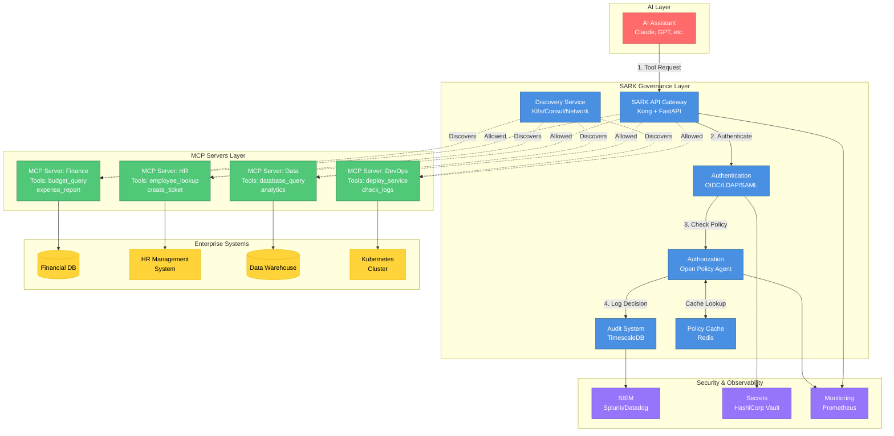

# MCP Architecture Diagram

## Overview
This diagram shows how SARK fits into the Model Context Protocol ecosystem, providing enterprise governance for MCP deployments.

## Diagram



## Key Components

### AI Layer
- **AI Assistants**: Claude, GPT, or other LLMs that need to access enterprise tools
- **Request Flow**: AI sends tool invocation requests through SARK

### SARK Governance Layer
- **API Gateway**: Kong + FastAPI handling all MCP requests
- **Authentication**: Multi-protocol support (OIDC, LDAP, SAML, API Keys)
- **Authorization**: OPA-based policy decisions with caching
- **Audit System**: Immutable event log in TimescaleDB
- **Discovery**: Automated finding and registration of MCP servers
- **Cache**: Redis-based policy decision cache (>95% hit rate target)

### MCP Servers Layer
- **Finance MCP**: Financial tools (budgets, expenses, reporting)
- **HR MCP**: Human resources tools (employee data, ticketing)
- **Data MCP**: Data analysis and query tools
- **DevOps MCP**: Infrastructure and deployment tools

Each MCP server exposes tools that AI can invoke via the protocol.

### Enterprise Systems
- Backend systems that MCP servers integrate with
- May include databases, APIs, SaaS platforms, cloud services

### Security & Observability
- **SIEM**: Security events forwarded to Splunk or Datadog
- **Vault**: Dynamic secrets for MCP server credentials
- **Prometheus**: Metrics collection for monitoring

## Data Flow

1. **AI Request**: AI assistant requests to invoke a tool
2. **Authentication**: SARK validates user identity (JWT, OIDC, etc.)
3. **Authorization**: OPA evaluates policy (role, sensitivity, time, etc.)
4. **Cache Check**: Policy decision checked in Redis first
5. **Audit Log**: Decision logged to TimescaleDB and SIEM
6. **Tool Invocation**: If allowed, request proxied to MCP server
7. **Execution**: MCP server executes tool against backend system
8. **Response**: Result returned through SARK back to AI

## Security Layers

```
┌─────────────────────────────────────────┐
│ Layer 1: Network Security               │
│ - Firewall, VPC, Security Groups        │
└─────────────────────────────────────────┘
           ↓
┌─────────────────────────────────────────┐
│ Layer 2: API Gateway (Kong)             │
│ - Rate limiting, WAF, DDoS protection   │
└─────────────────────────────────────────┘
           ↓
┌─────────────────────────────────────────┐
│ Layer 3: Authentication                 │
│ - Identity verification, MFA            │
└─────────────────────────────────────────┘
           ↓
┌─────────────────────────────────────────┐
│ Layer 4: Authorization (OPA)            │
│ - Policy-based access control           │
└─────────────────────────────────────────┘
           ↓
┌─────────────────────────────────────────┐
│ Layer 5: MCP Protocol Validation        │
│ - Schema validation, signature check    │
└─────────────────────────────────────────┘
           ↓
┌─────────────────────────────────────────┐
│ Layer 6: Tool Execution                 │
│ - MCP server invokes tool                │
└─────────────────────────────────────────┘
```

## Discovery Mechanisms

SARK automatically discovers MCP servers through multiple methods:

1. **Kubernetes Discovery**: Watches K8s API for MCP server pods
2. **Consul Service Discovery**: Monitors Consul catalog for services
3. **Network Scanning**: Probes network ranges for MCP endpoints
4. **Manual Registration**: API endpoint for explicit registration
5. **Cloud Provider APIs**: AWS/GCP/Azure service discovery

## Scaling Patterns

- **Horizontal Scaling**: Multiple SARK API instances behind load balancer
- **Cache Replication**: Redis cluster for distributed caching
- **Database Sharding**: PostgreSQL read replicas for query distribution
- **Regional Deployment**: Multi-region for low latency globally

## Use Cases

1. **AI-Powered Analytics**: AI queries data warehouse via MCP Data server
2. **Automated HR Tasks**: AI creates tickets via MCP HR server
3. **Financial Reporting**: AI generates expense reports via MCP Finance server
4. **DevOps Automation**: AI deploys services via MCP DevOps server

All with enterprise governance, audit trails, and zero-trust security.
