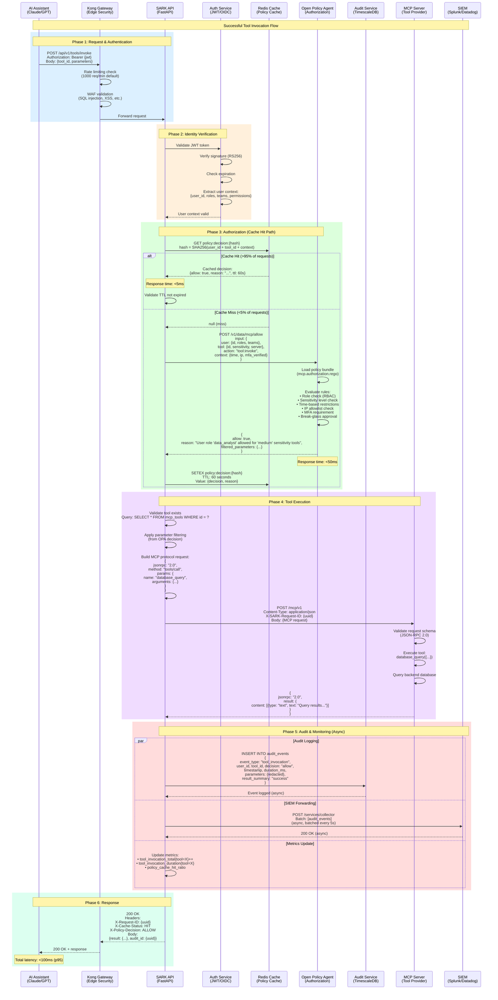
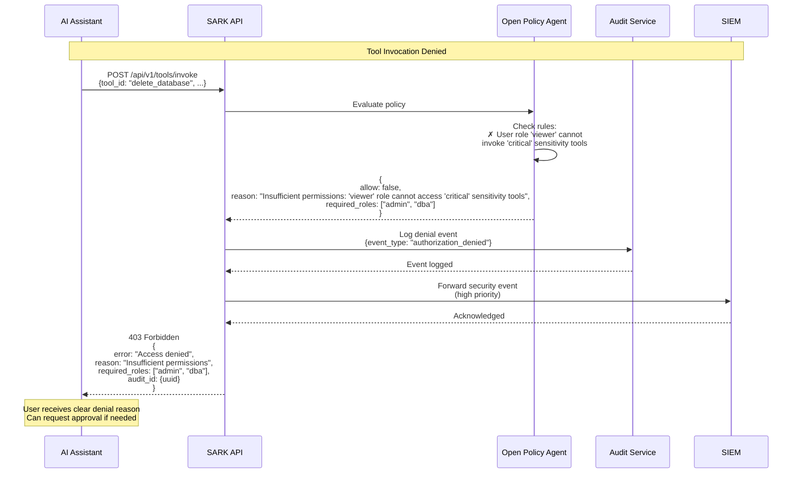
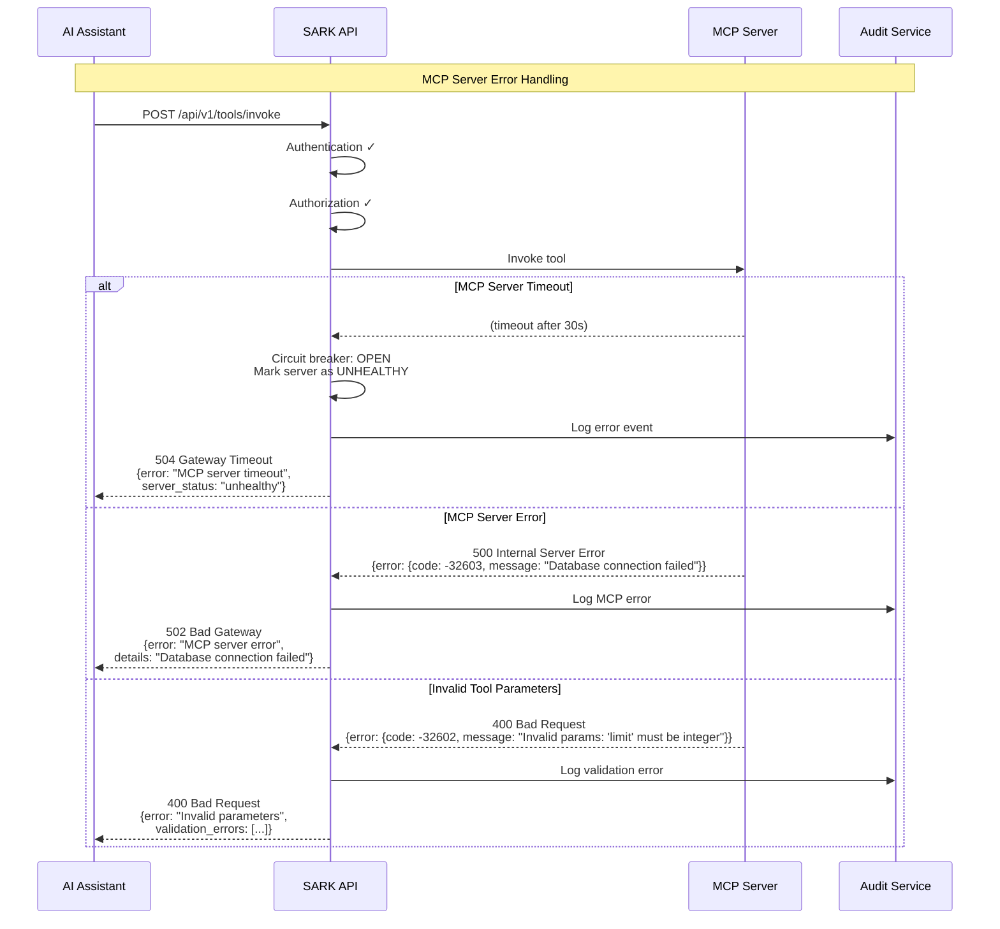
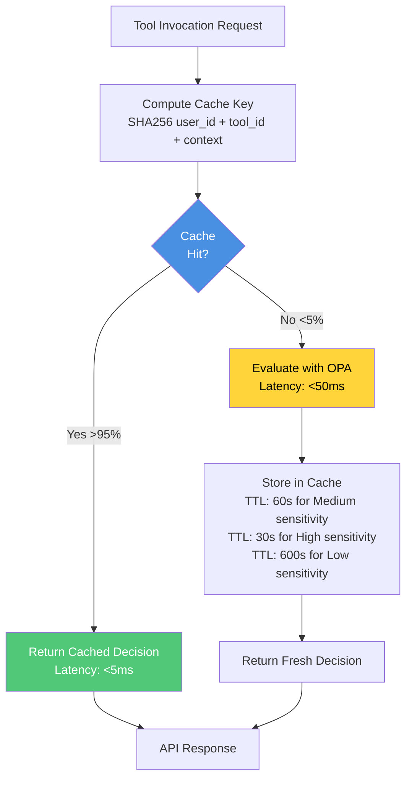

# MCP Tool Invocation Flow

## Overview
This diagram shows the complete end-to-end sequence when an AI assistant invokes an MCP tool through SARK, including authentication, authorization, caching, audit, and error handling.

## Complete Invocation Sequence



## Denial Flow



## Error Handling Flow



## Caching Strategy



## Performance Targets

| Metric | Target | Measurement Point |
|--------|--------|-------------------|
| **Authentication** | <10ms p95 | JWT validation |
| **Cache Hit** | <5ms p95 | Redis lookup + return |
| **Cache Miss** | <50ms p95 | OPA policy evaluation |
| **MCP Tool Call** | Variable | Depends on backend system |
| **Audit Logging** | <1ms | Async, non-blocking |
| **Total Latency** | <100ms p95 | End-to-end (excluding tool execution) |
| **Cache Hit Ratio** | >95% | Redis cache effectiveness |

## Security Checks

Each invocation passes through multiple security layers:

1. **Network Layer**
   - Rate limiting (1,000 req/min default)
   - WAF (Web Application Firewall)
   - DDoS protection

2. **Authentication Layer**
   - JWT signature validation
   - Token expiration check
   - User identity verification
   - MFA validation (if required)

3. **Authorization Layer**
   - Role-based access control (RBAC)
   - Sensitivity level matching
   - Time-based restrictions
   - IP allowlist validation
   - Break-glass approval workflow

4. **Protocol Layer**
   - MCP protocol validation
   - JSON-RPC 2.0 compliance
   - Tool parameter schema validation
   - Result sanitization

5. **Audit Layer**
   - Immutable event logging
   - SIEM forwarding
   - Metrics collection
   - Alerting on anomalies

## Audit Event Structure

```json
{
  "event_id": "550e8400-e29b-41d4-a716-446655440000",
  "event_type": "tool_invocation",
  "timestamp": "2025-11-27T10:30:45.123Z",
  "user": {
    "id": "user-123",
    "email": "analyst@company.com",
    "roles": ["data_analyst"],
    "teams": ["analytics-team"]
  },
  "tool": {
    "id": "tool-456",
    "name": "database_query",
    "server": "mcp-data-server",
    "sensitivity": "medium"
  },
  "decision": {
    "allow": true,
    "reason": "User role 'data_analyst' allowed for 'medium' sensitivity tools",
    "policy_version": "v1.2.3",
    "cache_hit": true
  },
  "request": {
    "parameters": {
      "query": "SELECT *** REDACTED ***",
      "limit": 100
    },
    "ip_address": "10.0.1.45",
    "user_agent": "Claude-AI/1.0"
  },
  "response": {
    "status": "success",
    "duration_ms": 245,
    "result_size_bytes": 4096
  },
  "context": {
    "request_id": "req-789",
    "session_id": "sess-012",
    "mfa_verified": true,
    "compliance_tags": ["SOC2", "GDPR"]
  }
}
```

## Next Steps

For implementation details, see:
- [OPA Policy Guide](../OPA_POLICY_GUIDE.md) - Policy authoring
- [API Reference](../API_REFERENCE.md) - API endpoints
- [Audit Guide](../AUDIT.md) - Audit event schema
