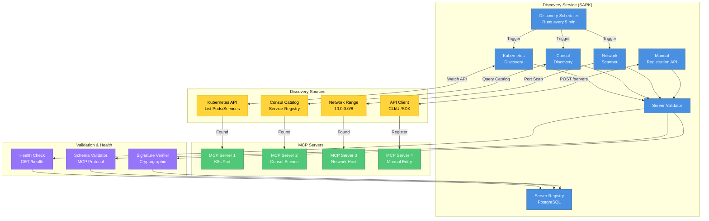
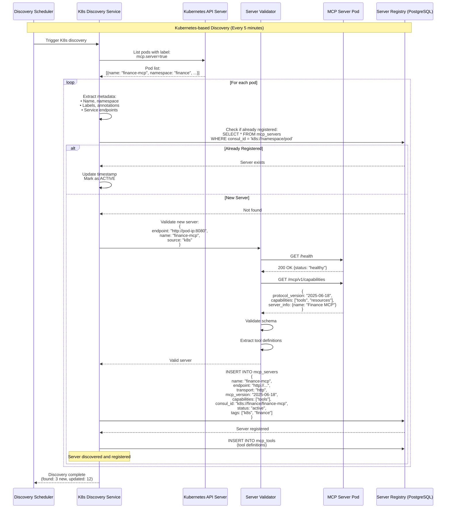
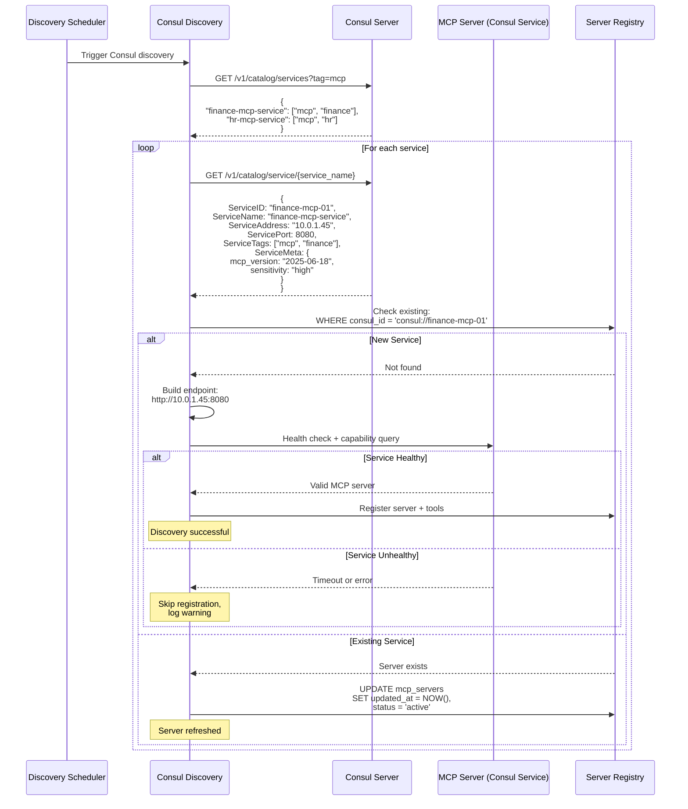
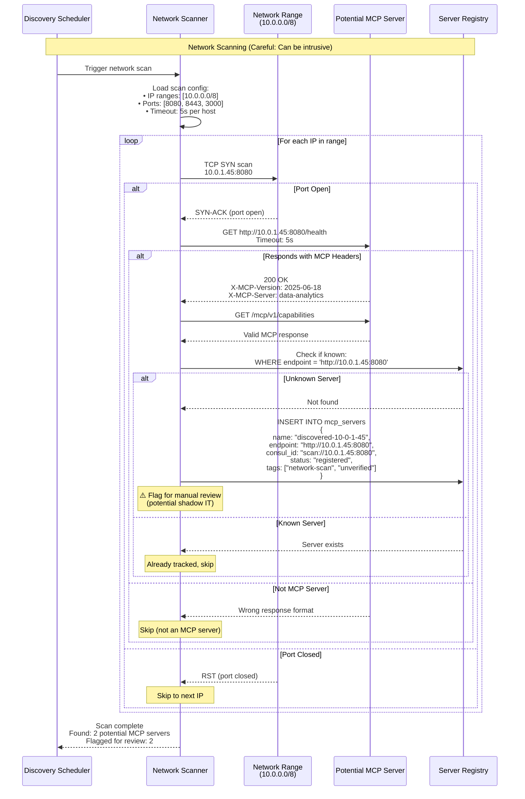
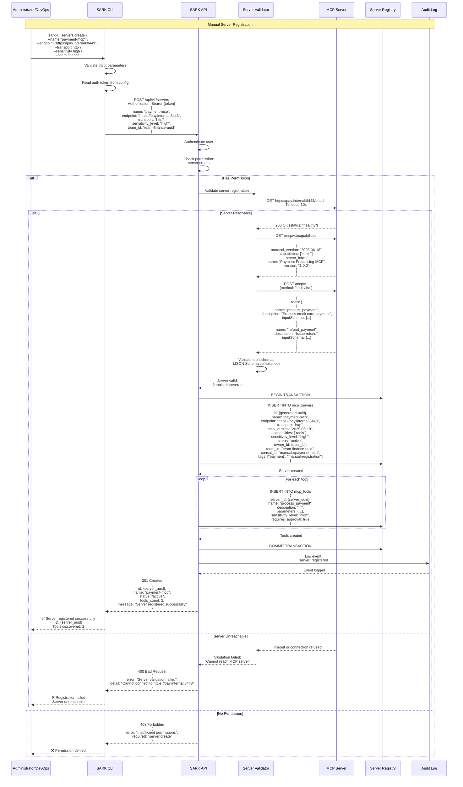

# MCP Server Discovery Flow

## Overview
This diagram shows how SARK automatically discovers and registers MCP servers using multiple discovery methods: Kubernetes API, Consul service catalog, network scanning, and manual registration.

## Discovery Architecture



## Kubernetes Discovery Sequence



## Consul Discovery Sequence



## Network Scanner Flow



## Manual Registration Flow



## Discovery Method Comparison

```mermaid
graph TB
    subgraph "Comparison Matrix"
        direction TB

        K8S_BOX[Kubernetes Discovery]
        CONSUL_BOX[Consul Discovery]
        NET_BOX[Network Scanning]
        MANUAL_BOX[Manual Registration]
    end

    K8S_BOX -.->|Pros| K8S_PROS["✅ Automatic<br/>✅ Real-time (watch API)<br/>✅ Metadata rich<br/>✅ Reliable"]
    K8S_BOX -.->|Cons| K8S_CONS["❌ K8s only<br/>❌ Requires RBAC setup"]
    K8S_BOX -.->|Use Case| K8S_USE["Cloud-native deployments"]

    CONSUL_BOX -.->|Pros| CONSUL_PROS["✅ Automatic<br/>✅ Cross-platform<br/>✅ Service health checks<br/>✅ Tags and metadata"]
    CONSUL_BOX -.->|Cons| CONSUL_CONS["❌ Requires Consul<br/>❌ Manual service registration"]
    CONSUL_BOX -.->|Use Case| CONSUL_USE["Multi-cloud, hybrid cloud"]

    NET_BOX -.->|Pros| NET_PROS["✅ No dependencies<br/>✅ Finds shadow IT<br/>✅ Works anywhere"]
    NET_BOX -.->|Cons| NET_CONS["❌ Slow (scanning)<br/>❌ May be intrusive<br/>❌ False positives"]
    NET_BOX -.->|Use Case| NET_USE["Security audit, compliance"]

    MANUAL_BOX -.->|Pros| MANUAL_PROS["✅ Full control<br/>✅ Pre-validated<br/>✅ Works always"]
    MANUAL_BOX -.->|Cons| MANUAL_CONS["❌ Manual effort<br/>❌ Human error risk<br/>❌ Doesn't scale"]
    MANUAL_BOX -.->|Use Case| MANUAL_USE["Legacy systems, initial setup"]

    style K8S_BOX fill:#4a90e2,color:#fff
    style CONSUL_BOX fill:#50c878,color:#fff
    style NET_BOX fill:#ffd43b,color:#000
    style MANUAL_BOX fill:#9775fa,color:#fff
```



## Discovery Configuration

Example configuration in `.env`:

```bash
# Discovery Service Configuration
DISCOVERY_INTERVAL_SECONDS=300  # Run every 5 minutes

# Enable/disable discovery methods
DISCOVERY_K8S_ENABLED=true
DISCOVERY_CONSUL_ENABLED=true
DISCOVERY_NETWORK_SCAN_ENABLED=false  # Disabled by default (intrusive)

# Kubernetes Discovery
K8S_NAMESPACE=all  # or specific namespace
K8S_LABEL_SELECTOR=mcp.server=true

# Consul Discovery
CONSUL_HOST=localhost
CONSUL_PORT=8500
CONSUL_SERVICE_TAG=mcp

# Network Scanner
NETWORK_SCAN_RANGES=10.0.0.0/8,172.16.0.0/12
NETWORK_SCAN_PORTS=8080,8443,3000
NETWORK_SCAN_TIMEOUT_SECONDS=5
NETWORK_SCAN_THREADS=10  # Parallel scan threads
```

## Best Practices

1. **Use Kubernetes Discovery** for cloud-native deployments
2. **Use Consul Discovery** for hybrid/multi-cloud environments
3. **Avoid Network Scanning** in production (use only for audits)
4. **Manual Registration** for legacy systems or one-off servers
5. **Regular Health Checks** to mark stale servers as INACTIVE
6. **Signature Verification** for critical/high-sensitivity servers
7. **Audit All Discoveries** for security review

## Next Steps

- [Server Management](../API_REFERENCE.md#servers) - API documentation
- [Health Checks](../OPERATIONS_RUNBOOK.md#health-checks) - Monitoring guide
- [Security](../SECURITY.md) - Security best practices
