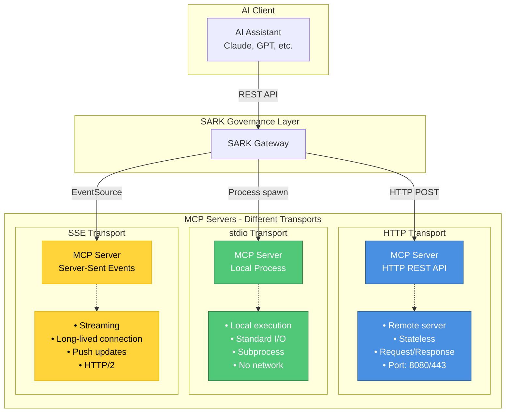
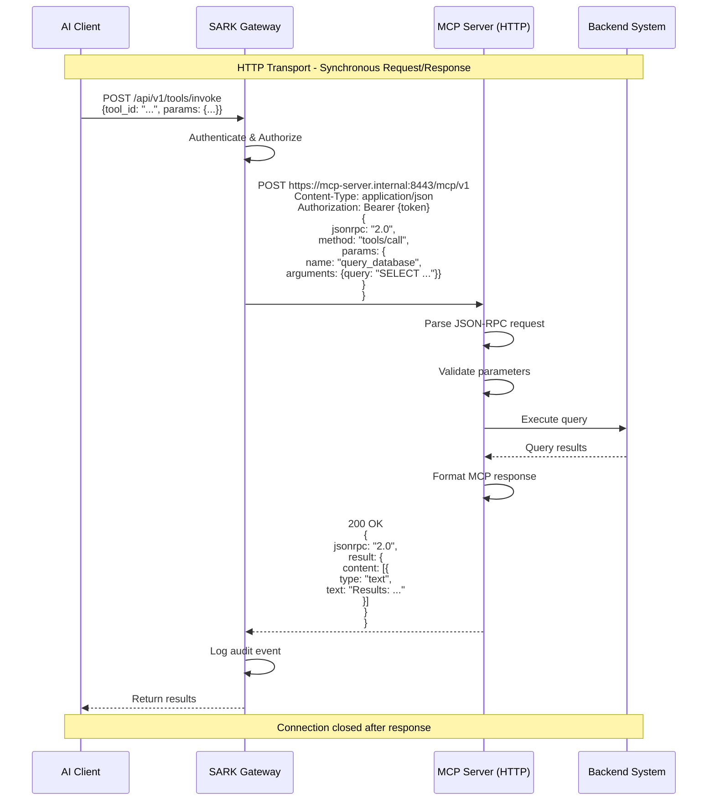
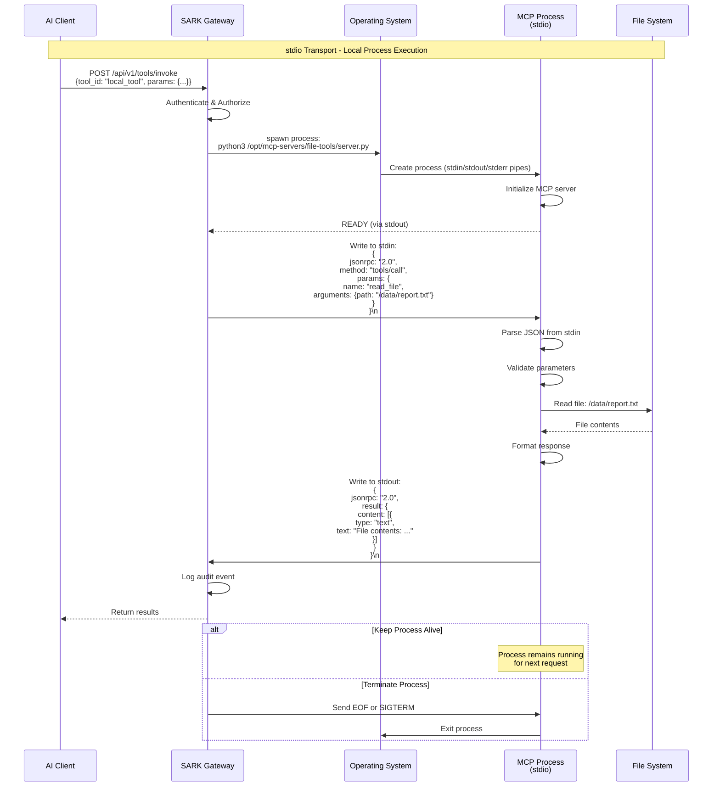
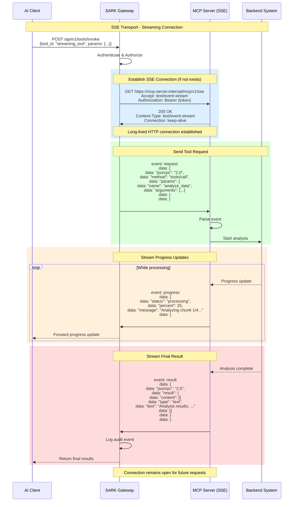
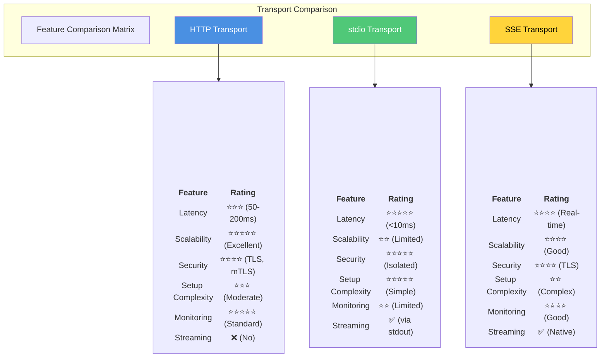
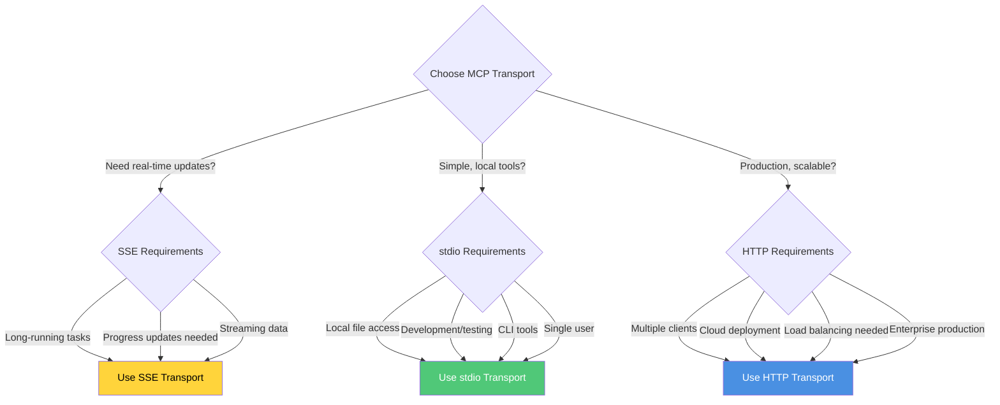

# MCP Transport Types Comparison

## Overview
This document compares the three MCP transport types: HTTP, stdio (standard input/output), and SSE (Server-Sent Events). Each has different use cases, performance characteristics, and security implications.

## Transport Architecture Overview



## HTTP Transport

### Request/Response Flow



### HTTP Configuration Example

```json
{
  "name": "finance-mcp-server",
  "transport": "http",
  "endpoint": "https://finance-mcp.internal.company.com:8443",
  "health_endpoint": "https://finance-mcp.internal.company.com:8443/health",
  "capabilities": ["tools", "resources"],
  "tls": {
    "enabled": true,
    "verify_cert": true,
    "client_cert_required": true
  },
  "timeout_seconds": 30,
  "retry_policy": {
    "max_retries": 3,
    "backoff": "exponential"
  }
}
```

### HTTP Pros & Cons

**Advantages:**
- ✅ **Scalable**: Can run on multiple servers behind load balancer
- ✅ **Remote**: MCP server can be anywhere on network
- ✅ **Stateless**: No connection state, easy to restart
- ✅ **Standard**: Works with existing HTTP infrastructure (proxies, load balancers, WAF)
- ✅ **Secure**: TLS encryption, certificate auth, mTLS support
- ✅ **Monitored**: Standard HTTP metrics and logging

**Disadvantages:**
- ❌ **Network Overhead**: HTTP headers, TCP handshake per request
- ❌ **Latency**: Higher latency than local execution
- ❌ **Firewall**: Requires open network ports
- ❌ **Request/Response Only**: No streaming or push notifications

**Best Use Cases:**
- Production MCP servers serving multiple clients
- Cloud-deployed MCP services
- Enterprise-managed MCP servers
- High-availability requirements

---

## stdio Transport

### Process Execution Flow



### stdio Configuration Example

```json
{
  "name": "local-file-tools",
  "transport": "stdio",
  "command": "/usr/bin/python3 /opt/mcp-servers/file-tools/server.py",
  "env": {
    "MCP_SERVER_NAME": "file-tools",
    "DATA_DIR": "/data",
    "LOG_LEVEL": "INFO"
  },
  "working_directory": "/opt/mcp-servers/file-tools",
  "capabilities": ["tools"],
  "process_management": {
    "keep_alive": true,
    "idle_timeout_seconds": 300,
    "max_concurrent": 10
  }
}
```

### stdio Pros & Cons

**Advantages:**
- ✅ **Zero Latency**: No network overhead, local execution
- ✅ **Simple**: No HTTP server needed, just stdin/stdout
- ✅ **Secure**: No network exposure, process isolation
- ✅ **Portable**: Works on any OS with process execution
- ✅ **Lightweight**: Minimal dependencies
- ✅ **File Access**: Direct access to local file system

**Disadvantages:**
- ❌ **Local Only**: Cannot access remote MCP servers
- ❌ **Process Management**: Need to spawn/kill processes
- ❌ **Resource Limits**: Limited by single machine resources
- ❌ **Not Scalable**: Cannot distribute across multiple machines
- ❌ **No Load Balancing**: All requests to same process
- ❌ **Process Crashes**: Need restart logic

**Best Use Cases:**
- Development and testing
- Local tools (file operations, system commands)
- Single-user scenarios
- CLI applications
- Resource-constrained environments

---

## SSE (Server-Sent Events) Transport

### Streaming Connection Flow



### SSE Configuration Example

```json
{
  "name": "analytics-mcp-server",
  "transport": "sse",
  "endpoint": "https://analytics-mcp.internal.company.com/mcp/v1/sse",
  "capabilities": ["tools", "resources"],
  "connection": {
    "keep_alive": true,
    "reconnect": true,
    "reconnect_interval_seconds": 5,
    "heartbeat_interval_seconds": 30
  },
  "streaming": {
    "buffer_size_kb": 64,
    "max_message_size_kb": 1024
  }
}
```

### SSE Event Format

```
event: progress
id: 123
data: {"status": "processing", "percent": 25}

event: log
id: 124
data: {"level": "info", "message": "Starting analysis"}

event: result
id: 125
data: {"jsonrpc": "2.0", "result": {...}}

event: error
id: 126
data: {"jsonrpc": "2.0", "error": {"code": -32603, "message": "Internal error"}}
```

### SSE Pros & Cons

**Advantages:**
- ✅ **Real-time Updates**: Stream progress, logs, intermediate results
- ✅ **Efficient**: Single connection for multiple requests
- ✅ **Push Notifications**: Server can push updates without polling
- ✅ **Long-running Tasks**: Perfect for tasks that take minutes/hours
- ✅ **HTTP-based**: Works with existing infrastructure
- ✅ **Reconnection**: Built-in automatic reconnection

**Disadvantages:**
- ❌ **Stateful**: Requires connection management
- ❌ **Complexity**: More complex than request/response
- ❌ **One-way**: Server to client only (need separate channel for requests)
- ❌ **Connection Limits**: Limited concurrent connections per client
- ❌ **Proxy Issues**: Some proxies don't support long-lived connections
- ❌ **Resource Usage**: Keeps connection open, uses server resources

**Best Use Cases:**
- Long-running data analysis or processing
- Real-time monitoring and dashboards
- Progress reporting for multi-step workflows
- Live log streaming
- Continuous data feeds

---

## Transport Comparison Matrix



## Performance Characteristics

| Metric | HTTP | stdio | SSE |
|--------|------|-------|-----|
| **Connection Setup** | 50-100ms (TCP + TLS) | <1ms (process spawn cached) | 50-100ms (initial), then reused |
| **Request Latency** | 50-200ms | <10ms | 10-50ms (connection exists) |
| **Throughput** | 100-10,000 req/s | 1,000-100,000 req/s | Varies (streaming) |
| **Memory Overhead** | Low (per request) | Medium (process memory) | High (connection state) |
| **Network Bandwidth** | High (HTTP headers) | None (local) | Medium (efficient streaming) |
| **Max Concurrent** | Unlimited (horizontal scaling) | Limited (process count) | Limited (connection limits) |

## Security Comparison

| Security Feature | HTTP | stdio | SSE |
|------------------|------|-------|-----|
| **Encryption** | ✅ TLS 1.3 | ❌ Not needed (local) | ✅ TLS 1.3 |
| **Authentication** | ✅ Bearer tokens, mTLS | ✅ Process isolation | ✅ Bearer tokens |
| **Authorization** | ✅ SARK OPA policies | ✅ SARK OPA policies | ✅ SARK OPA policies |
| **Network Isolation** | ❌ Exposed on network | ✅ No network exposure | ❌ Exposed on network |
| **Certificate Auth** | ✅ Client certificates | ❌ N/A | ✅ Client certificates |
| **Audit Logging** | ✅ Full request/response | ✅ stdin/stdout logs | ✅ Event stream logs |

## Decision Tree: Which Transport to Use?



## Transport Selection Guidelines

### Use HTTP When:
- ✅ Deploying to cloud or multiple servers
- ✅ Need horizontal scaling and load balancing
- ✅ Serving multiple concurrent clients
- ✅ Integrating with existing HTTP infrastructure
- ✅ Require enterprise security (mTLS, WAF, etc.)
- ✅ **Recommendation**: Default choice for production

### Use stdio When:
- ✅ Building local development tools
- ✅ Need direct file system access
- ✅ Single-user CLI applications
- ✅ Minimal latency requirements (<10ms)
- ✅ No network connectivity available
- ✅ **Recommendation**: Development, testing, local tools

### Use SSE When:
- ✅ Long-running tasks (minutes to hours)
- ✅ Need progress updates during execution
- ✅ Real-time monitoring or dashboards
- ✅ Live log streaming
- ✅ Continuous data feeds
- ✅ **Recommendation**: Analytics, monitoring, real-time systems

## Code Examples

### HTTP Transport - Client

```python
import requests

response = requests.post(
    "https://mcp-server.company.com/mcp/v1",
    headers={
        "Content-Type": "application/json",
        "Authorization": "Bearer YOUR_TOKEN"
    },
    json={
        "jsonrpc": "2.0",
        "method": "tools/call",
        "params": {
            "name": "query_database",
            "arguments": {"query": "SELECT * FROM users LIMIT 10"}
        },
        "id": 1
    }
)

result = response.json()
print(result["result"])
```

### stdio Transport - Client

```python
import subprocess
import json

# Spawn MCP server process
proc = subprocess.Popen(
    ["python3", "mcp_server.py"],
    stdin=subprocess.PIPE,
    stdout=subprocess.PIPE,
    text=True
)

# Send request
request = {
    "jsonrpc": "2.0",
    "method": "tools/call",
    "params": {
        "name": "read_file",
        "arguments": {"path": "/data/report.txt"}
    },
    "id": 1
}

proc.stdin.write(json.dumps(request) + "\n")
proc.stdin.flush()

# Read response
response_line = proc.stdout.readline()
result = json.loads(response_line)
print(result["result"])
```

### SSE Transport - Client

```python
import sseclient
import requests

# Establish SSE connection
response = requests.get(
    "https://mcp-server.company.com/mcp/v1/sse",
    headers={
        "Accept": "text/event-stream",
        "Authorization": "Bearer YOUR_TOKEN"
    },
    stream=True
)

client = sseclient.SSEClient(response)

# Send request (via separate channel or initial query params)
# ...

# Listen for events
for event in client.events():
    if event.event == "progress":
        print(f"Progress: {event.data}")
    elif event.event == "result":
        print(f"Result: {event.data}")
        break
```

## Monitoring & Observability

| Aspect | HTTP | stdio | SSE |
|--------|------|-------|-----|
| **Metrics** | Standard HTTP metrics (latency, throughput, errors) | Process metrics (CPU, memory, exit codes) | Connection metrics + event counts |
| **Logging** | Access logs, error logs | stdout/stderr capture | Event stream logs |
| **Tracing** | Distributed tracing (OpenTelemetry) | Local tracing only | Distributed tracing |
| **Health Checks** | HTTP /health endpoint | Process alive check | Connection heartbeat |
| **Alerting** | HTTP error rates, latency spikes | Process crashes, resource limits | Connection drops, event errors |

## Next Steps

- See [MCP Architecture](01_mcp_architecture.md) for overall system design
- See [Tool Invocation Flow](02_tool_invocation_flow.md) for detailed request flow
- See [API Reference](../API_REFERENCE.md) for transport configuration
