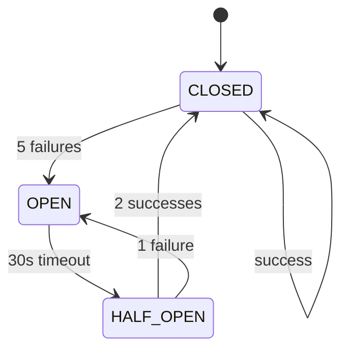

# Gateway Error Handling Guide

Comprehensive guide to error handling in the SARK Gateway client.

## Table of Contents

- [Overview](#overview)
- [Circuit Breaker](#circuit-breaker)
- [Retry Logic](#retry-logic)
- [Timeout Handling](#timeout-handling)
- [Error Types](#error-types)
- [Configuration](#configuration)
- [Best Practices](#best-practices)
- [Examples](#examples)

---

## Overview

The SARK Gateway client includes three layers of error handling to ensure reliability and prevent cascading failures:

1. **Circuit Breaker**: Prevents overwhelming failing services
2. **Retry Logic**: Automatically retries transient failures with exponential backoff
3. **Timeout Handling**: Prevents hung requests from blocking operations

### Architecture

```
Request → Circuit Breaker → Retry Logic → Timeout → Transport → Gateway
            (5 failures)    (3 attempts)   (30s)
```

All three layers are enabled by default and can be configured or disabled independently.

---

## Circuit Breaker

### What is a Circuit Breaker?

The circuit breaker pattern prevents your application from repeatedly trying to execute an operation that's likely to fail. It acts like an electrical circuit breaker:

- **CLOSED**: Normal operation, requests pass through
- **OPEN**: Too many failures, requests are blocked immediately
- **HALF_OPEN**: Testing if the service has recovered

### State Transitions



### Default Configuration

```python
{
    "failure_threshold": 5,       # Open after 5 consecutive failures
    "timeout_seconds": 30,         # Wait 30s before half-open
    "half_open_max_calls": 3,     # Max 3 concurrent calls in half-open
    "success_threshold": 2,        # Close after 2 successes in half-open
}
```

### Basic Usage

```python
from sark.gateway import GatewayClient, CircuitBreakerError

async with GatewayClient(
    gateway_url="http://gateway:8080",
    enable_error_handling=True,  # Default
) as client:
    try:
        result = await client.invoke_tool(...)
    except CircuitBreakerError as e:
        # Circuit is OPEN - service is unavailable
        print(f"Service unavailable: {e}")
        # Wait or use fallback strategy
```

### Custom Configuration

```python
async with GatewayClient(
    gateway_url="http://gateway:8080",
    circuit_breaker_config={
        "failure_threshold": 3,    # More sensitive - open after 3 failures
        "timeout_seconds": 60,      # Wait longer - 60s before retry
        "success_threshold": 3,     # More cautious - need 3 successes to close
    },
) as client:
    result = await client.invoke_tool(...)
```

### Manual Circuit Breaker

Use circuit breaker directly for custom operations:

```python
from sark.gateway.error_handler import CircuitBreaker

breaker = CircuitBreaker(
    failure_threshold=5,
    timeout_seconds=30,
)

async def my_operation():
    # Your code here
    return await some_api_call()

try:
    result = await breaker.call(my_operation)
except CircuitBreakerError:
    print("Circuit is OPEN")

# Check circuit state
print(f"State: {breaker.state}")  # CLOSED, OPEN, or HALF_OPEN
print(f"Failures: {breaker._failure_count}")

# Get metrics
metrics = breaker.get_metrics()
print(f"Total calls: {metrics['total_calls']}")
print(f"Failure rate: {metrics['failure_rate']:.2%}")

# Reset circuit manually if needed
breaker.reset()
```

### Circuit Breaker States Explained

#### CLOSED (Normal Operation)

```python
# All requests pass through
result = await client.invoke_tool(...)  # ✅ Executes normally
```

Transitions to OPEN after `failure_threshold` consecutive failures.

#### OPEN (Blocking Requests)

```python
# Requests are blocked immediately
try:
    result = await client.invoke_tool(...)
except CircuitBreakerError:
    print("Circuit is OPEN - blocking request")
    # Request never reaches the Gateway
```

Transitions to HALF_OPEN after `timeout_seconds` elapsed.

#### HALF_OPEN (Testing Recovery)

```python
# Limited requests allowed to test recovery
result = await client.invoke_tool(...)  # ✅ May execute (limited)

# If success_threshold reached → CLOSED
# If any failure → OPEN
```

Only `half_open_max_calls` concurrent requests allowed.

### Metrics & Monitoring

```python
async with GatewayClient(gateway_url="http://gateway:8080") as client:
    # Perform operations
    for _ in range(10):
        try:
            await client.invoke_tool(...)
        except Exception:
            pass

    # Check circuit breaker metrics
    metrics = client.get_metrics()
    cb_metrics = metrics["error_handler"]["circuit_breaker"]

    print(f"State: {cb_metrics['state']}")
    print(f"Total calls: {cb_metrics['total_calls']}")
    print(f"Total failures: {cb_metrics['total_failures']}")
    print(f"Total successes: {cb_metrics['total_successes']}")
    print(f"Failure rate: {cb_metrics['failure_rate']:.2%}")
    print(f"State changes: {cb_metrics['state_changes']}")
```

---

## Retry Logic

### Exponential Backoff

The retry mechanism uses exponential backoff to avoid overwhelming failing services:

```
Attempt 1: Immediate
Attempt 2: Wait 1s   (initial_delay * 2^0)
Attempt 3: Wait 2s   (initial_delay * 2^1)
Attempt 4: Wait 4s   (initial_delay * 2^2)
...
Max delay: 30s
```

### Default Configuration

```python
{
    "max_attempts": 3,           # Retry up to 3 times (total 3 attempts)
    "initial_delay": 1.0,        # Start with 1 second delay
    "max_delay": 30.0,           # Cap delay at 30 seconds
    "exponential_base": 2.0,     # Double the delay each time
    "jitter": True,              # Add ±25% random variance
}
```

### Why Jitter?

Jitter adds randomness to prevent the "thundering herd" problem:

```python
# Without jitter - all clients retry at the same time
Retry 1: 1.000s, 1.000s, 1.000s  ⚡ Surge!
Retry 2: 2.000s, 2.000s, 2.000s  ⚡ Surge!

# With jitter - clients retry at different times
Retry 1: 0.823s, 1.142s, 0.957s  ✅ Distributed
Retry 2: 1.621s, 2.301s, 1.884s  ✅ Distributed
```

### Basic Usage

Retry is automatic when `enable_error_handling=True`:

```python
async with GatewayClient(
    gateway_url="http://gateway:8080",
    enable_error_handling=True,
) as client:
    # Automatically retries transient failures
    result = await client.invoke_tool(...)
    # If it fails 3 times → RetryExhaustedError
```

### Custom Retry Configuration

```python
from sark.gateway import RetryExhaustedError

async with GatewayClient(
    gateway_url="http://gateway:8080",
    retry_config={
        "max_attempts": 5,         # Try 5 times
        "initial_delay": 0.5,      # Start with 500ms delay
        "max_delay": 60.0,         # Max 60s delay
        "exponential_base": 3.0,   # Triple delay each time
        "jitter": False,           # No random variance
    },
) as client:
    try:
        result = await client.invoke_tool(...)
    except RetryExhaustedError as e:
        print(f"Failed after 5 attempts: {e}")
```

### Manual Retry

Use retry logic for custom operations:

```python
from sark.gateway.error_handler import with_retry, RetryConfig, RetryExhaustedError
import httpx

async def flaky_api_call():
    async with httpx.AsyncClient() as client:
        response = await client.get("http://flaky-api.com/data")
        response.raise_for_status()
        return response.json()

config = RetryConfig(
    max_attempts=5,
    initial_delay=2.0,
    max_delay=60.0,
)

try:
    result = await with_retry(
        flaky_api_call,
        config=config,
        retryable_exceptions=(httpx.NetworkError, httpx.TimeoutException),
    )
    print(f"Success: {result}")
except RetryExhaustedError:
    print("All retries exhausted")
```

### Retryable vs Non-Retryable Errors

By default, all exceptions trigger retries. You can specify which exceptions should trigger retries:

```python
from sark.gateway.error_handler import with_retry
import httpx

# Only retry network and timeout errors
result = await with_retry(
    my_api_call,
    retryable_exceptions=(
        httpx.NetworkError,
        httpx.TimeoutException,
        httpx.ConnectTimeout,
    ),
)

# Don't retry 4xx client errors (they won't succeed)
# Don't retry authentication errors
# These will raise immediately
```

### Delay Calculation

```python
from sark.gateway.error_handler import RetryConfig

config = RetryConfig(
    initial_delay=1.0,
    exponential_base=2.0,
    max_delay=30.0,
    jitter=True,
)

# Attempt 0: delay = min(1.0 * 2^0, 30) = 1.0s ± 25% = 0.75-1.25s
# Attempt 1: delay = min(1.0 * 2^1, 30) = 2.0s ± 25% = 1.5-2.5s
# Attempt 2: delay = min(1.0 * 2^2, 30) = 4.0s ± 25% = 3.0-5.0s
# Attempt 3: delay = min(1.0 * 2^3, 30) = 8.0s ± 25% = 6.0-10.0s
# Attempt 4: delay = min(1.0 * 2^4, 30) = 16.0s ± 25% = 12.0-20.0s
# Attempt 5: delay = min(1.0 * 2^5, 30) = 30.0s (capped) ± 25% = 22.5-37.5s

for attempt in range(6):
    delay = config.get_delay(attempt)
    print(f"Attempt {attempt}: {delay:.2f}s")
```

---

## Timeout Handling

### Default Timeout

All operations have a default 30-second timeout:

```python
async with GatewayClient(
    gateway_url="http://gateway:8080",
    timeout=30.0,  # Default timeout for all operations
) as client:
    result = await client.invoke_tool(...)
    # Raises TimeoutError if > 30 seconds
```

### Operation-Specific Timeout

Override timeout for specific operations:

```python
from sark.gateway.error_handler import with_timeout, TimeoutError

async with GatewayClient(gateway_url="http://gateway:8080") as client:
    try:
        # Long-running operation - 5 minute timeout
        result = await with_timeout(
            client.invoke_tool,
            server_name="analytics-server",
            tool_name="generate_report",
            parameters={"report_id": "monthly"},
            timeout_seconds=300.0,  # 5 minutes
        )
    except TimeoutError:
        print("Report generation timed out")
```

### Disable Timeout

Set timeout to `None` or a very large value:

```python
async with GatewayClient(
    gateway_url="http://gateway:8080",
    timeout=None,  # No timeout (not recommended)
) as client:
    result = await client.invoke_tool(...)
```

⚠️ **Warning**: Disabling timeouts can cause requests to hang indefinitely.

### Manual Timeout

Use timeout for any async operation:

```python
from sark.gateway.error_handler import with_timeout, TimeoutError
import asyncio

async def slow_operation():
    await asyncio.sleep(10)
    return "done"

try:
    result = await with_timeout(
        slow_operation,
        timeout_seconds=5.0,
    )
except TimeoutError:
    print("Operation took too long")
```

---

## Error Types

### Gateway Client Errors

```python
from sark.gateway import (
    GatewayClientError,           # Base exception
    TransportNotAvailableError,    # Transport not available in current mode
    CircuitBreakerError,           # Circuit breaker is OPEN
    RetryExhaustedError,           # All retry attempts failed
    TimeoutError,                  # Operation timed out
)

async with GatewayClient(gateway_url="http://gateway:8080") as client:
    try:
        result = await client.invoke_tool(...)
    except CircuitBreakerError:
        # Handle circuit breaker open
        pass
    except RetryExhaustedError:
        # Handle retry exhaustion
        pass
    except TimeoutError:
        # Handle timeout
        pass
    except TransportNotAvailableError:
        # Handle transport mode mismatch
        pass
    except GatewayClientError:
        # Handle any other Gateway client error
        pass
```

### HTTP Errors

```python
import httpx

async with GatewayClient(gateway_url="http://gateway:8080") as client:
    try:
        result = await client.invoke_tool(...)
    except httpx.HTTPStatusError as e:
        # HTTP error responses (4xx, 5xx)
        if e.response.status_code == 401:
            print("Unauthorized")
        elif e.response.status_code == 403:
            print("Forbidden")
        elif e.response.status_code == 404:
            print("Not found")
        elif e.response.status_code >= 500:
            print("Server error")
    except httpx.NetworkError:
        # Network connectivity issues
        print("Network error")
    except httpx.TimeoutException:
        # HTTP client timeout (different from our TimeoutError)
        print("HTTP timeout")
```

### OPA Errors

```python
async with GatewayClient(
    gateway_url="http://gateway:8080",
    opa_client=opa_client,
) as client:
    try:
        result = await client.invoke_tool(...)
    except PermissionError as e:
        # OPA denied the request
        print(f"Access denied: {e}")
        # Don't retry - permission won't change
```

### stdio Errors

```python
from sark.gateway.transports.stdio_client import (
    ProcessStartError,
    ProcessCrashError,
    ResourceLimitExceededError,
)

async with GatewayClient(transport_mode=TransportMode.STDIO_ONLY) as client:
    try:
        local_server = await client.connect_local_server(
            command=["python", "server.py"]
        )
    except ProcessStartError:
        print("Failed to start subprocess")
    except ProcessCrashError:
        print("Subprocess crashed")
    except ResourceLimitExceededError:
        print("Resource limits exceeded")
```

---

## Configuration

### Full Configuration Example

```python
from sark.gateway import GatewayClient, TransportMode
from sark.services.policy.opa_client import OPAClient

opa_client = OPAClient(opa_url="http://opa:8181")

async with GatewayClient(
    # Connection settings
    gateway_url="http://gateway:8080",
    api_key="your-api-key",
    timeout=30.0,
    max_connections=50,

    # Transport mode
    transport_mode=TransportMode.AUTO,

    # OPA authorization
    opa_client=opa_client,

    # Error handling enabled
    enable_error_handling=True,

    # Circuit breaker configuration
    circuit_breaker_config={
        "failure_threshold": 5,       # Open after 5 failures
        "timeout_seconds": 30,         # Wait 30s before half-open
        "half_open_max_calls": 3,     # Max 3 calls in half-open
        "success_threshold": 2,        # Close after 2 successes
    },

    # Retry configuration
    retry_config={
        "max_attempts": 3,             # Retry up to 3 times
        "initial_delay": 1.0,          # Start with 1s delay
        "max_delay": 30.0,             # Max 30s delay
        "exponential_base": 2.0,       # Double delay each time
        "jitter": True,                # Add random variance
    },
) as client:
    result = await client.invoke_tool(...)
```

### Environment-Specific Configurations

#### Development

```python
# More retries, shorter timeouts for faster feedback
async with GatewayClient(
    gateway_url="http://localhost:8080",
    timeout=10.0,  # Shorter timeout
    circuit_breaker_config={
        "failure_threshold": 10,  # More lenient
    },
    retry_config={
        "max_attempts": 5,  # More retries
        "initial_delay": 0.5,  # Faster retries
    },
) as client:
    pass
```

#### Production

```python
# More conservative, longer timeouts
async with GatewayClient(
    gateway_url="http://gateway.prod:8080",
    timeout=60.0,  # Longer timeout
    circuit_breaker_config={
        "failure_threshold": 3,  # Fail fast
        "timeout_seconds": 60,  # Wait longer
    },
    retry_config={
        "max_attempts": 3,
        "initial_delay": 2.0,  # Slower retries
    },
) as client:
    pass
```

### Disable Error Handling

For testing or manual control:

```python
async with GatewayClient(
    gateway_url="http://gateway:8080",
    enable_error_handling=False,
) as client:
    # No circuit breaker, retry, or timeout
    # Errors propagate directly
    result = await client.invoke_tool(...)
```

---

## Best Practices

### 1. Use Default Error Handling

The defaults are well-tuned for most use cases:

```python
# ✅ Good - use defaults
async with GatewayClient(gateway_url="http://gateway:8080") as client:
    result = await client.invoke_tool(...)

# ❌ Bad - unnecessary customization
async with GatewayClient(
    gateway_url="http://gateway:8080",
    enable_error_handling=False,  # Don't disable without good reason
) as client:
    result = await client.invoke_tool(...)
```

### 2. Handle Circuit Breaker OPEN State

When the circuit is OPEN, implement fallback logic:

```python
from sark.gateway import CircuitBreakerError
import asyncio

async with GatewayClient(gateway_url="http://gateway:8080") as client:
    try:
        result = await client.invoke_tool(...)
    except CircuitBreakerError:
        # Option 1: Wait and retry later
        await asyncio.sleep(60)

        # Option 2: Use cached/stale data
        result = get_from_cache()

        # Option 3: Degrade gracefully
        result = {"status": "unavailable", "message": "Service temporarily down"}

        # Option 4: Use alternative service
        result = await fallback_service.invoke_tool(...)
```

### 3. Don't Retry Permanent Failures

Some errors should never be retried:

```python
from sark.gateway import RetryExhaustedError

async with GatewayClient(gateway_url="http://gateway:8080") as client:
    try:
        result = await client.invoke_tool(...)
    except PermissionError:
        # ✅ Don't retry - permission won't change
        logger.error("Access denied - check user permissions")
        raise
    except httpx.HTTPStatusError as e:
        if e.response.status_code == 404:
            # ✅ Don't retry - resource doesn't exist
            logger.error("Resource not found")
            raise
        elif e.response.status_code >= 500:
            # ✅ Do retry - server error may be transient
            raise  # Will be retried automatically
```

### 4. Set Appropriate Timeouts

Different operations need different timeouts:

```python
async with GatewayClient(
    gateway_url="http://gateway:8080",
    timeout=30.0,  # Default for most operations
) as client:
    # Quick operation - use default
    servers = await client.list_servers()

    # Long operation - override timeout
    from sark.gateway.error_handler import with_timeout

    report = await with_timeout(
        client.invoke_tool,
        server_name="analytics",
        tool_name="monthly_report",
        parameters={},
        timeout_seconds=300.0,  # 5 minutes
    )

    # Very long operation - consider async processing instead
    # Don't use extremely long timeouts (>10 min)
```

### 5. Monitor Error Rates

Track errors and circuit breaker state:

```python
async with GatewayClient(gateway_url="http://gateway:8080") as client:
    # Periodically check metrics
    metrics = client.get_metrics()
    cb_metrics = metrics["error_handler"]["circuit_breaker"]

    # Alert on high failure rate
    if cb_metrics["failure_rate"] > 0.1:  # >10% failures
        logger.warning(
            "High failure rate",
            failure_rate=cb_metrics["failure_rate"],
        )

    # Alert on circuit breaker OPEN
    if cb_metrics["state"] == "open":
        logger.error(
            "Circuit breaker OPEN",
            failures=cb_metrics["failure_count"],
        )
```

### 6. Use Jitter

Always use jitter in production to avoid thundering herd:

```python
# ✅ Good - jitter enabled (default)
async with GatewayClient(
    gateway_url="http://gateway:8080",
    retry_config={"jitter": True},
) as client:
    pass

# ❌ Bad - no jitter (only for testing)
async with GatewayClient(
    gateway_url="http://gateway:8080",
    retry_config={"jitter": False},
) as client:
    pass
```

### 7. Reset Circuit Breaker Manually When Needed

If you know the service has recovered:

```python
async with GatewayClient(gateway_url="http://gateway:8080") as client:
    # Circuit is OPEN due to previous failures
    # Service team confirms issue is fixed

    # Reset circuit breaker manually
    client.error_handler.reset()

    # Circuit is now CLOSED - try again
    result = await client.invoke_tool(...)
```

---

## Examples

### Example 1: Complete Error Handling

```python
from sark.gateway import (
    GatewayClient,
    CircuitBreakerError,
    RetryExhaustedError,
    TimeoutError,
)
import asyncio
import logging

logger = logging.getLogger(__name__)

async def resilient_tool_invocation(
    server_name: str,
    tool_name: str,
    parameters: dict,
):
    """Invoke tool with complete error handling."""
    async with GatewayClient(gateway_url="http://gateway:8080") as client:
        max_retries = 3
        retry_count = 0

        while retry_count < max_retries:
            try:
                result = await client.invoke_tool(
                    server_name=server_name,
                    tool_name=tool_name,
                    parameters=parameters,
                )
                logger.info("Tool invocation successful", result=result)
                return result

            except CircuitBreakerError:
                logger.warning("Circuit breaker OPEN - waiting 60s")
                await asyncio.sleep(60)
                retry_count += 1

            except RetryExhaustedError:
                logger.error("All retries exhausted - backing off 30s")
                await asyncio.sleep(30)
                retry_count += 1

            except TimeoutError:
                logger.warning("Timeout - retrying with longer timeout")
                # Could override timeout here
                retry_count += 1

            except PermissionError as e:
                logger.error("Access denied - not retrying", error=str(e))
                raise  # Don't retry permission errors

            except Exception as e:
                logger.exception("Unexpected error", error=str(e))
                retry_count += 1

        # All retries failed
        logger.error("Tool invocation failed after all retries")
        raise Exception("Operation failed")

if __name__ == "__main__":
    asyncio.run(resilient_tool_invocation(
        server_name="postgres-mcp",
        tool_name="execute_query",
        parameters={"query": "SELECT 1"},
    ))
```

### Example 2: Custom Circuit Breaker

```python
from sark.gateway.error_handler import CircuitBreaker, CircuitBreakerError, CircuitState
import asyncio

async def main():
    breaker = CircuitBreaker(
        failure_threshold=3,
        timeout_seconds=10,
        success_threshold=2,
    )

    async def flaky_operation():
        """Simulates a flaky operation."""
        import random
        if random.random() < 0.7:  # 70% failure rate
            raise Exception("Operation failed")
        return "success"

    # Simulate many calls
    for i in range(20):
        try:
            result = await breaker.call(flaky_operation)
            print(f"Call {i}: SUCCESS - {result}")
        except CircuitBreakerError:
            print(f"Call {i}: BLOCKED - Circuit is {breaker.state}")
        except Exception as e:
            print(f"Call {i}: FAILED - {e}")

        # Show circuit state
        print(f"  State: {breaker.state}, Failures: {breaker._failure_count}")

        await asyncio.sleep(0.5)

    # Show final metrics
    metrics = breaker.get_metrics()
    print(f"\nFinal Metrics:")
    print(f"  Total calls: {metrics['total_calls']}")
    print(f"  Total failures: {metrics['total_failures']}")
    print(f"  Failure rate: {metrics['failure_rate']:.2%}")
    print(f"  State changes: {metrics['state_changes']}")

if __name__ == "__main__":
    asyncio.run(main())
```

### Example 3: Retry with Custom Logic

```python
from sark.gateway.error_handler import with_retry, RetryConfig, RetryExhaustedError
import asyncio
import random

async def main():
    attempt_number = 0

    async def operation_with_tracking():
        nonlocal attempt_number
        attempt_number += 1

        print(f"Attempt {attempt_number}...")

        # Simulate intermittent failures
        if random.random() < 0.5:  # 50% failure rate
            raise Exception("Transient failure")

        return "success"

    config = RetryConfig(
        max_attempts=5,
        initial_delay=1.0,
        max_delay=10.0,
        exponential_base=2.0,
        jitter=True,
    )

    try:
        result = await with_retry(operation_with_tracking, config=config)
        print(f"Success after {attempt_number} attempts: {result}")
    except RetryExhaustedError:
        print(f"Failed after {attempt_number} attempts")

if __name__ == "__main__":
    asyncio.run(main())
```

### Example 4: Monitoring & Alerting

```python
from sark.gateway import GatewayClient
import asyncio
import logging

logger = logging.getLogger(__name__)

async def monitor_client_health():
    """Monitor Gateway client health and alert on issues."""
    async with GatewayClient(gateway_url="http://gateway:8080") as client:
        while True:
            await asyncio.sleep(60)  # Check every minute

            metrics = client.get_metrics()
            cb_metrics = metrics["error_handler"]["circuit_breaker"]

            # Alert on circuit breaker OPEN
            if cb_metrics["state"] == "open":
                logger.critical(
                    "ALERT: Circuit breaker is OPEN",
                    failures=cb_metrics["failure_count"],
                    last_failure=cb_metrics["last_failure_time"],
                )
                # Send alert to monitoring system
                await send_alert("Circuit breaker OPEN")

            # Alert on high failure rate
            if cb_metrics["failure_rate"] > 0.1:
                logger.warning(
                    "High failure rate detected",
                    failure_rate=cb_metrics["failure_rate"],
                    total_calls=cb_metrics["total_calls"],
                )

            # Alert on low cache hit rate
            if metrics.get("http_cache_hit_rate", 1.0) < 0.8:
                logger.warning(
                    "Low cache hit rate",
                    hit_rate=metrics["http_cache_hit_rate"],
                )

async def send_alert(message: str):
    """Send alert to monitoring system."""
    # Implement your alerting logic here
    print(f"ALERT: {message}")

if __name__ == "__main__":
    logging.basicConfig(level=logging.INFO)
    asyncio.run(monitor_client_health())
```

---

## Related Documentation

- [Client Usage Guide](./CLIENT_USAGE.md) - Complete Gateway client guide
- [HTTP Transport](./HTTP_TRANSPORT.md) - HTTP transport details
- [SSE Transport](./SSE_TRANSPORT.md) - SSE transport details
- [stdio Transport](./STDIO_TRANSPORT.md) - stdio transport details

---

## References

- Circuit Breaker Pattern: https://martinfowler.com/bliki/CircuitBreaker.html
- Exponential Backoff: https://en.wikipedia.org/wiki/Exponential_backoff
- Jitter: https://aws.amazon.com/blogs/architecture/exponential-backoff-and-jitter/
