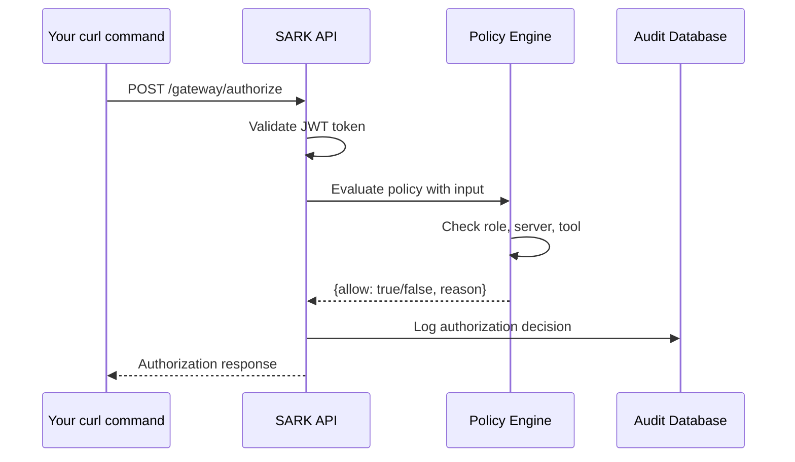

# Gateway Integration Quick Start Guide

**Level:** Beginner
**Time:** 10 minutes
**Version:** SARK v1.1.0+

---

## Overview

Welcome to SARK Gateway Integration! In this quick start guide, you'll:

- Register your first MCP Gateway server with SARK
- Configure basic authentication between Gateway and SARK
- Test your first tool invocation through the authorization flow
- Verify the integration is working correctly

By the end of this tutorial, you'll have a working Gateway integration that authorizes tool invocations before they reach your MCP servers.

### Prerequisites

Before you begin, ensure you have:

- **Docker & Docker Compose** installed (20.10+ and 2.0+)
- **curl** or **Postman** for testing API calls
- **jq** (optional, for JSON formatting)
- **Basic knowledge** of REST APIs and JWT tokens
- **10 minutes** of focused time

---

## What is Gateway Integration?

SARK Gateway Integration provides a **policy enforcement layer** for the MCP Gateway Registry. When enabled:

```
User/Agent → Gateway → SARK (Authorize?) → Gateway → MCP Server
                          ↓
                     OPA Policies
```

**Key Benefits:**
- 🔒 **Zero-trust security** - Every request is authorized before execution
- 📊 **Unified audit trail** - All gateway operations logged centrally
- 🎯 **Fine-grained control** - Policy-based access control per tool/server
- 🚀 **Enterprise-ready** - Compliance, SIEM integration, and more

---

## Step 1: Start the Stack

Let's start SARK with Gateway integration enabled using Docker Compose.

### 1.1 Clone the Repository (if needed)

```bash
# Skip if you already have SARK
git clone https://github.com/your-org/sark.git
cd sark
```

### 1.2 Configure Environment

```bash
# Navigate to examples directory
cd examples/gateway-integration

# Copy environment template
cp .env.example .env

# Generate required secrets
export JWT_SECRET=$(openssl rand -hex 32)
export GATEWAY_API_KEY=$(openssl rand -hex 32)

# Update .env file with generated secrets
cat > .env << EOF
# SARK Configuration
SARK_ENV=development
LOG_LEVEL=INFO
JWT_SECRET_KEY=$JWT_SECRET

# Gateway Integration (v1.1.0 Feature)
GATEWAY_ENABLED=true
GATEWAY_URL=http://mcp-gateway:8080
GATEWAY_API_KEY=$GATEWAY_API_KEY

# Database
POSTGRES_PASSWORD=sark_postgres_dev_password
POSTGRES_DB=sark
POSTGRES_USER=sark

# Redis
VALKEY_PASSWORD=sark_redis_dev_password

# OPA
OPA_URL=http://opa:8181
EOF

echo "✅ Environment configured!"
```

### 1.3 Start Services

```bash
# Start all services (SARK, Gateway, OPA, PostgreSQL, Redis)
docker compose -f docker-compose.gateway.yml up -d

# Wait for services to be ready (30-60 seconds)
echo "⏳ Waiting for services to start..."
sleep 30

# Check service health
docker compose -f docker-compose.gateway.yml ps
```

**Expected Output:**
```
NAME                STATUS              PORTS
sark-app            Up 30 seconds       0.0.0.0:8000->8000/tcp
mcp-gateway         Up 30 seconds       0.0.0.0:8080->8080/tcp
postgres            Up 30 seconds       5432/tcp
redis               Up 30 seconds       6379/tcp
opa                 Up 30 seconds       0.0.0.0:8181->8181/tcp
```

**Success Criteria:** ✅ All services show "Up" status

---

## Step 2: Verify SARK is Running

### 2.1 Check SARK Version

```bash
curl http://localhost:8000/api/v1/version
```

**Expected Response:**
```json
{
  "version": "1.1.0",
  "features": {
    "gateway_integration": true,
    "a2a_authorization": false
  },
  "status": "healthy"
}
```

**Success Criteria:** ✅ `gateway_integration: true`

### 2.2 Check SARK Health

```bash
curl http://localhost:8000/health
```

**Expected Response:**
```json
{
  "status": "healthy",
  "components": {
    "database": "healthy",
    "redis": "healthy",
    "opa": "healthy"
  },
  "timestamp": "2025-01-15T10:00:00Z"
}
```

**Success Criteria:** ✅ All components healthy

---

## Step 3: Authenticate with SARK

### 3.1 Create Admin User (First Time Only)

```bash
# Run database migrations and create default admin user
docker exec -it sark-app python -m alembic upgrade head
docker exec -it sark-app python -m sark.cli.create_admin \
  --email admin@example.com \
  --password admin123 \
  --name "Admin User"
```

**Expected Output:**
```
✅ Admin user created successfully
   Email: admin@example.com
   Password: admin123
   ⚠️  Change password in production!
```

### 3.2 Login and Get JWT Token

```bash
# Login to get access token
export TOKEN=$(curl -s -X POST http://localhost:8000/api/v1/auth/login \
  -H "Content-Type: application/json" \
  -d '{
    "email": "admin@example.com",
    "password": "admin123"
  }' | jq -r '.access_token')

# Verify token was received
echo $TOKEN
```

**Expected Output:**
```
eyJhbGciOiJIUzI1NiIsInR5cCI6IkpXVCJ9.eyJzdWIiOiJ1c2VyXzEyMyIsInJvbGUiOiJhZG1pbiIsImV4cCI6MTY0MjI1MjgwMH0...
```

**Success Criteria:** ✅ Token is a long JWT string (not "null")

---

## Step 4: Register Your First Gateway Server

SARK needs to know about your MCP servers. Let's register a PostgreSQL MCP server.

### 4.1 Register PostgreSQL MCP Server

```bash
# Register postgres-mcp server
curl -X POST http://localhost:8000/api/v1/servers \
  -H "Authorization: Bearer $TOKEN" \
  -H "Content-Type: application/json" \
  -d '{
    "name": "postgres-mcp",
    "url": "mcp://postgres-server:5000",
    "description": "PostgreSQL database access via MCP",
    "enabled": true,
    "metadata": {
      "sensitivity_level": "high",
      "environment": "development"
    }
  }'
```

**Expected Response:**
```json
{
  "id": "server_abc123",
  "name": "postgres-mcp",
  "url": "mcp://postgres-server:5000",
  "description": "PostgreSQL database access via MCP",
  "enabled": true,
  "created_at": "2025-01-15T10:00:00Z",
  "metadata": {
    "sensitivity_level": "high",
    "environment": "development"
  }
}
```

**Success Criteria:** ✅ Server created with ID returned

### 4.2 Verify Server Registration

```bash
# List all registered servers
curl -X GET http://localhost:8000/api/v1/servers \
  -H "Authorization: Bearer $TOKEN" | jq
```

**Expected Output:**
```json
{
  "servers": [
    {
      "id": "server_abc123",
      "name": "postgres-mcp",
      "url": "mcp://postgres-server:5000",
      "enabled": true
    }
  ],
  "total": 1
}
```

**Success Criteria:** ✅ Your `postgres-mcp` server appears in the list

---

## Step 5: Test Gateway Authorization

Now for the exciting part! Let's test the Gateway authorization flow.

### 5.1 Authorize a Database Query (Should Allow)

```bash
# Request authorization for a safe SELECT query
curl -X POST http://localhost:8000/api/v1/gateway/authorize \
  -H "Authorization: Bearer $TOKEN" \
  -H "Content-Type: application/json" \
  -d '{
    "action": "gateway:tool:invoke",
    "server_name": "postgres-mcp",
    "tool_name": "execute_query",
    "parameters": {
      "query": "SELECT * FROM users WHERE department = ?",
      "params": ["engineering"]
    },
    "user": {
      "id": "user_123",
      "email": "admin@example.com",
      "roles": ["admin"]
    }
  }' | jq
```

**Expected Response:**
```json
{
  "allow": true,
  "reason": "Allowed: admin role can execute queries",
  "filtered_parameters": {
    "query": "SELECT * FROM users WHERE department = ?",
    "params": ["engineering"]
  },
  "audit_id": "audit_abc123",
  "cache_ttl": 60,
  "metadata": {
    "policy_version": "1.0.0",
    "evaluated_at": "2025-01-15T10:00:00Z"
  }
}
```

**Success Criteria:** ✅ `"allow": true` in response

### 5.2 Try a Destructive Operation (Should Deny)

Let's verify that SARK blocks dangerous operations:

```bash
# Request authorization for a DROP TABLE (should be denied)
curl -X POST http://localhost:8000/api/v1/gateway/authorize \
  -H "Authorization: Bearer $TOKEN" \
  -H "Content-Type: application/json" \
  -d '{
    "action": "gateway:tool:invoke",
    "server_name": "postgres-mcp",
    "tool_name": "execute_query",
    "parameters": {
      "query": "DROP TABLE users"
    },
    "user": {
      "id": "user_456",
      "email": "analyst@example.com",
      "roles": ["analyst"]
    }
  }' | jq
```

**Expected Response:**
```json
{
  "allow": false,
  "reason": "Denied: destructive SQL operations (DROP, DELETE, TRUNCATE) not allowed for analyst role",
  "cache_ttl": 0,
  "metadata": {
    "policy_version": "1.0.0",
    "evaluated_at": "2025-01-15T10:00:00Z"
  }
}
```

**Success Criteria:** ✅ `"allow": false` in response

---

## Step 6: List Authorized Servers

Gateway can query SARK to see which servers a user can access.

```bash
# List servers the authenticated user can access
curl -X GET http://localhost:8000/api/v1/gateway/servers \
  -H "Authorization: Bearer $TOKEN" | jq
```

**Expected Response:**
```json
{
  "servers": [
    {
      "name": "postgres-mcp",
      "description": "PostgreSQL database access via MCP",
      "url": "mcp://postgres-server:5000",
      "allowed_actions": ["query", "read"]
    }
  ]
}
```

**Success Criteria:** ✅ Server list returned successfully

---

## Step 7: View Audit Logs

All authorization decisions are audited. Let's check the audit trail.

```bash
# Query audit events
curl -X GET "http://localhost:8000/api/v1/audit/events?event_type=gateway_authorization&limit=5" \
  -H "Authorization: Bearer $TOKEN" | jq
```

**Expected Response:**
```json
{
  "events": [
    {
      "id": "audit_abc123",
      "event_type": "gateway_authorization",
      "user_id": "user_123",
      "action": "gateway:tool:invoke",
      "resource": "postgres-mcp:execute_query",
      "decision": "allow",
      "timestamp": "2025-01-15T10:00:00Z",
      "metadata": {
        "server_name": "postgres-mcp",
        "tool_name": "execute_query"
      }
    },
    {
      "id": "audit_abc124",
      "event_type": "gateway_authorization",
      "user_id": "user_456",
      "action": "gateway:tool:invoke",
      "resource": "postgres-mcp:execute_query",
      "decision": "deny",
      "timestamp": "2025-01-15T10:00:30Z"
    }
  ],
  "total": 2
}
```

**Success Criteria:** ✅ Both allow and deny events appear in audit log

---

## Verification Checklist

Before moving on, verify you've completed all steps:

- [x] ✅ All Docker containers running
- [x] ✅ SARK version shows `gateway_integration: true`
- [x] ✅ Successfully logged in and obtained JWT token
- [x] ✅ Registered `postgres-mcp` server
- [x] ✅ Authorization request allowed for safe query
- [x] ✅ Authorization request denied for destructive query
- [x] ✅ Server list retrieved successfully
- [x] ✅ Audit events visible in logs

**If all checkboxes are checked, congratulations! Your Gateway integration is working! 🎉**

---

## Understanding What Just Happened

Let's break down the authorization flow:



**What happened:**

1. **Authentication:** SARK validated your JWT token
2. **Policy Evaluation:** OPA checked if your user/role can invoke that tool
3. **Parameter Filtering:** Sensitive parameters removed (if any)
4. **Audit Logging:** Decision logged to database
5. **Response:** Allow/deny decision returned to Gateway

---

## Next Steps

Now that you have a working Gateway integration, explore these topics:

### Tutorial 2: Building a Gateway Server
Learn to build a complete MCP Gateway server from scratch with:
- Multiple tool endpoints
- Advanced authentication
- OPA policy integration
- Development deployment

👉 **[Continue to Tutorial 2 →](./02-building-gateway-server.md)**

### Explore Documentation
- **[Gateway API Reference](../../gateway-integration/API_REFERENCE.md)** - Full API documentation
- **[OPA Policy Guide](../../gateway-integration/configuration/POLICY_CONFIGURATION.md)** - Writing custom policies
- **[Authentication Guide](../../AUTHENTICATION.md)** - Advanced authentication methods

---

## Troubleshooting

### Issue: `"gateway_integration": false` in version

**Problem:** Gateway integration not enabled

**Solution:**
```bash
# Check GATEWAY_ENABLED in .env
grep GATEWAY_ENABLED .env

# Should output: GATEWAY_ENABLED=true

# If not, update .env and restart
echo "GATEWAY_ENABLED=true" >> .env
docker compose -f docker-compose.gateway.yml restart sark-app
```

---

### Issue: "Connection refused" when calling SARK

**Problem:** SARK not running or not accessible

**Solution:**
```bash
# Check SARK container status
docker ps | grep sark-app

# View SARK logs
docker logs sark-app --tail 50

# Restart SARK
docker compose -f docker-compose.gateway.yml restart sark-app
```

---

### Issue: "Invalid token" error

**Problem:** JWT token expired or invalid

**Solution:**
```bash
# Get a fresh token
export TOKEN=$(curl -s -X POST http://localhost:8000/api/v1/auth/login \
  -H "Content-Type: application/json" \
  -d '{
    "email": "admin@example.com",
    "password": "admin123"
  }' | jq -r '.access_token')

# Verify token
echo $TOKEN
```

---

### Issue: All requests denied

**Problem:** OPA policies not loaded

**Solution:**
```bash
# Check OPA status
curl http://localhost:8181/health

# Check loaded policies
curl http://localhost:8181/v1/policies

# Reload policies
docker compose -f docker-compose.gateway.yml restart opa
```

---

### Issue: Server registration fails

**Problem:** Server name already exists or invalid URL

**Solution:**
```bash
# Check existing servers
curl -X GET http://localhost:8000/api/v1/servers \
  -H "Authorization: Bearer $TOKEN"

# Use a unique server name
# Ensure URL follows format: mcp://hostname:port
```

---

## Common Questions

### Q: Can I use this in production?

**A:** This quick start is for **development/testing only**. For production:
- Use strong passwords and secrets
- Enable TLS/HTTPS
- Use managed databases (RDS, Cloud SQL)
- Configure monitoring and alerting
- See **[Tutorial 3: Production Deployment](./03-production-deployment.md)**

---

### Q: How do I add more MCP servers?

**A:** Simply register them via the `/api/v1/servers` endpoint:

```bash
curl -X POST http://localhost:8000/api/v1/servers \
  -H "Authorization: Bearer $TOKEN" \
  -H "Content-Type: application/json" \
  -d '{
    "name": "github-mcp",
    "url": "mcp://github-server:5001",
    "description": "GitHub API access",
    "enabled": true
  }'
```

---

### Q: How do I customize authorization policies?

**A:** Edit OPA policies in `examples/gateway-integration/policies/gateway.rego`:

```rego
# Allow developers to query databases
allow if {
    input.user.roles[_] == "developer"
    input.action == "gateway:tool:invoke"
    input.server_name == "postgres-mcp"
    input.tool_name == "execute_query"
}
```

Then reload policies:
```bash
cd examples/gateway-integration/policies
tar -czf ../opa/bundle/bundle.tar.gz .
docker compose -f docker-compose.gateway.yml restart opa
```

See **[Tutorial 4: Extending Gateway](./04-extending-gateway.md)** for advanced policy authoring.

---

### Q: Where are audit logs stored?

**A:** Audit logs are stored in:
1. **PostgreSQL** - For querying and compliance
2. **SIEM** (optional) - For security monitoring (Splunk, Datadog, etc.)

Query via API:
```bash
curl -X GET http://localhost:8000/api/v1/audit/events \
  -H "Authorization: Bearer $TOKEN"
```

---

## What You Learned

Congratulations! In this 10-minute tutorial, you:

✅ **Set up** SARK with Gateway integration enabled
✅ **Registered** your first MCP server
✅ **Authenticated** with JWT tokens
✅ **Authorized** tool invocations through the Gateway flow
✅ **Verified** policy enforcement (allow and deny)
✅ **Queried** audit logs for compliance

You now have a **working foundation** for Gateway integration!

---

## Additional Resources

- **[API Reference](../../gateway-integration/API_REFERENCE.md)** - Complete Gateway API documentation
- **[Example Policies](../../../examples/gateway-integration/policies/)** - Sample OPA policies
- **[Docker Compose Setup](../../../examples/gateway-integration/README.md)** - Full setup guide
- **[Troubleshooting Guide](../../gateway-integration/runbooks/TROUBLESHOOTING.md)** - Common issues and solutions

---

## Feedback

Found an issue or have suggestions? We'd love to hear from you!

- **GitHub Issues:** [Report a bug](https://github.com/your-org/sark/issues)
- **Documentation:** [Contribute improvements](https://github.com/your-org/sark/pulls)

---

**Next Tutorial:** [Building a Gateway Server →](./02-building-gateway-server.md)

---

*Last Updated: 2025-01-15*
*SARK Version: 1.1.0+*
*Tutorial Version: 1.0*
